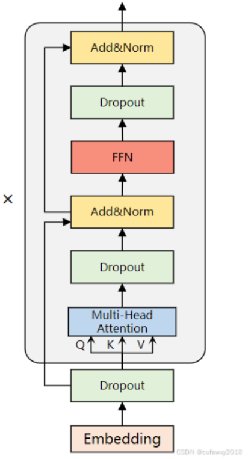
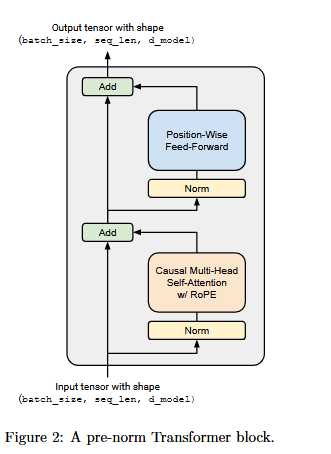
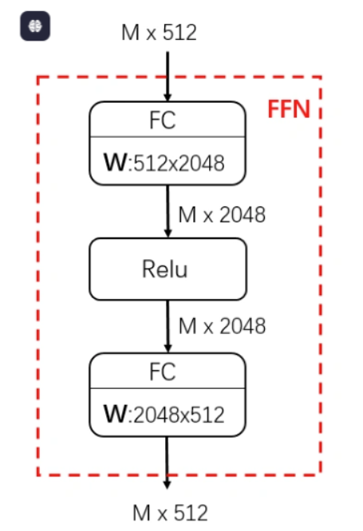
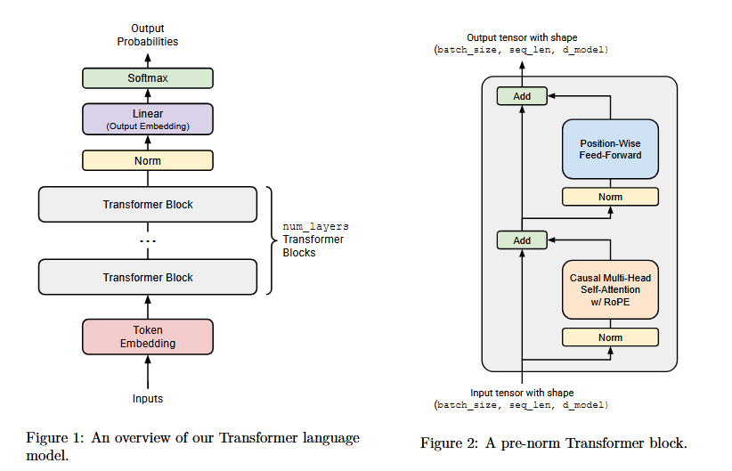

### 残差连接与先行归一化



这个是在后面进行残差连接并归一化的方式，称为**后规范化**

#### $\textcolor{red}{消融实验2}$

预规范化和后规范化的对比



将层归一化转到输入之前，可以让训练更加稳定。这个就是**预规范化**

#### 预规范化的作用：

从输入嵌入到transfromer的输出，可以有一个干净的残差流，没有任何规范化，可以看到上面的图add没有任何规范化处理，这样可以改善**梯度流**，即使模型堆叠得很深（几十上百层），梯度也能顺利传回到底层，不会出现梯度消失或爆炸的问题。

这个标准是当前**LLAMA架构的基本标准**

### 层归一化与均方层根归一化

#### $\textcolor{red}{消融实验3}$

对比层归一化与均方层归一化

刚开始2017年的实现使用的是layer normalization（LN）。然后后面又提出了新的架构：

root mean square layer normalization（RMSNorm）

LN公式：给定一个输入向量 $x \in \mathbb{R}^d$：
$$
\mu = \frac{1}{d} \sum_{i=1}^{d} x_i
$$

$$
\sigma = \sqrt{\frac{1}{d} \sum_{i=1}^{d} (x_i - \mu)^2 + \epsilon}
$$

$$
\text{LayerNorm}(x) = \frac{x - \mu}{\sigma} \cdot \gamma + \beta
$$

- **Re-centering (去中心化)**：计算均值 $\mu$，然后输入减去均值。
- **Re-scaling (重缩放)**：计算标准差 $\sigma$，然后除以标准差。
- **Affine Transformation (仿射变换)**：乘上可学习参数 $\gamma$ 并加上 $\beta$，以恢复模型的表达能力。

RMSNorm 

提出者（Zhang and Sennrich, 2019）发现，LayerNorm 能够起作用，主要归功于 **Re-scaling (重缩放)** 的效果，而 **Re-centering (去中心化)** 并没有那么重要，甚至计算均值还浪费了时间。

RMSNorm **去掉了减均值的步骤**，直接除以均方根（RMS）。这使得计算更简单、速度更快，效果通常与 LayerNorm 相当甚至更好。

RMSNorm同样在最后没有偏置项，传统的layerNoem是有偏置项的，在前面整体项后面有一个偏置项$\beta$，而RMS的是没有的。

给定一个输入向量 $a \in \mathbb{R}^{d_{model}}$

**计算 RMS**：
$$
RMS(a) = \sqrt{\frac{1}{d_{model}}\sum_{i=1}^{d_{model}}a_{i}^{2} + \epsilon}
$$
**归一化并缩放**：
$$
\text{RMSNorm}(a_i) = \frac{a_i}{RMS(a)} \cdot g_i
$$
其中 $g_i$ 是可学习的缩放参数 (gain)，一共有 $d_{model}$ 个。ε是一个超参数，通常固定为1e-5。


#### 注意

应该将输入向上转换为 torch.float32，以防止在对输入求平方时溢出。总的来说，您的前向方法应该如下所示：、

```
in_dtype = x.dtype 
x = x.to(torch.float32)  
# Your code here performing RMSNorm 
... 
result = ...  
# Return the result in the original dtype 
return result.to(in_dtype)
```

请记住在执行标准化之前将输入向上转换为 torch.float32（然后向下转换为原始数据类型），如上所述。


上面的所有归一化都是根据一条d_model向量来说的，对于batch和swq，这些不参与RMS计算


### 前馈网络（FFN）

#### $\textcolor{red}{消融实验4}$

传统ReLU GELU,SILU(无门控)与SwiGLU对比

在2017的前馈网络实现中，有是由**两个MLP层**（线性变换），中间是由Relu激活函数进行的。前向维度为x，通过参数转化为4x层，然后在转化回去。可以包含更多的信息



新的前馈层有两个主要变化，使用新的激活函数，并加入门控机制：

激活函数使用**Llama 3**与**Qwen 2.5**采用的**SwiGLU**激活函数。这个激活函数综合了

**SiLU与GLU门控**，并且在定义的时候将两个**线性层的偏置**去掉，遵循现代LLM法则

SiLU 或 Swish 激活函数 定义如下：
$$
\text{SiLU}(x) = x \cdot \sigma(x) = \frac{x}{1 + e^{-x}}
$$
原始 GLU 定义:
$$
\text{GLU}(x, W_1, W_2) = \sigma(W_1 x) \odot W_2 x
$$
注意：$\sigma$ 是 Sigmoid 函数。

**门控线性单元**（Gated Linear Units, GLUs）最初由 Dauphin 等人 [2017] 定义，它是**经过 Sigmoid 函数的一个线性变换**与**另一个线性变换**的逐元素乘积.其中 $\odot$ 代表逐元素乘法

门控线性单元被建议用于“通过为梯度提供线性路径同时保留非线性能力，从而减少深度架构的梯度消失问题”。

 FFN 的 SwiGLU 实现:
$$
\text{FFN}(x) = \text{SwiGLU}(x, W_1, W_2, W_3) = W_2(\text{SiLU}(W_1 x) \odot W_3 x)
$$
由于多了一层权重矩阵，为了保证总参数量大致一致，缩小中间隐藏层的维度 $d_{ff}$。

#### 对比

| **特征**              | **原始 Transformer (ReLU FFN)** | **现代 Transformer (SwiGLU FFN)**      |
| --------------------- | ------------------------------- | -------------------------------------- |
| **激活函数**          | ReLU (硬截断，非平滑)           | SiLU (平滑，带负值)                    |
| **结构机制**          | 线性堆叠                        | **门控机制 (Gating)**                  |
| **权重矩阵数**        | 2个                             | **3个** ($W_1, W_2, W_3$)              |
| **中间维度 $d_{ff}$** | $4 \times d_{model}$            | $\approx \frac{8}{3} \times d_{model}$ |
| **偏置项 (Bias)**     | 通常有                          | **无**                                 |

#### 注意

前馈层的维度数量要向上取整到64的倍数，此时内存读取效率最高，且模型参数量不会亏本


### 位置编码

#### $\textcolor{red}{消融实验5}$

位置编码拥有多种方式，包括绝对位置编码，相对位置编码，ROPE旋转位置编码等

传统位置编码

Vaswani等人在2017年的原始Transformer论文《Attention is All You Need》中提出了正弦/余弦位置编码（Sinusoidal Positional Encoding）。这种方法为每个位置生成一个固定的编码向量，并将其加到词嵌入向量上，以提供位置信息。
$$
PE(pos, 2i) = \sin\left(\frac{pos}{10000^{2i/d}}\right), \quad PE(pos, 2i+1) = \cos\left(\frac{pos}{10000^{2i/d}}\right)
$$


(pos)：词在序列中的位置
(i)：嵌入向量的维度索引
(d)：嵌入向量的总维度


在这里介绍旋转编码的方式

假设你有一个 $d$ 维的向量 $x$（比如 query 或 key）。RoPE 不会一次性处理整个 $d$ 维空间，而是把它看作是 **$d/2$ 个独立的二维子空间**。（这个d其实就是d_model维度除多头数量）

对于两个相邻的数，组成一个二维平面的坐标。

对于第 $i$ 个位置（Token Position $i$），我们希望把它的特征向量旋转一个特定的角度。在二维平面上逆时针旋转角度 $\theta$ 的公式是标准的旋转矩阵：
$$
\begin{pmatrix} x'_{1} \\ x'_{2} \end{pmatrix} = \begin{bmatrix} \cos \theta & -\sin \theta \\ \sin \theta & \cos \theta \end{bmatrix} \begin{pmatrix} x_{1} \\ x_{2} \end{pmatrix}
$$
展开来写就是：
$$
\begin{aligned} x'_{1} &= x_{1} \cos \theta - x_{2} \sin \theta \\ x'_{2} &= x_{1} \sin \theta + x_{2} \cos \theta \end{aligned}
$$
在ROPE中，旋转角度 ($\theta$) 由词的位置 ($p$) 和预定义的频率决定。具体地，对于第 ($k$) 个复数对 (对应第 ($2k$) 和 ($2k+1$) 维)，旋转角度为：

$$\theta_k = p \cdot \omega_k$$

其中，频率 ($\omega_k$) 定义为：

$$\omega_k = \frac{1}{10000^{2k/d}}, \quad k = 0, 1, \dots, d/2 - 1$$

theta就是那个10000

**注意：** 

1. 这里的频率设计与正弦/余弦位置编码中的频率类似，但ROPE将其用于旋转角度，而不是直接加到嵌入向量上。
2. 这个p均摊到整个维度里面。是为了像**“多指针时钟”**（秒针、分针、时针）那样实现**多分辨率编码**：**高频维度**（转得快）就像**秒针**，能极高精度地分辨相邻词的微小距离（捕捉局部语法）；**低频维度**（转得慢）就像**时针**，能覆盖很长的距离而不发生周期重叠（捕捉长程语义）；这种**“快慢结合”**的机制，让模型仅通过简单的向量点积，就能同时完美处理**短距离的精确性**和**长距离的广阔性**，这是单一频率无法做到的。


对于位置 ($p$) 处的嵌入向量 ($\mathbf{x} \in \mathbb{R}^d$)，ROPE通过以下方式旋转它：
$$
\mathbf{x}_{\text{rot}} = \begin{bmatrix}
x_0 \cos\theta_0 - x_1 \sin\theta_0 \\
x_0 \sin\theta_0 + x_1 \cos\theta_0 \\
x_2 \cos\theta_1 - x_3 \sin\theta_1 \\
x_2 \sin\theta_1 + x_3 \cos\theta_1 \\
\vdots \\
x_{d-2} \cos\theta_{d/2-1} - x_{d-1} \sin\theta_{d/2-1} \\
x_{d-2} \sin\theta_{d/2-1} + x_{d-1} \cos\theta_{d/2-1}
\end{bmatrix}
$$
简言之，ROPE对嵌入向量的每一对维度应用一个旋转矩阵，旋转角度由位置 ($p$) 和频率 ($\omega_k$) 决定。

#### 注意

1. 这个ROPE需要使用 self.register_buffer(persistent=False) 创建一个 2d 预先计算的 sin 和 cos 值缓冲区，而不是 nn.Parameter，因为不需要训练
2. 对于token_positions的位置，他们的**相对编码是一致**的，但是他们本身的向量不同，因此向量不同。因此矩阵每一行一致，编码一致，直接扩展就可以。


### softmax

$$\text{Softmax}(x_i) = \frac{\exp(x_i - x_{\max})}{\sum_{j} \exp(x_j - x_{\max})}$$

**防止溢出 (Overflow)**：如果直接计算 $e^{x_i}$，当 $x_i$ 很大时（例如 100），结果会变成无穷大 (`inf`)，导致最终计算出现 `NaN`。

**数学等价性**：利用性质 $\text{softmax}(x) = \text{softmax}(x - c)$，减去常数不改变最终的概率分布结果。


### Pre-norm结构



组装 Transformer 块：

一个 Transformer 块包含两个“子层”，一个是多头自注意力（multihead self attention），另一个是前馈网络（feed-forward network）。在每个子层中，我们要**先执行 RMSNorm**，然后是主要操作（MHA/FF），**最后加上残差连接**。

具体来说，Transformer 块的前半部分（第一个“子层”）应该实现以下一组更新，以从输入 $x$ 生成输出 $y$：
$$
y = x + \text{MultiHeadSelfAttention}(\text{RMSNorm}(x)) \quad (15)
$$

#### 注意

1. 最后要加上RMSNorm,并加入Linear
2. 由于他要给所有的词表生成概率，所以要把**d_model变成vocab_size**，让他能够打分。
3. 语言模型将整数标记为id标记序列，从(batch_size, sequence_length)转到(batch_size, sequence_length, vocab_size)


### 权重绑定

简单来说，它强制让 **“输入嵌入层（Token Embeddings）”** 和 **“输出投影层（LM Head / Output Linear）”** 使用**完全相同**的权重矩阵。

可以大幅度减少参数量。

输出输出权重矩阵一致，可以让输出效果更好。
