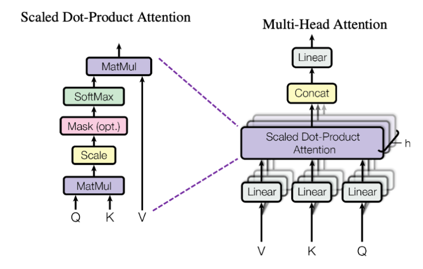

### attention

我们现在可以从数学上将注意力（Attention）操作定义如下：
$$
\text{Attention}(Q, K, V) = \text{softmax} \left( \frac{Q^T K}{\sqrt{d_k}} \right) V
$$
其中 $Q \in \mathbb{R}^{n \times d_k}$，$K \in \mathbb{R}^{m \times d_k}$，以及 $V \in \mathbb{R}^{m \times d_v}$。这里，$Q$、$K$ 和 $V$ 都是该操作的输入——请注意，它们**不是**可学习的参数。如果你好奇为什么这里写的是 $Q^T K$ 而不是 $QK^T$，请参阅 3.3.1 节。

**Softmax 的物理意义**：

对于 **每一个 Query**（比如第 3 个词），它需要决定：“我应该分配多少注意力给那 20 个 Key？”因此，我们必须让这 **20 个分数** 加起来等于 1。这 20 个分数正好位于 **最后一个维度 (`dim=-1`)**。

#### **掩码 (Masking)：**

有时对注意力操作的输出进行 **掩码 (mask)** 处理会很方便。掩码的形状应为 $M \in \{\text{True, False}\}^{n \times m}$，且该布尔矩阵的每一行 $i$ 指示了查询 (query) $i$ 应该关注哪些键 (key)。

按照惯例（虽然有点令人困惑），位置 $(i, j)$ 值为 **True** 表示查询 $i$ **确实**关注键 $j$，而值为 **False** 表示查询 **不** 关注该键。换句话说，“信息流”在值为 **True** 的 $(i, j)$ 对处通过。例如，考虑一个元素为 `[[True, True, False]]` 的 $1 \times 3$ 掩码矩阵。这表示单个查询向量仅关注前两个键。

在计算上，使用掩码比在子序列上计算注意力要高效得多。我们可以通过获取 softmax 之前的值 $\left( \frac{Q^T K}{\sqrt{d_k}} \right)$，并在掩码矩阵为 **False** 的任何位置加上 $-\infty$（负无穷）来实现这一点。

**这个掩码是计算完Q与K后进行掩码。**

其中d_k表示如下：
$$
d_k = \frac{d_{model}}{\text{num\_heads}}
$$

#### 自注意力与交叉注意力

自注意力Q K V都一致，交叉注意力 Q独立 ，K V一致

### 多头注意力

多头注意力在上面还要用一个head

$$\text{MultiHead}(Q, K, V) = \text{Concat}(\text{head}_1, \dots, \text{head}_h) \quad (12)$$

$$\text{for head}_i = \text{Attention}(Q_i, K_i, V_i) \quad (13)$$

$$\text{MultiHeadSelfAttention}(x) = W_O \text{MultiHead}(W_Q x, W_K x, W_V x) \quad (14)$$

这个步骤就是先计算w，然后计算attention ，最后融合

#### 注意

1. RoPE 应该应用于 Query 和 Key 向量，但 **不要** 应用于 Value 向量。此外，Head 维度应该作为 Batch 维度处理，因为在多头注意力中，注意力是独立应用于每个头的。这意味着完全相同的 RoPE 旋转应该应用于每个头的 Query 和 Key 向量。
2. 因果掩码：掩码要是一个倒三角，即前面计算的时候要把后面掩码掩码住，是一个倒三角。
3. 这里的可学习参数包括 $W_Q \in \mathbb{R}^{h d_k \times d_{model}}$, $W_K \in \mathbb{R}^{h d_k \times d_{model}}$, $W_V \in \mathbb{R}^{h d_v \times d_{model}}$, 以及 $W_O \in \mathbb{R}^{d_{model} \times h d_v}$。 既然 $Q, K$ 和 $V$ 在多头注意力操作中是沿着输出维度切片的，我们可以将 $W_Q, W_K$ 和 $W_V$ 视为针对每个头沿输出维度分离的。当你完成了这个功能，你应该计算 Key、Value 和 Query 的投影总共需要三次矩阵乘法。（注5：作为一个**进阶目标 (stretch goal)**，尝试将 Key、Query 和 Value 的投影合并为一个单一的权重矩阵，这样你只需要一次矩阵乘法。）这里面$hd_k$等都是$d_{model}$

