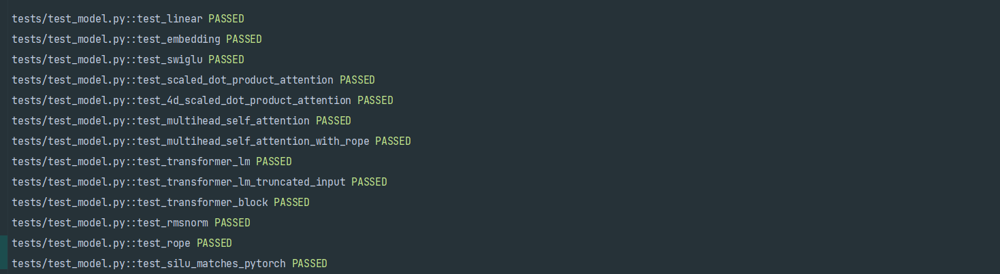
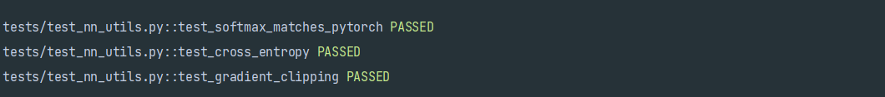
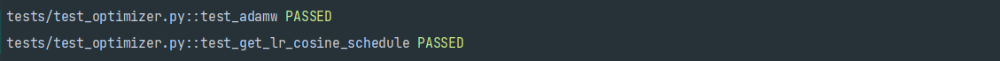

### model测试结果如下：

线性层

词嵌入层

前馈层FFN

注意力机制（多权重+单权重）

多头注意力（有无rope）

层模块

整个transformer

RMSNorm归一化

Rope编码

SILU激活函数

### nn_utils部分测试

包括交叉熵损失函数

softmax函数

梯度裁剪函数

### 优化器部分测试

优化器测试

余弦退火学习率调度器

