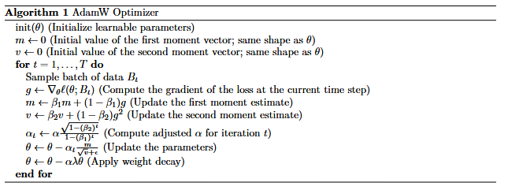

### 交叉熵损失

Transformer 语言模型为每个长度为 $m + 1$ 的序列 $x$ 以及 $i = 1, ..., m$，定义了一个分布 $p_\theta(x_{i+1} | x_{1:i})$ 。给定一个由长度为 $m$ 的序列组成的训练集 $D$，我们定义标准的交叉熵（负对数似然）损失函数
$$
\ell(\theta; D) = \frac{1}{|D|m} \sum_{x \in D} \sum_{i=1}^{m} -\log p_\theta(x_{i+1} | x_{1:i}).
$$
注意，Transformer 的一次前向传播会针对所有 $i = 1, ..., m$ 产生 $p_\theta(x_{i+1} | x_{1:i})$。）具体来说，Transformer 为每个位置 $i$ 计算 logits $o_i \in \mathbb{R}^{\text{vocab\_size}}$，其结果为：
$$
p(x_{i+1} | x_{1:i}) = \text{softmax}(o_i)[x_{i+1}] = \frac{\exp(o_i[x_{i+1}])}{\sum_{a=1}^{\text{vocab\_size}} \exp(o_i[a])}. \quad (17)
$$
这个公式解读一下就是遍历整个循环，从1到n，每次计算一个p，就是对于每一个答案都要计算一次损失（1个p,不是多个，前面信息累加是靠的attention）（置信度高）。


#### 注意

1. 减去最大元素以保持数值稳定性

2. 尽可能抵消 $\log$ 和 $\exp$ 运算（即使用 Log-Sum-Exp 技巧）

3. 处理任何额外的批次（batch）维度，并返回整个批次的**平均值**。与 3.3 节一样，我们假设批次类维度总是排在最前面，位于词汇表大小（vocabulary size）维度之前。

   

$$
L = \log\left(\sum_{j} e^{x_j - c}\right) - (x_y - c)
$$

这格式按照$\log(\frac{a}{b}) = \log(a) - \log(b)$ 展开的，在代码中m =seq。


### AdamW优化器

AdamW 是有状态的：对于每个参数，它都会跟踪其第一和第二时刻的运行估计。因此，AdamW 使用额外的内存来换取稳定性和收敛性的提高。除了学习率 α 之外，AdamW 还有一对控制矩估计更新的超参数（β1、β2）和权重衰减率 λ。典型应用将 (β1, β2) 设置为 (0.9, 0.999)，但 LLaMA [Touvron et al., 2023] 和 GPT-3 [Brown et al., 2020] 等大型语言模型通常使用 (0.9, 0.95) 进行训练。该算法可以写如下，其中 ε 是一个小值（例如 10−8），用于提高数值稳定性，以防我们在 v 中得到极小的值：



这个流程的step是一次循环的，对所有参数进行一次step


### warmup学习率策略

使用**学习率调度 (learning rate schedule)** 是很常见的做法：我们从一个较大的学习率开始，在初期进行较快的更新，然后随着模型的训练慢慢将其衰减到一个较小的值。在这个作业中，我们将实现 Llama [Touvron et al., 2023] 中使用的**余弦退火调度** 

调度器 (Scheduler) 实际上就是一个函数，它接收当前步数 $t$ 和其他相关参数（例如初始和最终学习率），并返回在第 $t$ 步用于梯度更新的学习率。最简单的调度是常数函数，即对任何 $t$ 返回相同的学习率。

余弦退火学习率调度接收：(i) 当前迭代步数 $t$，(ii) 最大学习率 $\alpha_{\text{max}}$，(iii) 最小（最终）学习率 $\alpha_{\text{min}}$，(iv) **预热 (warm-up)** 迭代次数 $T_w$，以及 (v) **余弦退火** 迭代次数 $T_c$。在迭代 $t$ 时的学习率定义如下：

- **(Warm-up) 预热阶段**：如果 $t < T_w$，则 $\alpha_t = \frac{t}{T_w} \alpha_{\text{max}}$。
- **(Cosine annealing) 余弦退火阶段**：如果 $T_w \le t \le T_c$，则 $\alpha_t = \alpha_{\text{min}} + \frac{1}{2} \left( 1 + \cos \left( \frac{t - T_w}{T_c - T_w} \pi \right) \right) (\alpha_{\text{max}} - \alpha_{\text{min}})$。
- **(Post-annealing) 后退火阶段**：如果 $t > T_c$，则 $\alpha_t = \alpha_{\text{min}}$。


### 梯度裁剪

给定（所有参数的）梯度 $g$，我们计算它的 $\ell_2$-范数 $\|g\|_2$。如果这个范数小于最大值 $M$，那么我们保持 $g$ 不变；否则，我们将 $g$ 缩小一个因子 $\frac{M}{\|g\|_2 + \epsilon}$（其中加入一个很小的 $\epsilon$，比如 $10^{-6}$，用于数值稳定性）。注意，结果的范数将刚好略低于 $M$。

本人函数需要接受一个参数列表与一个最大的l2范数，可以**原地 ** 修改每个参数的梯度

使用 $\epsilon = 10^{-6}$ M =1


$$
g_{\text{clipped}} = 
\begin{cases} 
g, & \text{if } \|g\| \leq \text{clipnorm} \\[6pt]
g \cdot \dfrac{\text{clipnorm}}{\|g\|}, & \text{otherwise}
\end{cases}
$$

#### 训练流程

```
run_all_experiments()
    │
    ├── 读取 YAML 配置
    │
    └── 遍历 experiments 列表
            │
            └── train_single_model(实验1)
                    │
                    ├── wandb.init(project="cs336-transformer-ablation", name="baseline")
                    ├── 创建 DataLoader
                    ├── 创建 TransformerLM 模型
                    ├── 创建 AdamW 优化器
                    │
                    └── for step in range(max_iters):
                            ├── 获取 batch (x, y)
                            ├── 计算 cosine learning rate
                            ├── 前向传播: logits = model(x)
                            ├── 计算 loss = cross_entropy(logits, y)
                            ├── 反向传播: loss.backward()
                            ├── 计算梯度范数 (用于监控)
                            ├── 梯度裁剪: gradient_clipping()
                            ├── 优化器步进: optimizer.step()
                            │
                            ├── wandb.log({"train/loss": ..., "train/grad_norm": ...})
                            │
                            └── 定期保存检查点: save_checkpoint()
                    
                    ├── wandb.finish()
                    └── 清理内存
            
            └── train_single_model(实验2)  [重复上述流程]
            └── train_single_model(实验3)  [重复上述流程]
```

#### 参数估计
核心符号$N$: 层数 (num_layers)$d$: 模型维度 (d_model)$d_{ff}$: FFN维度 (d_ff)$V$: 词表大小 (vocab_size)1. 通用公式 (最主要的三大块)$$\text{Total} \approx \underbrace{N \cdot (4d^2 + 2d \cdot d_{ff})}_{\text{Transformer主体}} + \underbrace{\text{Emb} + \text{Head}}_{\text{词表相关}}$$
2. 针对你的实验 (Tying vs Untied)情况 A: Weight Untied (不共享权重)输入和输出是两个独立的矩阵，所以算 2 份 $V \cdot d$。$$P_{\text{untied}} \approx N \cdot (4d^2 + 2d \cdot d_{ff}) + \mathbf{2} \cdot V \cdot d$$情况 B: Weight Tied (共享权重)输入和输出共享同一个矩阵，只算 1 份 $V \cdot d$。$$P_{\text{tied}} \approx N \cdot (4d^2 + 2d \cdot d_{ff}) + \mathbf{1} \cdot V \cdot d$$

这个4是Q K V O（映射）