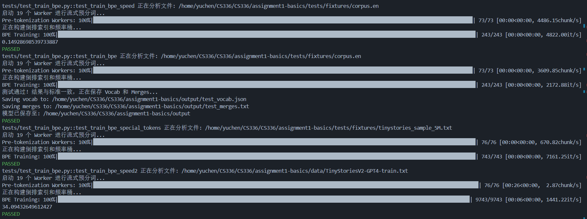
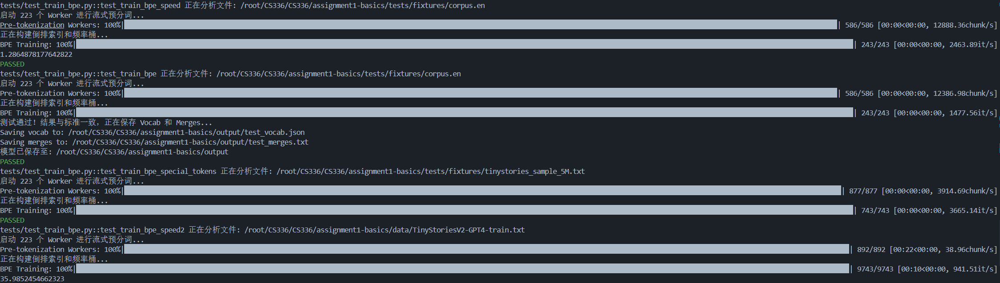
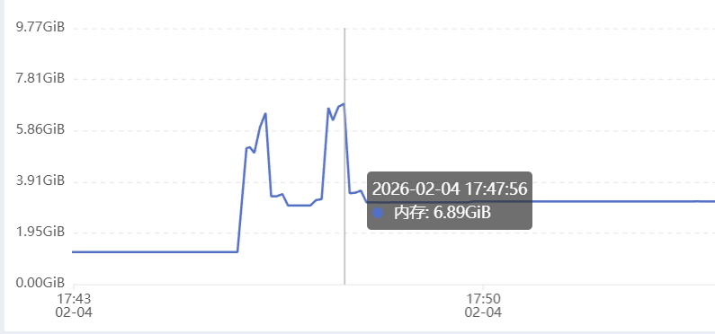
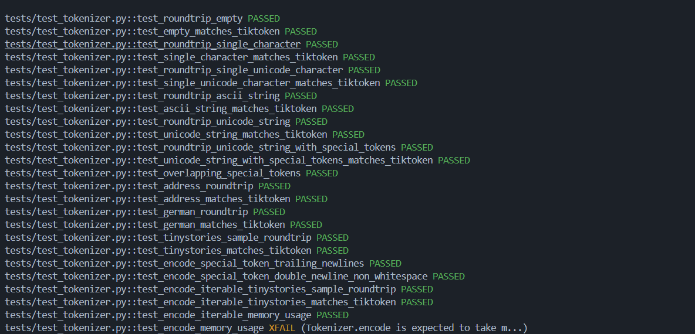

### 训练结果

#### 1.本地结果

首先是官方要求的三个test，我是用wsl Ubuntu-22.04环境环境，CPU为i7-13700H，全部通过，然后wsl环境下前三个测试如下

第一个时间官方要求最低时间**1.5s**，然后官方优化过的时间底线是**0.38s**，我的时间差不多是官方时间的二分之一，0.14-0.2s，然后对于TinyStoriesV2-GPT4-train.txt的时间，预分词时间27秒，但是构建倒排索引大概**6**秒，总时间34秒，远超官方优秀线。

##### 官方要求的三个测试用例

#### 2.V-GPU服务器测试结果

由于本人的电脑内存不够，跑tinystory内存可能会爆掉，因此我是用V-GPU服务器进行测试大内存，我将四个方案都跑了一遍。结果如下图

##### 时间结果展示

可以看到，前三个测试点都通过了，然后对于TinyStoriesV2-GPT4-train.txt将近一个G的语料，预分词大概**25秒**，分词仅仅用了**10秒**，总用时**36秒**。远远大于官方要求的30分钟及格线和2分钟的优秀线。

还有一个事实，可以看到服务器跑第一个结果比本地慢了十倍，我看到这个CPU是25 vCPU Intel(R) Xeon(R) Platinum 8481C。性能远不如我个人电脑的CPU，因此可以进行合理假设，如果我能用和我性能一致的CPU跑这个结果，速度也许会更快。不过由于本人电脑不大行，因此后面有机会我会在进行测试（**新电脑测试完毕，见本地结果**）。

##### 性能监控

可以看到，在进行tiny_story分词时，其最大内存占用量约为**6.89GB**，也远远低于官方要求的**30GB**，因此这个代码可以很好的作为BPE训练结果。

### 推理结果

推理结果测试如下，可以看到所有结果均成功。

由于测试代码直接连接的encode，因此并行编码目前还没有测试完全，后续会再增加tinystory与owt分词测试结果。
