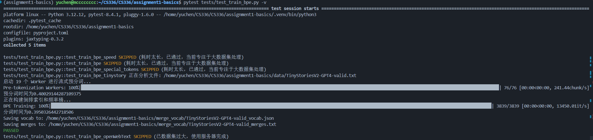
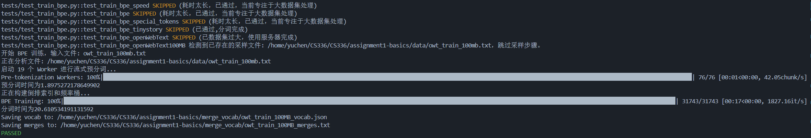
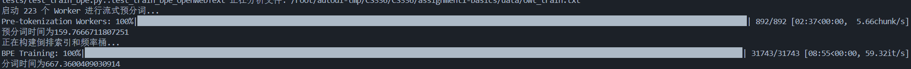
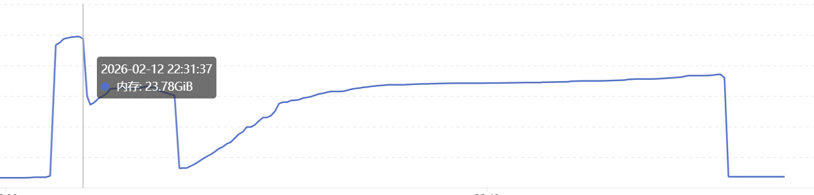
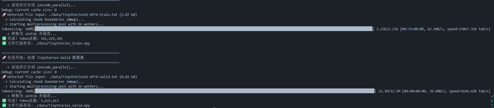
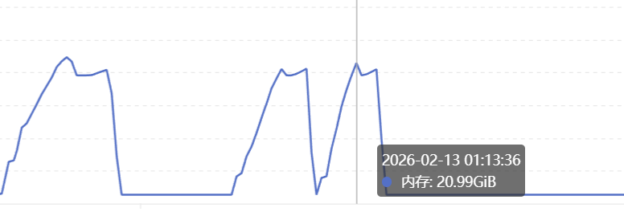

### 训练结果

#### 1.本地结果

首先是官方要求的三个test，我是用wsl Ubuntu-22.04环境环境，CPU为i7-13700H，全部通过，然后wsl环境下前三个测试如下

第一个时间官方要求最低时间**1.5s**，然后官方优化过的时间底线是**0.38s**，我的时间差不多是官方时间的二分之一，0.14-0.2s，然后对于TinyStoriesV2-GPT4-train.txt的时间，预分词时间27秒，但是构建倒排索引大概**6**秒，总时间34秒，远超官方优秀线。

##### 官方要求的三个测试用例

#### 2.V-GPU服务器测试结果

由于本人的电脑内存不够，跑tinystory内存可能会爆掉，因此我是用V-GPU服务器进行测试大内存，我将四个方案都跑了一遍。结果如下图

##### 时间结果展示

可以看到，前三个测试点都通过了，然后对于TinyStoriesV2-GPT4-train.txt将近一个G的语料，预分词大概**25秒**，分词仅仅用了**10秒**，总用时**36秒**。远远大于官方要求的30分钟及格线和2分钟的优秀线。

还有一个事实，可以看到服务器跑第一个结果比本地慢了十倍，我看到这个CPU是25 vCPU Intel(R) Xeon(R) Platinum 8481C。性能远不如我个人电脑的CPU，因此可以进行合理假设，如果我能用和我性能一致的CPU跑这个结果，速度也许会更快。不过由于本人电脑不大行，因此后面有机会我会在进行测试（**新电脑测试完毕，见本地结果**）。

##### 性能监控

可以看到，在进行tiny_story分词时，其最大内存占用量约为**6.89GB**，也远远低于官方要求的**30GB**，因此这个代码可以很好的作为BPE训练结果。

##### 时间结果展示

可以看到，前三个测试点都通过了，然后对于TinyStoriesV2-GPT4-train.txt将近一个G的语料，预分词大概**25秒**，分词仅仅用了**10秒**，总用时**36秒**。远远大于官方要求的30分钟及格线和2分钟的优秀线。

还有一个事实，可以看到服务器跑第一个结果比本地慢了十倍，我看到这个CPU是25 vCPU Intel(R) Xeon(R) Platinum 8481C。性能远不如我个人电脑的CPU，因此可以进行合理假设，如果我能用和我性能一致的CPU跑这个结果，速度也许会更快。不过由于本人电脑不大行，因此后面有机会我会在进行测试（**新电脑测试完毕，见本地结果**）。

##### 性能监控

可以看到，在进行tiny_story分词时，其最大内存占用量约为**6.89GB**，也远远低于官方要求的**30GB**，因此这个代码可以很好的作为BPE训练结果。

### 训练结果Tinystory_vaild(21MB)

小规模 (20MB) 进行了端到端测试。

| 数据集 (大小)                    | 目标词表 | 版本       | 预分词耗时 | BPE合并速度       | 总耗时    | 加速比      |
| -------------------------------- | -------- | ---------- | ---------- | ----------------- | --------- | ----------- |
| **TinyStories-valid **(21MB子集) | 4096     | 朴素版     | 6.18s      | 298merge/s        | 32.42s    | -           |
|                                  |          | **优化版** | **0.4s**   | **13450 merge/s** | **0.39s** | **~48.25x** |

### 训练结果OpenWebText(100MB)

在OWT数据集中随机取了100MB的数据集，进行分词，中规模数据集进行端到端测试。对于耗时过长的朴素版100M语料实验，采用了基于前 5% 进度的线性外推估算。

| 数据集 (大小)               | 目标词表 | 版本       | 预分词耗时 | BPE合并速度      | 总耗时    | 加速比    |
| --------------------------- | -------- | ---------- | ---------- | ---------------- | --------- | --------- |
| **OpenWebText** (100MB子集) | 32000    | 朴素版     | 30.02s     | ~7 merge/s       | > 1.2h*   | -         |
|                             |          | **优化版** | **1.89s**  | **1827 merge/s** | **20.6s** | **~210x** |

#### 训练结果OpenWebText(10GB)

训练时间8分55s，内存峰值23.78GB,官方要求时间小于12h，

### 推理结果

推理结果测试如下，可以看到所有结果均成功。

由于测试代码直接连接的encode，因此并行编码目前还没有测试完全，后续会再增加tinystory与owt分词测试结果。

### 推理结果

推理结果测试如下，可以看到所有结果均成功。

由于测试代码直接连接的encode，因此并行编码目前还没有测试完全，后续会再增加tinystory与owt分词测试结果。

#### 16进程tinystory与OWT推理测试结果

| 数据集文件                       | Token 总数    | 版本       | 总耗时 (秒) | 吞吐量 (k tokens/s) | 加速比 (相比朴素版) | 数据集大小 |
| -------------------------------- | ------------- | ---------- | ----------- | ------------------- | ------------------- | ---------- |
| **TinyStoriesV2-GPT4-train.txt** | 541,229,310   | 朴素版     | 219.56      | 2,494.62            | -                   | 2.23GB     |
|                                  |               | **优化版** | **35.21**   | **15067.31**        | **~6.05x**          |            |
|                                  |               |            |             |                     |                     |            |
| **TinyStoriesV2-GPT4-valid.txt** | 5,637,616     | 朴素版     | 4.84        | 1,142.19            | -                   | 21.46MB    |
|                                  |               | **优化版** | **0.64**    | **9144.42**         | **~8.01x**          |            |
|                                  |               |            |             |                     |                     |            |
| **owt_train.txt**                | 2,727,120,452 | 朴素版     | 2169.38     | 1246.46             | -                   |            |
|                                  |               | **优化版** | **212.79**  | **12843.05**        | **~10.3x**          | 11.10GB    |
|                                  |               |            |             |                     |                     |            |

这里有一个很有趣的现象，16个并行其实远小于服务器的可分割进程总量，但是测试223的速度不到16个的一半，目前猜测是**IPC通信过长，每个进程分配的内容太少，初始化时间过长，分词器开销远小于python进程管理开销**

其实这一点可以明白，进程数不是越多越好，而是要适合当前任务数量。
