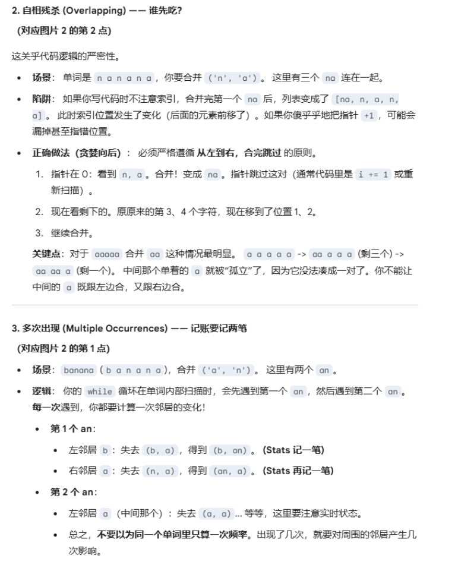

注：

1. 本BPE分词器有多种优化，大的优化（数据结构，缓存）标注我都会在标题中予以显示，红色字体标注：$\textcolor{Red}{倒排索引}$
2. 对于有些比较小的一些优化点（删除逻辑），我会使用橙色字体标注，用于一些细节问题,例如：$\textcolor{Orange}{merge优化}$


## 基本原理

### 第一阶段：训练过程 (Training)

这是构建词表（Vocabulary）和合并规则（Merge Rules）的过程。

#### 1. 准备语料库与预处理

首先，准备一段训练文本。通常会先进行简单的预分词（Pre-tokenization），比如按空格将句子切分成单词，并在每个单词末尾添加一个特殊符号（如 `</w>`），用来标识单词边界。

#### 2. 统计词频并拆分为字符

统计每个单词在语料库中出现的频率，并将单词拆分为基础字符序列。

**初始状态：** | 单词 | 频率 | 当前拆分 | | :--- | :--- | :--- | | hug | 10 | `h` `u` `g` `</w>` | | pug | 5 | `p` `u` `g` `</w>` | | pun | 12 | `p` `u` `n` `</w>` | | bun | 4 | `b` `u` `n` `</w>` | | hugs | 5 | `h` `u` `g` `s` `</w>` |

**基础词表：** `{h, u, g, p, n, b, s, </w>}`

#### 3. 统计字符对频率 (Pair Counting)

扫描所有单词，统计相邻字符对（Bi-gram）出现的总次数。

- `u` + `g` : 在 hug(10) + pug(5) + hugs(5) 中出现 -> **20次**
- `u` + `n` : 在 pun(12) + bun(4) 中出现 -> **16次**
- `h` + `u` : 在 hug(10) + hugs(5) 中出现 -> **15次**
- ...以此类推

#### 4. 合并最高频字符对 (Merge)

找到频率最高的字符对（这里是 `u` + `g` = 20次），将其合并为一个新符号 `ug`，并将这个合并操作记录到**合并规则表**中。

**合并后状态：** | 单词 | 频率 | 当前拆分 | | :--- | :--- | :--- | | hug | 10 | `h` `ug` `</w>` | | pug | 5 | `p` `ug` `</w>` | | pun | 12 | `p` `u` `n` `</w>` | | bun | 4 | `b` `u` `n` `</w>` | | hugs | 5 | `h` `ug` `s` `</w>` |

**更新基础词表：** `{h, u, g, p, n, b, s, </w>, ug}`

#### 5. 迭代 (Iteration)

重复步骤 3 和 4，直到达到预设的词表大小（Vocabulary Size）或合并次数。

- **下一轮统计：**
  - `u` + `n` : 16次 (最高)
  - `ug` + `</w>` : 15次
  - ...
- **下一轮合并：** 合并 `u` 和 `n` 为 `un`。

如此循环，直到词表构建完成。最终我们得到：

1. **词表 (Vocabulary)**：包含字符和合并后的子词。
2. **合并规则 (Merge Rules)**：记录了如 `(u, g) -> ug`, `(u, n) -> un` 的优先级顺序。

------

### 第二阶段：推理过程 (Inference/Tokenization)

当模型训练好后，面对一个新的句子（从未见过的文本），如何分词？

假设输入单词：**`bug`** （注意：`bug` 并不在最初的训练语料中）。

1. **字符拆分：** 先将单词拆分为字符序列：`b`, `u`, `g`, `</w>`。
2. **应用合并规则：** 按照训练阶段得到的合并规则顺序（优先级）进行扫描：
   - 规则表里有 `(u, g) -> ug` 吗？**有**。
   - 于是合并为：`b`, `ug`, `</w>`。
   - 规则表里有 `(b, ug)` 吗？**没有**。
   - 规则表里有 `(ug, </w>)` 吗？如果有则合并，没有则停止。
3. **输出结果：** 最终分词结果为 `["b", "ug", "</w>"]`。

**关键点：** 即使 `bug` 是生词（OOV），BPE 也能通过已知的子词 `b` 和 `ug` 将其表示出来，而不会变成 `<UNK>` (Unknown)。

### 关键点：

1. 注意：**训练阶段是生成merge（规则）与vocab（词 表）的**，而推理阶段是面对一个完全不认识的单词进行的一种推理**，按照merge（规则）与vocab（词 表）进行分词**。先使用merge进行分词合并，分词结束后使用vocab进行编号输出。
2. 根据表进行映射，就会有一**个以id为列表的大列表**，这样就可以进行训练了，这个是对原文进行映射的。

————————————————————————————————————————


## 数据结构：


### 训练阶段

注意，合并本身要针对的是元组，所以我们能要维护元组的每个合并对象，而不是针对每个词进行合并。

#### 词表 train_data

预分词以后统计各个词的数据结构，以一个嵌套对象列表的形式呈现：

##### 数据结构类型：List[Object]，对象列表

```
train_data = [
    WordObject(tokens=['h', 'u', 'g'], count=10), # ID 0
    WordObject(tokens=['p', 'u', 'g'], count=5)   # ID 1
]
```

##### 对应的操作

1.  用于标记每一个token的id，方便倒排索引找，

2.  count统计可以直接修改的时候把这个count加上，而不是一个一个的遍历，这样的化就减少的时间。
3.  注意，这个词表的id永远不会变化，仅仅是里面的列表可能会出现变化

##### $\textcolor{Orange}{数据结构优化}$

不使用字典查找，而是使用`__slots__` 优化 ：

**内存方面**

如果您使用字典（如 `{'tokens': [...], 'count': 10}`）来表示一个词对象，Python 需要为每个对象维护一个哈希表，内存开销大。使用 `__slots__` 后，`WordObject` 的内存布局类似于 C 结构体，**比字典节省约 60% 的内存**。虽然多存了一个 `id` (8字节)，但相比字典节省的开销，这是非常划算的。

**访问速度**

在 Python 中，访问 `obj.tokens`（属性访问）通常比 `obj['tokens']`（字典哈希查找）要快一点点。在数亿次循环中，这会有累积优势。

#### 训练结果vocab& merge

是作为BPE的最终产出，包括词表vocab与合并规则merges

##### 数据结构

**vocab: 字典，merges：元组列表List[trupe(byte,byte)]**

```
# merges.txt (或者在内存里的 list)
[
    ('u', 'g'),    # 第1步：看到 u 和 g 连着，必须先合并！
    ('u', 'n'),    # 第2步：...
    ('h', 'ug'),   # 第3步：看到 h 和 ug 连着，合并！
    ...
]
```

```
# vocab.json
{
    # --- 基础部分 (Base Vocab) ---
    "a": 0,
    "b": 1,
    ...
    "h": 7,
    "u": 20,
    "g": 6,
    ...
    
    # --- 训练出来的新部分 (Added Tokens) ---
    "ug": 256,   # 这是第1次合并产生的
    "un": 257,   # 这是第2次合并产生的
    "hug": 258   # 这是第3次合并产生的
}#注意，实现反了，题目要求是前面序号，后面二进制编码字符
{
    256: b'\xe4\xb8',  # Key是Int，Value是Bytes (打印出来像16进制)
    257: b'\xad'       # Key是Int，Value是Bytes
}
```

##### merges作用：

1. merge的顺序很重要，他是分词优先级，每读一条都要遍历一次，把这个规则进行执行。

2. merge在训练阶段是生成规则的，在推理阶段是利用阶段的


#### $\textcolor{Red}{倒排索引}$：

##### 数据结构：

Dict{ Tuple, Set}，用于存储每一个训练相邻组合的word词表 **defaultdict**

```
inverted_index = {
    ('u', 'g'): {0, 1, 5},  # ID 0, 1, 5 的单词里都有 ('u', 'g')
    ('h', 'u'): {0},        # 只有 ID 0 里有 ('h', 'u')
    ('n', 'a'): {2, 9}      # ID 2, 9 里有 ('n', 'a')
}
```

元组存储的是每一个**相邻词表的一个元组**，用于频率桶找到最后频率以后的词频进行快速定位，注意定位的是**词表**。

后面存的是一个集合，用于让他能够找到预分词后的各个去重单词的编号，

##### 实现方式

对于每一个合并，可以通过这种元组+集合的方式精准找到每一个单词，在后续便于合并。

##### 添加与修改

###### $\textcolor{Orange}{只增不减策略原因与解决方法:}$

1. 倒排索引遵循**只增不减**的基本原则。
2. 对一次合并操作，如果有很多个单词都包含这个组合，那么他这个组合的前后邻居势必也会出现变化，如果邻居很多，那么对他们前后邻居进行删减是一件十分困难的事情（一个前后邻居**不一定都会删完的**，因为可能有其他组和，比如u,g合并，前邻居是h,u，但是h,u后面可能是s，所以你只能删掉h,u,g有这个的组合，其他的你不能删），开销很大。
3. 如果我们执行了只增不减的策略，那我们下一次执行的时候可能会找到这个id,但是由于预训练词表里面已经没有这个组合了，通过一次判断可以确认他没有，代价比较小。
4. 对于数量较多判断，判断比删除速度快，因为每一次remove都要定位，通过查表做一次哈希运算，时间较长。
5. 频率表也会降低他的死链概率，因为会降掉他的值，让他频率降低。他在最后才可能进行执行。
6. **一次哈希删除可能比遍历一整个词消耗还大**

###### 增减执行方式

1. 首先通过频率表找到最大的一个元组，然后在倒排索引查找它对应的id，拿到对应的词表id名单。
2. 在里面进行扫描与更新，等每个词局部扫描更新完了以后，他会有一些新邻居的索引。对于减掉的你不用管。可以添加id（如果字典本身有这个元组），如果没有就需要添加那个字典的词频。

#### 频率表

它是最基础的数据源，记录了每个 Pair 在整个语料库中**当前的**总出现次数。

##### 数据结构：

Dict[Tuple[str, str], int] 对应每一个pair当前出现的总指数

```
stats = {
    ('u', 'g'): 10,   # 'ug' 出现了 10 次
    ('h', 'u'): 5,    # 'hu' 出现了 5 次
    ('n', 'a'): 8     # 'na' 出现了 8 次
}
```

##### 作用：

瞬间知道 `('u', 'g')` 现在有多少分。当你要把一个 Pair 从“桶”里移动时，你需要查这张表才知道它原来在哪个桶。

由于频率桶仅仅只能直到他抽出来本身的，所以需要频率表来快速定位他的**邻居节点的更新**

##### 添加与修改：

1. 对于常见的合并操作，邻居仅仅是减少了，而不是消失了，因此只需要直接对他的value，进行加1减1操作。
2. 对于那种选中为最佳组合的，需要把他全部合并，因此这个组合就已经消失了，需要对他进行删除
3. 当一个频率从n个值转为0以后，他也是需要删除的。

#### $\textcolor{Red}{频率桶}$：

##### 数据结构

Dict[int, Set[Tuple[str, str]]],存储每一个频率中 **defaultdict**

```
buckets = {
    10: { ('u', 'g') },           # 频率为 10 的只有它
    8:  { ('n', 'a'), ('x', 'y') }, # 频率为 8 的有两个
    5:  { ('h', 'u') }            # 频率为 5 的有一个
}

max_freq = 10  # 当前指针
```

##### 作用

这是为了**极速（O(1)）找到最大值**而设计的。如果只用频率表，每次找最大值都要遍历整个字典，速度太慢。

##### $\textcolor{Orange}{max指针}$

这个通常要结合max_freq指针。

1. 使用max指针的原因，_freq_buckets本质是一个哈希表，如果排序找的话很慢，但是这个合并词频是不可能增大的，因此可以用这个。
2. 这个指针始终指向当前的非空最大key
3. **在get_pair_max中更新，如果频率表空了，就把这个字典项删了，不再更新处进行更新**（**get_max_pair的次数不多，而update次数多，因此职能分离**）

##### $\textcolor{Orange}{不使用频率堆的原因：}$

1. 它们不支持高效的“修改任意元素的值”，对于最大的一个频率堆，你无法让他能够任意的修改到其他值，这样难以插入。

2. 代码逻辑里面要求对于相同频率的表

##### **单词合并逻辑**：双向链表逻辑

分词器最多只能找到自己的词进行合并，因此合并的时候通过倒排索引就可以查到token，在token里面遍历

更新逻辑：编写函数给出全局的变化量，需要移除什么，移除多少，需要添加什么，添加多少。

对于频率表，根据change表进行修改。新生的关系有一个表会记录这个集合，

对于倒排索引，在上面的更新逻辑会出现新的id，添加就可以（外层循环迭代，每次都更新），对于死掉的旧关系，其实可以不用删的，因为单词序号变化了，没有这个pair了，这样就可以直接掠过了。

##### 内部词表更新重复逻辑



### 推理阶段

#### vocab&merge

##### $\textcolor{Orange}{merge在推理阶段的优化:}$

如果每次都遍历的化，这样执行效率会很低，因此要对merge的结构进行转换，从列表转化为字典，表示如下：

```
# Key: Pair, Value: 它的优先级（越小越优先）
ranks = {
    ('u', 'g'): 1,    # 排名第 1
    ('h', 'ug'): 2,   # 排名第 2
    ('i', 'n'): 3,    # 排名第 3
    ...
}
```

这样的话，每次来到一个词，就可以根据这个词，**找到这个单词有什么组合**，然后根据这个组合去字典查询，如果**没有查到排名就是无限大**，如果查到就存一下排名，找到**最小的排名**，然后进行**合并**。

合并以后就有新的Pair组合了，接着循环，接着合并，直到什么都查不到了。

##### vocab作用

对应词表中每一个id，用于将merge完的词表转化为id序列

##### $\textcolor{Red}{cache缓存}$

###### 数据结构：

Dict[bytes, List[int]]

```
self.cache = {
    # Key (bytes): 正则切分出来的原始片段
    # Value (List[int]): BPE 分词后的 ID 列表
    
    # 1. 普通单词 (ASCII)
    b'High': [2159],
    b'est': [456],
    
    # 2. 中文/特殊字符 (UTF-8 编码后的 bytes)
    # 这里不需要存 "0xE4BDA0"，内存里存的就是 b'\xe4\xbd\xa0' (即 '你' 的 utf-8)
    b'\xe4\xbd\xa0': [20345],  # 假设 '你' 在词表里是一个整体
    
    # 3. OOV 生僻字 (Byte Fallback)
    # 假设有个生僻字对应 bytes 是 b'\xf0\x9f\x98\x80'，且没有合并规则
    b'\xf0\x9f\x98\x80': [240, 159, 152, 128]  # 缓存记住了：这个字要拆成4个基础字节ID
}
```

设置阈值为1,000,000

## 训练过程

### 预分词阶段


#### 训练阶段的预分词

1. 首先对text进行切分，处理特殊token ，如如 `<|endoftext|>`。使用 `re.split` 将文本按特殊 Token 切割，分别处理每一段 。

2. 正则切分进行预分词。使用标准GPT-2分词实现：

   ```
   # 文档中给出的 PAT 模式 (GPT-2 style)
   
   PAT = r"""'(?:[sdmt]|ll|ve|re)| ?\p{L}+| ?\p{N}+| ?[^\s\p{L}\p{N}]+|\s+(?!\S)|\s+"""
   ```

3. 对每一个字符都应该进行拆分，并转化为UTF-8字节序列。生成

4. 统计频率 生成train_data

   ```
   train_data = [
      {'origin': b'\xf0\xa0\xae\xb7',  # Python bytes (存储原始身份)
       'tokens': [240, 160, 174, 183],  # List[int] (用于后续计算)
       'count': 1}
       ...
   ]
   ```

5. 注意，对于其他其他可能多个字节出现在一块的不用担心，因为会通过merge拼回去。

   (**OOV问题的彻底解决**)

#### 倒排索引的初始化：

倒排索引的添加方式和添加频率表同时进行，同样是**defaultdict**。对于每一个索引，同时加入他的id号。

#### 频率表、频率桶的初始化

1. 需要train_data的产物，然后首先创建**频率表**，遍历整个单词，对频率表的字典进行加入或者累加
2. 生成频率桶，注意，频率桶的初始化是**defaultdict**，这样即使空了也不会报错，然后初始化指针。对频率表进行遍历，将每一个频率加入到他的set集合里面，并更新最大指针。

#### vocab&merge初始化

初始词表必须包含所有可能的 **256 个单字节**。

```
vocab = {i: bytes([i]) for i in range(256)}
```

Merges：刚开始什么都没有。就是一个{}

#### 推理阶段的预分词

| **阶段**              | **数据形态**                        | **说明**                           |
| --------------------- | ----------------------------------- | ---------------------------------- |
| **0. 原始输入**       | `"Hi world!"`                       | 原始字符串                         |
| **1. 正则预分词**     | `["Hi", " world", "!"]`             | 被正则切成了 3 个小块 (Pre-tokens) |
| **2. 转字节 (UTF-8)** | `[ [72, 105], [32, 119...], [33] ]` | 变成了 3 个独立的**整数列表**      |
| **3. BPE 查表合并**   | `[ [Hi_id], [world_id], [!_id] ]`   | 对这 3 个列表**分别**循环执行合并  |
| **4. 最终输出**       | `[Hi_id, world_id, !_id]`           | 拼成最终的 Token ID 序列           |

#### $\textcolor{Red}{预分词的高效并行处理}$

##### 内存友好的正则匹配 (`Iterator Optimization`)

- **手段**：在 `_process_chunk_worker` 中，强制使用 `re.finditer` 而非 `re.findall`。

- **解析**：

  - 作业明确指出，直接存储所有预分词后的单词列表会消耗大量内存 。

    

    

  - 通过 `finditer` 返回迭代器，配合生成器（Generator）逐个处理 Token 并更新局部频率表，避免了一次性在内存中构建巨大的字符串列表 (`List[str]`)，显著降低峰值内存占用。

##### 特殊 Token 的严格隔离 (`Special Token Isolation`)

- **手段**：在正则预分词之前，先利用特殊 Token（如 `<|endoftext|>`）将文本物理切断。

- **解析**：

  - 

    **防止跨文档合并**：作业要求必须在特殊 Token 处进行切分，确保 BPE 合并操作（Merge）永远不会跨越文档边界（即不跨越 `<|endoftext|>`） 。

    

    

  - 

    **预处理顺序**：必须在应用 GPT-2 正则模式（`re.finditer`）之前，先剔除或切分特殊 Token 。如果不这样做，正则表达式可能会错误地将特殊 Token 的一部分与普通文本粘连，导致特殊 Token 被“吃掉”或破坏。

    

    

##### 基于内存映射的文件读取 (`Memory-Mapped I/O`)

- **手段**：对于超大语料库（无法一次性载入 RAM），主进程使用 `mmap` 或文件指针 `seek` 定位，子进程只读取属于自己的字节范围。

- **解析**：

  - 作业提示在处理大数据集时（如 OpenWebText），应避免将整个文件读入内存 。

    

    

  - 通过计算好的 Chunk 边界（`boundaries`），子进程可以直接从磁盘读取特定片段，仅在局部内存中处理该片段的数据，从而实现对 TB 级数据的恒定内存复杂度处理 。

    

    

##### Map-Reduce 归约策略 (`Frequency Aggregation`)

- **手段**：主进程负责汇总（Reduce）各个 Worker 返回的局部 `Counter`。
- **解析**：
  - 子进程不返回原始 Token 列表，而是返回 `Dict[bytes, int]`（局部词频表）。
  - 主进程将所有子进程的词频相加，生成全局的 `train_data`。这不仅减少了进程间通信（IPC）的数据量，也直接为后续的 BPE 训练准备好了去重后的数据源 。


### 训练阶段

#### 1，频率表抽调

##### 目标

这一步的主要目标就是找到最大候选pair。这里面涉及了**多个频率相同的最大元组问题**和**max指针的更新问题**。后面将会详细说明。

##### 步骤

1. 首先是对max指针的判断，对于当下的max指针，判断此时的频率桶set集合的长度是否为0，如果为0，则需要减1，
2. 在这个桶的set里面,比较字典序列最大的那个，其实就是使用set的max就可以
3. 取出来以后，需要立刻将他从**频率桶剔除**。同时，**频率表也应该剔除**
4. merge要加入这个元组。
5. 将合并的词表加入到一个新的id里面去：vocab[new_id] = new_token_bytes

#### 2.定位

##### 步骤

1. 然后通过这个取出来的元组，去找倒排索引的id，得到这个set。
2. 安全性检查：就是说的那个只增不减策略的if策略。
3. 虽然只增不减，但是这个合并的这个删除比较简单（**因为会把整个key:value删去，而不是删除里面set集合部分id**），没有必要了，删除可以释放大量内存。

#### 3.单词内部操作

**注意，不是处理完所有单词才有操作，而是每次处理完一个单词都要进行一次更新操作**

##### 步骤

1. 从左到右进行扫描，找到第一个位置合并，然后对其左右邻居进行记录（**减少**），记录到remove列表中。然后接着往后扫描，直到扫描完成。此时新的列表页合并完成了。

   **旧列表**：`['h', 'u', 'g', 'h', 'u', 'g']`

   **新列表**：`['h', 'ug', 'h', 'ug']`

2. 然后开始执行新列表的合并，找到合并后项的左右邻居（**注意要去重，从左向右扫描就可以**）记录新的增加次数，记录到add列表中。

##### **特殊情况**

1.bnanana：

我们要看看哪些旧邻居关系被打断了。注意：我们是盯着**原始列表**看的。

- **第 1 个 `na` (位置 1,2)**：

  - 左邻居 `b` (0) + 自己 `n` (1) $\rightarrow$ `('b', 'n')` 断裂。
  - 自己 `a` (2) + 右邻居 `n` (3) $\rightarrow$ `('a', 'n')` 断裂。

- **第 2 个 `na` (位置 3,4)**：

  - 左邻居 `a` (2) + 自己 `n` (3) $\rightarrow$ `('a', 'n')` 断裂。但是前面断了，不算
  - 自己 `a` (4) + 右邻居 `n` (5) $\rightarrow$ `('a', 'n')` 断裂。

- **第 3 个 `na` (位置 5,6)**：

  - 左邻居 `a` (4) + 自己 `n` (5) $\rightarrow$ `('a', 'n')` 断裂。但是前面断了，不算
  - 右边没人了。

  统计**Removed**：`('b', 'n')`: -1  `('a', 'n')`: -2

  然后物理合并为变成：`['b', 'na', 'na', 'na']`

盯着**新列表**看。

- **第 1 个 `na`**：左边是 `b`，右边是 `na` $\rightarrow$ 增加 `('b', 'na')` 和 `('na', 'na')`。
- **第 2 个 `na`**：左边是 `na`，右边是 `na` $\rightarrow$ 增加 `('na', 'na')` 和 `('na', 'na')`。
- **第 3 个 `na`**：左边是 `na`，右边没人 $\rightarrow$ 增加 `('na', 'na')`。
- **统计 Added**：`('b', 'na')`: +1  `('na', 'na')`: +2
- 左右不能重复统计，因此下面的算法才是正确的

2.aaaaa

输入是 **`"aaaaa"`** (5个 a)，你要合并 **`('a', 'a')`**。

###### BPE 铁律：从左向右，贪婪匹配：

一旦前面的字符被用掉了，后面的就不能再用它了。

**原始状态**： `0:a`, `1:a`, `2:a`, `3:a`, `4:a`

**扫描过程**：

1. **检查索引 0, 1**：是 `a, a` 吗？**是**。
   - 锁定这两个。标记为“待合并”。
   - 指针跳过这两个，直接跳到索引 2。就是使用i+2实现
2. **检查索引 2, 3**：是 `a, a` 吗？**是**。
   - 锁定这两个。标记为“待合并”。
   - 指针跳过这两个，跳到索引 4。
3. **检查索引 4**：后面没有了。结束。

**合并结果**： `['aa', 'aa', 'a']` *(注意：中间那个 a 被前面的抢走了，后面的又不够凑一对，所以第 3 个 a 落单了)*

##### 实现方式

上面的所有实现都是基于i的跳转来实现的，具体遵循下面的要求：

使用new_tokens = [] 存储新列表

1. 算旧账 (Removed)
2. 这里的逻辑要小心处理 i-1 和 i+2    # 如果 i > 0: 记录 (tokens[i-1], tokens[i]) 移除            # 如果 i+2 < len: 记录 (tokens[i+1], tokens[i+2]) 移除
3. **注意，这个可能会出现多删得情况，左侧无所谓，右侧要要判断他得前瞻是不是下一个合并点，如果是下一个合并点，那么就不能移除。**
4. 算新帐：
   左边关系在处理pair的时候进行添加，添加newtoken的最后一个元素和后面的元素。右边的元素没有进入循环，因此可以不用管。然后把这个新字符加入字典里面。
5. 如果是一个老字母，就可以直接加入新列表，并且如果他最后一个是合并列表，则仍旧需要加入add，其他的就不用添加add

#### 4.更新方案

更新三个数据库：**频率表 (Stats)**、**频率桶 (Buckets)** 和 **倒排索引 (Index)**

**删除**

更新频率表：首先找到其原来的频率，然后减掉，如果为0则需要删掉这个key。

更新频率桶：通过他原来的标签找到原来频率，搬到新的桶。

更新倒排索引：可以不做。

**添加**

更新频率表：查一下这个频率表是否有，有就添加，没有就删除。

更新频率桶：通过他原来的标签找到原来频率，搬到新的桶。如果为0就删掉

更新倒排索引：添加这个索引名单的id。

### 推理阶段

##### $\textcolor{Orange}{merge结构在推理阶段的优化:}$

如果每次都遍历的化，这样执行效率会很低，因此要对merge的结构进行转换，从列表转化为字典，表示如下：

```
# Key: Pair, Value: 它的优先级（越小越优先）
ranks = {
    ('u', 'g'): 1,    # 排名第 1
    ('h', 'ug'): 2,   # 排名第 2
    ('i', 'n'): 3,    # 排名第 3
    ...
}
```

这样的话，每次来到一个词，就可以根据这个词，**找到这个单词有什么组合**，然后根据这个组合去字典查询，如果**没有查到排名就是无限大**，如果查到就存一下排名，找到**最小的排名**，然后进行**合并**。

合并以后就有新的Pair组合了，接着循环，接着合并，直到什么都查不到了。

此时时间复杂度为O(L),L为词的长度。


##### $\textcolor{Orange}{merge过程的堆优化}$

原有的合并方式需要遍历整个单词，效率较低，因此采用堆排序的形式进行取，由于取得是排名最小的，因此我们构建一个**最小堆**。

首先是堆的基本操作。对于堆的插入，将他用数组的方式插入到最后一位，然后根据推“父节点必须小于子节点”的规则。，进行上浮。

堆的删除操作只能**删除最顶部的元素**，然后把最末尾的元素弄到堆顶，然后进行下沉。（中间的元素他是找不到的，基本等于无法删除，找到了也是O(n)）

###### 具体操作

基于原始token扫描相邻对，入堆结构：(Rank=1, Start_Idx=1)

（注意：这个堆是一个元组，先插入最末尾，然后比较rank,rank相同比较Index。取出来就 仅仅操作一次）

然后根据这个结构，像后面加入索引，然后并修改指针，加入新邻居左堆与右堆。

后面接着添加，接着指向新的指针，直到全部遍历完。

最后的token就是找到 `prev_pos` 为 `-1` 的节点 索引，使用next_pos循环，查询词表进行映射，直到到next_pos[i]=-1。

快速找到头节点的方式：

1. 初始的时候，头节点head为0。
2. 如果头节点为left_Index的话，说明新的头节点就是我们新产生的节点。此时head_idx要更新。
3. 一直循环，只要left_index=head_index就更新，这样就可以直接取了。


##### $\textcolor{Orange}{懒惰删除的链表策略}$


上述堆的删除很麻烦，为了能够不找到一个失败的Pair,需要标记一个真是的邻居关系，这样才能判断这个pair是否存在。

双向链表本身也是为了解决 Python 列表（数组）操作慢的问题。

- **数组的痛点**：在列表 `['b', 'u', 'g']` 中，如果合并 `u` 和 `g` 变成 `['b', 'ug']`，你需要把 `g` 删掉，这会导致 `g` 后面所有的元素向前移动（Memory Shift），复杂度是 $O(L)$。

链表移动元素只需要严格的O(1)复杂度。

###### 结构方法

使用三个列表：

```
# 索引:      0    1    2
tokens   = ['h', 'u', 'g']
next_pos = [ 1,   2,  -1 ]  # h->u, u->g, g->End
prev_pos = [-1,   0,   1 ]  # Start<-h, h<-u, u<-g
```

定义三个列表，分别对应 token next_pos,prev_pos。

后面的**token仅仅时通过next_pos进行，与token本身列表无关**

当决定执行合并索引1与索引2时，执行append，将其加入到最后面。

对next_pos与prev_pos进行添加，前驱是1的前驱编号，后继是2的后记编号。

然后修改指针，将h指向ug，首先就是将h->next进行修改为现在添加的编号。然后将他的后继编号连接到3.进行修改。

###### 特殊情况的合并过程：


**bnanana：**


预先训练的词典：

`('n', 'a')`: **Rank 1** (最高优)

`('a', 'a')`: **Rank 2**

`('b', 'na')`: **Rank 3**

`('na', 'na')`: **Rank 4**

初始化：

```
tokens = ['b', 'n', 'a', 'n', 'a', 'n', 'a']
next   = [ 1,   2,   3,   4,   5,   6,  -1 ]
prev   = [-1,   0,   1,   2,   3,   4,   5 ]
```

2. **第一轮合并**

**Pop**: `(1, 1)` -> 处理索引 **1** 和 **2** (`n`, `a`)。 **Check**: 有效（链表结构正常）。

**Action**:

1. **Append**: `tokens` 加 `'na'` (索引 7)。
2. **Relink**:
   - 让 `0(b)` 的 next 指向 `7(na)`。
   - 让 `3(n)` 的 prev 指向 `7(na)`。
   - (索引 1, 2 被跳过)。

**Push Neighbors**:

- 检查左邻居 `0(b)` + `7(na)` -> `('b', 'na')` -> **Rank 3**。入堆 `(3, 0)`。
- 检查右邻居 `7(na)` + `3(n)` -> 无 Rank。

**Heap 状态**：`[(1, 3), (1, 5), (3, 0)]`

3. **第二轮合并**

**Pop**: `(1, 3)` -> 处理索引 **3** 和 **4** (`n`, `a`)。 **Check**: 有效。虽然 `3` 的左邻居变了（变成 7），但 `3` 本身还没被吃掉。

**Action**:

1. **Append**: `tokens` 加 `'na'` (索引 8)。
2. **Relink**:
   - 让 `7(na)` 的 next 指向 `8(na)`。
   - 让 `5(n)` 的 prev 指向 `8(na)`。
   - (索引 3, 4 被跳过)。

**Push Neighbors**:

- 检查左邻居 `7(na)` + `8(na)` -> `('na', 'na')` -> **Rank 4**。入堆 `(4, 7)`。
- 检查右邻居 `8(na)` + `5(n)` -> 无 Rank。

**Heap 状态**：`[(1, 5), (3, 0), (4, 7)]`

4. **第三轮合并**

**Pop**: `(1, 5)` -> 处理索引 **5** 和 **6** (`n`, `a`)。 **Check**: 有效。

**Action**:

1. **Append**: `tokens` 加 `'na'` (索引 9)。
2. **Relink**:
   - 让 `8(na)` 的 next 指向 `9(na)`。
   - 让 `End` 的 prev 指向 `9(na)`。

**Push Neighbors**:

- 检查左邻居 `8(na)` + `9(na)` -> `('na', 'na')` -> **Rank 4**。入堆 `(4, 8)`。

**Heap 状态**：`[(3, 0), (4, 7), (4, 8)]`

5. **后续合并**

- Pop `(3, 0)` -> 合并 `b`+`na` -> `bna`。
- Pop `(4, 7)` -> 合并 `na`+`na` -> `nana`。
- ...依此类推。


**aaaaa：**


这是最能体现 **Lazy Delete** 的例子。 输入：`['a', 'a', 'a', 'a', 'a']` 索引：`0, 1, 2, 3, 4`

**1. 初始化**

所有相邻对都是 `('a', 'a')`，Rank 为 2。 **Heap 状态**：`[(2, 0), (2, 1), (2, 2), (2, 3)]`

**2. 第一轮合并**

**Pop**: `(2, 0)` -> 处理索引 **0** 和 **1**。 **Check**: 有效。 **Action**:

- 生成 `'aa'` (索引 5)。
- 链表变为：`Start <-> 5(aa) <-> 2(a) <-> 3(a) <-> 4(a)`。
- (索引 0, 1 失效)。

**Push Neighbors**:

- 右邻居 `5(aa)` + `2(a)` -> 假设无 Rank。

**Heap 状态**：`[(2, 1), (2, 2), (2, 3)]` (原来的堆里还有这三个)

**3. 第二轮 (关键！冲突检测)**

**Pop**: `(2, 1)` -> 试图合并索引 **1** 和 **2**。 **Check (验证有效性)**:

- 当前堆元素说：开始节点是 `1`。
- **查链表**：
  - 看看 `1` 的 `next` 是谁？是 `2` (物理数组里记录的还是旧值)。
  - 看看 `2` 的 `prev` 是谁？是 **5** (因为上一轮合并把 2 的前任改成了 5)。
  - **判定**：`prev[next[1]] != 1` (即 `5 != 1`)。
  - **结论**：节点 1 已经被跳过/删除了，这个 Pair 失效！
- **Action**: **Continue (直接丢弃，不做任何操作)**。

**Heap 状态**：`[(2, 2), (2, 3)]`

**4. 第三轮**

**Pop**: `(2, 2)` -> 处理索引 **2** 和 **3**。 **Check**:

- `2` 的 `prev` 是 5 (有效，2 是上一轮合并的右邻居，幸存者)。
- `3` 的 `prev` 是 2。
- **判定**：有效。 **Action**:
- 生成 `'aa'` (索引 6)。
- 链表变为：`5(aa) <-> 6(aa) <-> 4(a)`。
- (索引 2, 3 失效)。

**Push Neighbors**:

- 左邻居 `5(aa)` + `6(aa)` -> Rank 4。入堆 `(4, 5)`。

**Heap 状态**：`[(2, 3), (4, 5)]`

**5. 第四轮 (再次冲突)**

**Pop**: `(2, 3)` -> 试图合并索引 **3** 和 **4**。 **Check**:

- `3` 的 `next` 是 4。
- `4` 的 `prev` 是 **6** (上一轮改的)。
- **判定**：`6 != 3`。失效！
- **Action**: **Continue (丢弃)**。

**最终结果**

链表状态：`aa(5) -> aa(6) -> a(4)` 也就是：`aa`, `aa`, `a`。
