[](README.md)   

# CS336 作业 1：从零构建 Transformer 语言模型

本项目实现了一个 GPT 风格的 Decoder-only Transformer 语言模型，使用 PyTorch 原生构建（避免使用 `nn.Transformer` 等封装模块）。该项目旨在探索大语言模型（LLM）架构的演变，通过对比 2017 年最初的 Transformer 设计与现代 Llama 风格的改进。

# 模块核心实验

- **分词器**：分词器分为两大模块，包括分词器训练模块与分词器推理模块。在 TinyStories/OpenWebText 数据集上训练的自定义字节对编码（BPE）分词器。

- **模型架构**：
  - **现代组件**：包括llama架构的ROPE(旋转位置编码)，Pre-Norm架构， RMSNorm,与SwiGLU 激活函数。
  - **传统支持**：可配置支持绝对可学习位置编码/正余弦位置编码、LayerNorm 和 ReLU，最后就是Post-Norm架构。
  - **优化**：自定义实现的 `AdamW` 优化器和带有数值稳定性技巧的交叉熵损失函数（Cross-Entropy Loss）。
  
  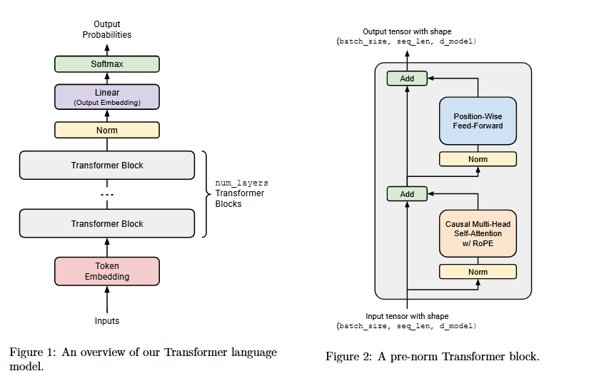


# 基础设施(BPE)效率测试

本次实验实现并对比了朴素版（Naive）与优化版（Fast）两套 BPE 。两者在算法设计上存在根本差异，并体现于训练时的合并策略与编码时的推断效率上。

##### 环境

- **小规模数据集**：Inter i7-13700H, 使用19进程，16GB RAM ， ubuntu22.04
- **大规模数据集：**25 vCPU Intel(R) Xeon(R) Platinum 8481C，使用16进程， 90GB RAM .  ubuntu22.04

#### 1. 分词器训练阶段

- **朴素版实现**

  - **串行预分词**：使用单进程进行正则匹配与统计，受限于 Python GIL，无法利用多核性能。
  - **全量扫描与更新**：在每一轮 Merge 中，算法需要遍历整个 `pair_counts` 寻找最高频对（$O(|P|)$），确定合并对后，又需**遍历整个词表**（Vocabulary）来定位并更新包含该 Pair 的单词。这种双重遍历导致复杂度随词表与 Merge 数量线性增长，效率极低。

- **优化版实现**：

  - **并行预分词**：引入 `multiprocessing` 模块与 Map-Reduce 策略，利用多个 Worker 并行处理文件切片。并使用`findall` 进行迭代式正则匹配，并行速度提升。

  - **核心数据结构优化 (Data Structures)：**

    - **构建 倒排索引 (`inverted_index`)：** 维护 `Pair -> Set[WordID]` 的映射。采用“**只增不减**”的懒惰删除策略，避免高昂的哈希删除开销，实现快速定位受影响的单词。
    - **引入 频率桶 (`buckets`)：** 配合 `max_freq` 指针，动态维护 `Frequency -> Set[Pair]` 的集合。将“寻找最高频合并对”的时间复杂度从遍历全表的 $O(N)$ 降低至严格的 $O(1)$。
    - **对象内存优化 (`__slots__`)：** 训练数据 `train_data` 中的 `WordObject` 使用 `__slots__` 替代默认字典，相比普通对象节省约 60% 内存。

    **高效合并循环 (Efficient Merge Loop)：**

    - **定位与抽取：** 利用频率桶 $O(1)$ 取出最佳 Pair，并通过倒排索引快速锁定包含该 Pair 的所有单词 ID。
    - **局部差分更新：** 在单词内部进行扫描，计算合并产生的“移除关系”（旧邻居）与“新增关系”（新邻居），仅对变化的局部频率进行全局 `stats` 和 `buckets` 的更新，而非全量重算。

  

**耗时测试**

分别在小规模 (10MB) 和中规模 (100MB) 数据集上进行了端到端测试。

**小规模 (20MB) 进行了端到端测试。**

| 数据集 (大小)                    | 目标词表 | 版本       | 预分词耗时 | BPE合并速度       | 总耗时    | 加速比      |
| -------------------------------- | -------- | ---------- | ---------- | ----------------- | --------- | ----------- |
| **TinyStories-valid **(21MB子集) | 4096     | 朴素版     | 6.18s      | 298merge/s        | 32.42s    | -           |
|                                  |          | **优化版** | **0.4s**   | **13450 merge/s** | **0.39s** | **~48.25x** |

**在OWT数据集中随机取了100MB的数据集，进行分词，**中规模数据集进行端到端测试。对于耗时过长的朴素版100M语料实验，采用了基于前 5% 进度的线性外推估算。

| 数据集 (大小)               | 目标词表 | 版本       | 预分词耗时 | BPE合并速度      | 总耗时    | 加速比    |
| --------------------------- | -------- | ---------- | ---------- | ---------------- | --------- | --------- |
| **OpenWebText** (100MB子集) | 32000    | 朴素版     | 30.02s     | ~7 merge/s       | > 1.2h*   | -         |
|                             |          | **优化版** | **1.89s**  | **1827 merge/s** | **20.6s** | **~210x** |

> \* *注：OpenWebText 朴素版总耗时基于 7 merge/s 的平均速度进行估算。

##### **性能加速分析**

**预分词加速 (Pre-tokenization Acceleration):**

- **数据表现：** 在 100MB 数据集上，耗时从 30.02s 降低至 1.89s，实现了约 **16x** 的加速。
- **核心原因：** 得益于 `multiprocessing` 多进程并行处理与正则引擎优化（如使用 `re.finditer`），突破了 Python 的 GIL 限制与单线程 I/O 瓶颈。

**合并算法优化 (Merge Algorithm Optimization):**

- **数据表现：**
  - **小规模 (20MB)：** 合并速度从 298 merge/s 提升至 **13450 merge/s**。
  - **中规模 (100MB)：** 合并速度从极低的 ~7 merge/s 飙升至 **1827 merge/s**，原本预计需 1.2 小时的任务仅需 20.6 秒完成。
- **核心原因：**
  - **倒排索引 (`inverted_index`)：** 将寻找待合并单词的时间复杂度从全量扫描的 $O(N)$ 降低为 $O(1)$ 的查表操作。
  - **频率桶 (`buckets`)：** 避免了每次合并后重新排序寻找最高频 Pair，实现了 $O(1)$ 获取最佳合并项。
  - **局部更新：** 仅对受合并影响的“邻居”进行频率更新，而非全局重算。

**整体规模扩展性 (Scalability):**

- **数据表现：** 随着数据量增加（10MB -> 100MB），朴素版的性能急剧下降（加速比从 ~48x 扩大到 **~210x**）。
- **结论：** 优化版算法在处理大规模语料时具有极高的稳定性，有效解决了朴素版 BPE 随词表和语料增大而出现的指数级性能衰减问题。

##### 大数据集端到端测试

训练语料: TinyStoriesV2-GPT4-train.txt (59933个不同单词/预分词片段)

词表大小: 10000

运行时长：预分词**25s**，merge时间**10s**，内存占用峰值**6.89GB**. (官方预期<30min, <30GB RAM)

训练语料: owt_train.txt  (6601892个不同单词/预分词片段)

词表大小: 32000

运行时长：预分词**2m37s**，merge时间**8m55s**，内存占用峰值**23.78GB**. (官方预期<12hours , <100GB RAM)

#### 2.编码阶段

编码是将新文本转化为 Token ID 的过程，需根据 Merge 规则不断合并字符。

- **朴素版实现:**
  - 对每个单词的字符序列，通过循环反复遍历当前所有可能的相邻 Pair，比对优先级并执行合并。对于长文本或高频词，这种重复计算存在大量冗余。
- **优化版实现：编码阶段 (Inference/Encoding Phase)**
  - **数据结构优化 (Data Structures):**
    - **Merge 规则哈希化 (`ranks`):** 将合并规则从列表转换为字典 `ranks` ({Pair: Rank})。这使得查询任意字符对优先级的操作从遍历列表的 $O(N)$ 降低至 $O(1)$。
    - **全局缓存 (`cache`):** 引入 `Dict[bytes, List[int]]` 缓存常见单词或 UTF-8 片段的分词结果（如常见词 "High" 或中文字符），对重复出现的文本直接查表返回，跳过计算。
  - **算法逻辑优化 (Algorithm Optimization):**
    - **堆优化 (Heap Optimization):**
      - 使用**最小堆**维护当前文本中所有相邻字符对的 `(Rank, Start_Index)`。每次仅需 $O(1)$ 取出优先级最高的合并对，无需重复扫描整个序列。
    - **双向链表与懒惰删除 (Doubly Linked List & Lazy Deletion):**
      - **结构设计：** 使用 `next_pos` 和 `prev_pos` 数组模拟双向链表，管理 Token 之间的邻接关系。
      - **懒惰删除：** 合并发生时，仅修改前后节点的指针（$O(1)$）来“跳过”被合并的节点，而非在数组中物理删除元素（避免了 $O(L)$ 的内存移动开销）。
      - **有效性检查：** 从堆中取出候选项时，通过链表指针验证其邻居关系是否依然存在（`prev[next[i]] == i`），从而忽略因由于周边合并而失效的“脏”数据。
  - **底层执行优化 (Execution Optimization):**
    - **ID 驱动处理 (ID-Level Processing):**
      - 摒弃低效的字节/字符串拼接操作。预先构建 `(ID1, ID2) -> NewID` 的整数映射表，使推理循环完全在整数层面运行，消除了对象创建与哈希计算的开销。

##### 吞吐量测试

| 数据集文件                       | Token 总数    | 版本       | 总耗时 (秒) | 吞吐量 (k tokens/s) | 加速比 (相比朴素版) | 数据集大小 |
| -------------------------------- | ------------- | ---------- | ----------- | ------------------- | ------------------- | ---------- |
| **TinyStoriesV2-GPT4-train.txt** | 541,229,310   | 朴素版     | 219.56      | 2,494.62            | -                   | 2.23GB     |
|                                  |               | **优化版** | **35.21**   | **15067.31**        | **~6.05x**          |            |
|                                  |               |            |             |                     |                     |            |
| **TinyStoriesV2-GPT4-valid.txt** | 5,637,616     | 朴素版     | 4.84        | 1,142.19            | -                   | 21.46MB    |
|                                  |               | **优化版** | **0.64**    | **9144.42**         | **~8.01x**          |            |
|                                  |               |            |             |                     |                     |            |
| **owt_train.txt**                | 2,727,120,452 | 朴素版     | 2169.38     | 1246.46             | -                   |            |
|                                  |               | **优化版** | **212.79**  | **12843.05**        | **~10.3x**          | 11.10GB    |
|                                  |               |            |             |                     |                     |            |


# 消融实验洞察

在 OpenWebText数据集上基于Transformer架构进行了多个消融实验，以理解现代架构选择的必要性和优势。

### 实验基准设置

为了确保对比的公平性，所有消融实验均基于以下基准超参数进行（除非特定实验中另有说明）：

- **数据集**: OpenWebText (subset)
- **模型规模**: ~8M 参数
  - $d_{model}$=256,  $n_{layers}$=4,  $n_{heads}$=4
- **训练配置**:
  - Context Length: 256 Max Steps: 40,000
  - Batch Size: 64
  - Weight_Tying: True
  - Max Learning Rate: 3e-4
  - Min Learning Rate: 3e-5

### Llama架构与Vanilla架构演进分析

Transformer 架构自 2017 年提出以来，经历了从原始设计（Vanilla）到现代主流（Modern, e.g., Llama）的显著演进。为了直观地展示这种演进的价值，我们首先对比了完全体的“现代架构”与“原始架构”在小参数下的性能：

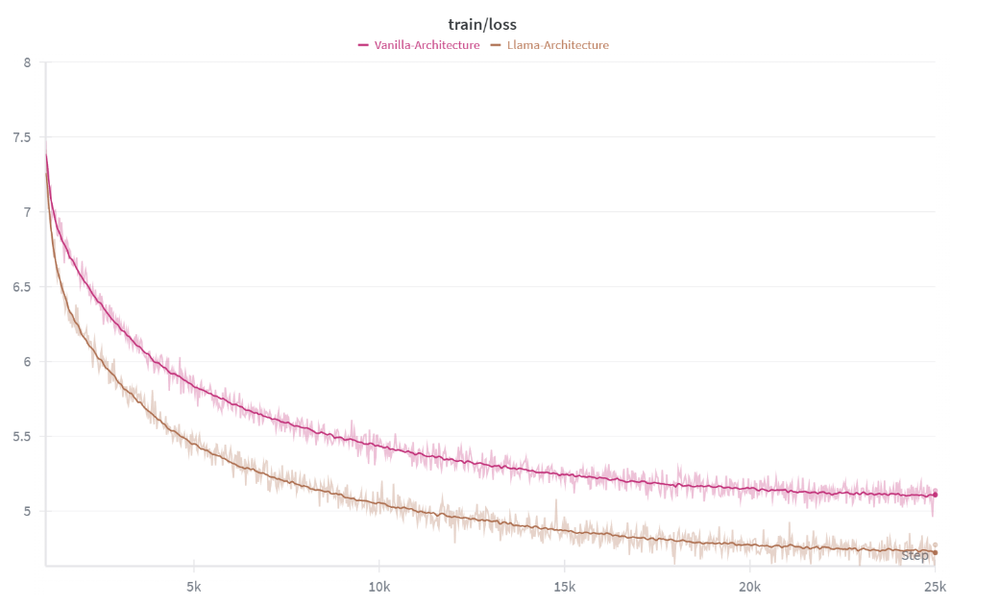

因为训练初期的 Loss 剧烈下降（Warmup 阶段）通常只是模型在适应词表的统计分布，这种“断崖式下跌”会拉伸 Y 轴，从而在视觉上掩盖模型架构之间的真实差距；**只有截取 1000 步以后并聚焦于低 Loss 区间（如 <10），才能过滤掉“起步噪音”，从而精准地暴露出不同架构在“最终收敛精度”（决定模型上限）和“训练稳定性”上的本质鸿沟**。

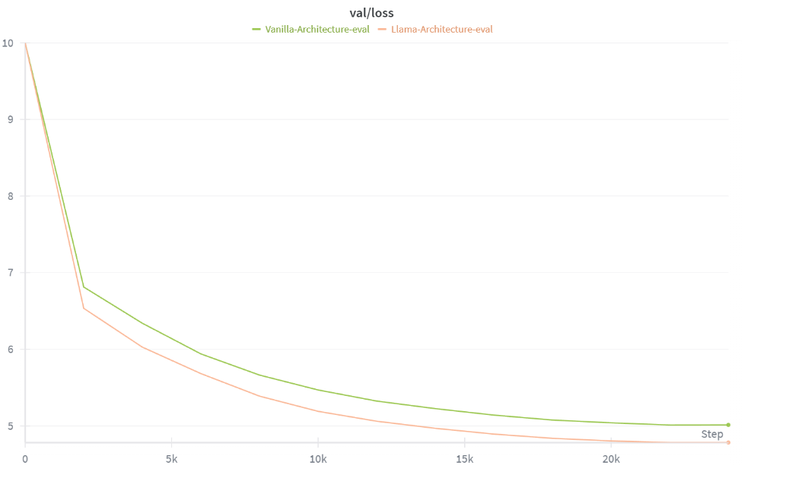

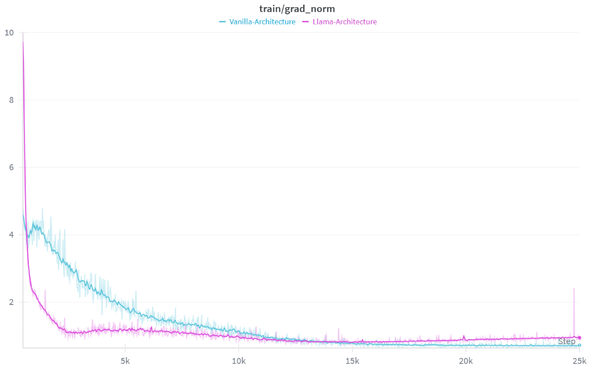

(上图对比了现代架构（Modern）与原始架构（Vanilla）的训练集验证集 Loss 和梯度范数。可以看到现代架构在收敛速度和训练稳定性上具有压倒性优势。)

这种演进并非偶然，而是为了解决**训练稳定性**和**模型表达能力**这两个核心痛点。下面的实验旨在解构这一过程：

##### 训练稳定性考量：Post-Norm $\to$ Pre-Norm (RMSNorm)

- **原始架构 (Vanilla):** 采用 Post-Norm，梯度需经过非线性层，导致梯度方差大且震荡严重（如图 青线所示），极易出现梯度爆炸或消失。
- **现代架构 (Llama):** 采用 **Pre-Norm** 结构配合 **RMSNorm**。Pre-Norm 将归一化置于残差分支内，建立恒等映射（Identity Mapping），保证了梯度流动的通畅；RMSNorm 去除中心化操作，进一步提升了数值稳定性，支持更高的学习率。

##### 模型性能能力

###### 位置编码：Absolute $\to$ RoPE (旋转位置编码)

- **原始架构 (Vanilla):** 绝对位置编码直接相加，破坏了词向量语义，且无法捕捉 Token 间的相对距离。
- **现代架构 (Llama):** 采用 **RoPE**，通过旋转操作将相对位置信息注入 Attention 机制。这赋予了模型显式的相对位置感知能力，提升了长距离依赖的捕捉能力和外推性，从而加速收敛。

###### 激活函数：ReLU $\to$ SwiGLU

- **原始架构 (Vanilla):** ReLU 仅做简单的线性截断，特征筛选能力有限。
- **现代架构 (Llama):** 采用 **SwiGLU**，引入门控机制（Gating）。通过双线性变换增加了非线性表达的丰富度，在参数量微增的情况下，显著提升了收敛效率和模型拟合能力。

##### 梯度范数的驼峰推移现象

这一现象在数值优化中可被称为 **“梯度峰值的预热对齐” (Alignment of Gradient Peak with Warmup)**。它反映了模型训练从 **结构性不稳定性** 向 **优化器主导性** 的转变。

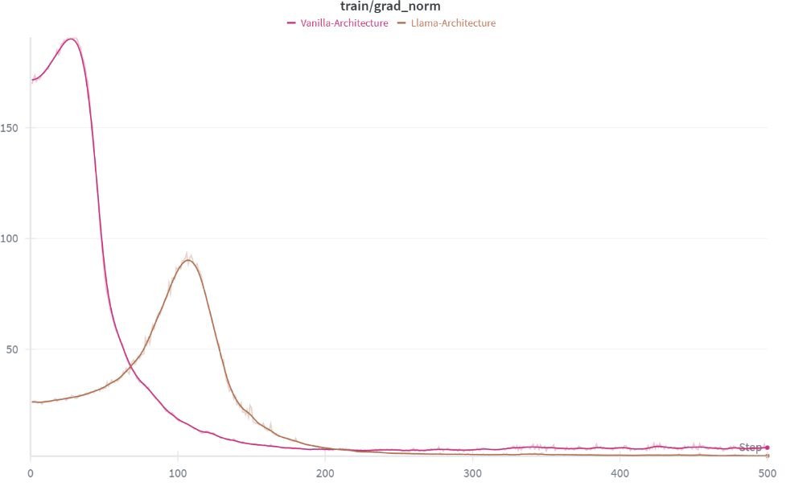

- **青线 (Vanilla) —— 梯度爆炸与截断 (Gradient Explosion & Clipping)：** 训练初始化阶段（Step 0）梯度范数即达到极值（>180）。这是 **Post-Norm** 结构的数学特性导致的：在深层网络中，梯度在反向传播时通过非线性层累积放大，发生**梯度爆炸**。随后的急速下降通常是优化器触发了 **梯度裁剪 (Gradient Clipping)** 机制，强制将梯度范数限制在阈值内，而非模型真正收敛。
- **粉线 (Llama) —— 学习率相关性 (Correlation with Learning Rate)：** 梯度范数的峰值从 Step 0 **滞后** 到了 Step 300 左右。这一位置精确对应了 **Learning Rate Warmup（学习率预热）** 的结束点。得益于 **Pre-Norm + RMSNorm** 维持了残差流的恒等映射特性，初始化梯度保持在低位。随后梯度范数的上升与下降，呈现出与学习率调度曲线（Schedule）高度的正相关性，表明模型的更新量主要由优化器策略控制，而非受制于参数初始化的数值不稳定性。

### 训练稳定性：Post-Norm 与 Pre-Norm 对比

我们在原始架构（**LayerNorm、learning、Relu**）对比**Post-Norm 与 Pre-Norm** 架构。与 Pre-Norm（GPT-2/Llama 采用）相比，Post-Norm 架构（原始 Transformer 采用）在早期训练阶段容易出现梯度不稳定的问题。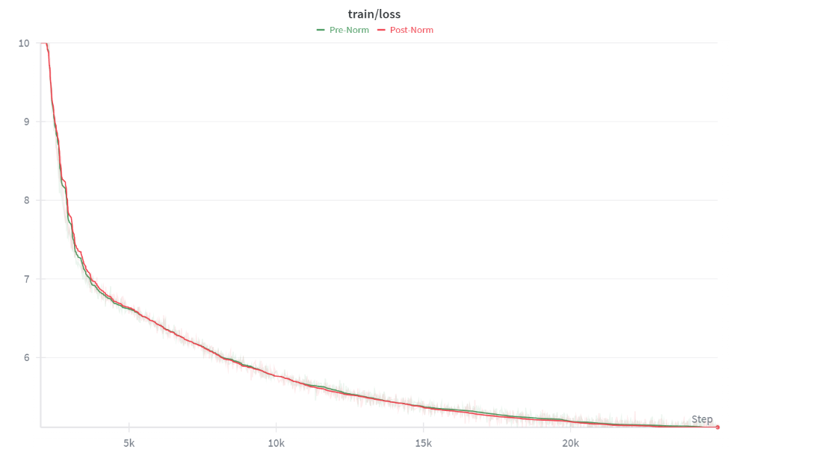

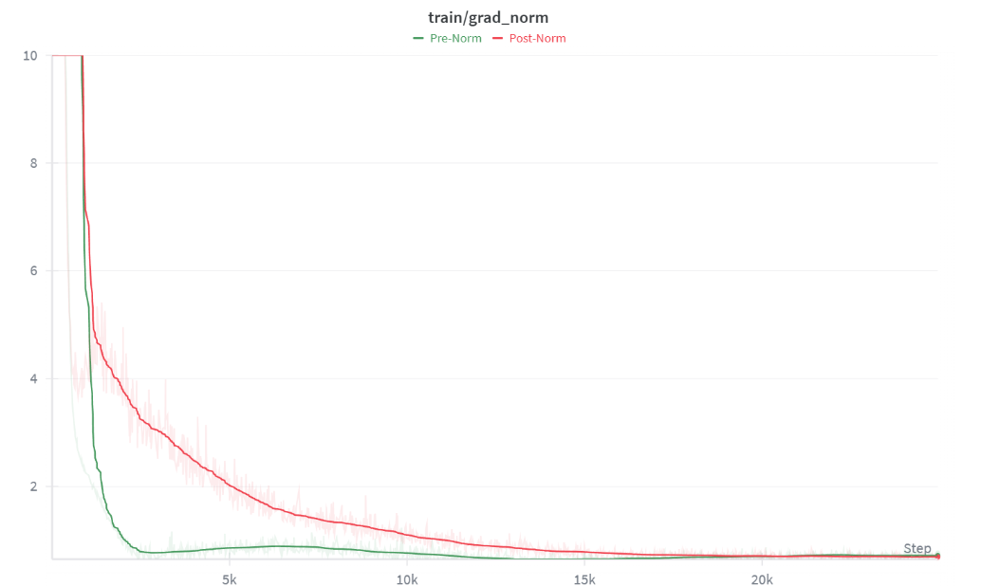

上图展示了训练过程中的loss和梯度范数。

红色线条**(原生/Post-Norm)**在预热结束后表现出剧烈的不稳定性，而绿色线条**(现代/Pre-Norm)**则保持稳定。这证实了 Post-Norm 在深层网络训练初期的不稳定性。

虽然 Pre-Norm 解决了稳定性问题，但在图 的 `train/loss` 中可以观察到一个反直觉现象：Pre-Norm与Post-Norm收敛图像近乎一致。**Pre-Norm（绿线）的最终收敛 Loss 反而略高于 Post-Norm（红线），即性能略有下降。（Zhuo, Z）**

这被称为 Pre-Norm 的 **“表征坍塌”** 或 **“深层退化”**：

- **主干主导：** 在 Pre-Norm 结构 $x_{l+1} = x_l + F(Norm(x_l))$ 中，随着层数增加，主干路径 $x_l$ 的数值模长会不断累积增长。
- **分支微弱：** 残差分支 $F(Norm(x_l))$ 的输出因为经过了 Norm，模长始终受限。这就导致 $\frac{F(x)}{x}$ 的比例逐渐趋近于 0。
- **深度失效：** 深层网络的行为逐渐退化为简单的恒等变换，模型无法有效利用深层参数提取高阶特征。

现代架构选择 Pre-Norm 是为了**用微小的性能上限折损（表征坍塌风险）换取了巨大的训练稳定性收益**。

### 2.位置编码策略对比分析：RoPE, NoPE, Sinusoidal 与 Learned

在原始 Transformer（Post-Norm）的基础上，控制其他变量不变，对比了四种位置编码配置的效果：RoPE（旋转位置编码）、NoPE（无位置编码）、Sinusoidal（正余弦绝对位置）和 Learned（可学习绝对位置）。

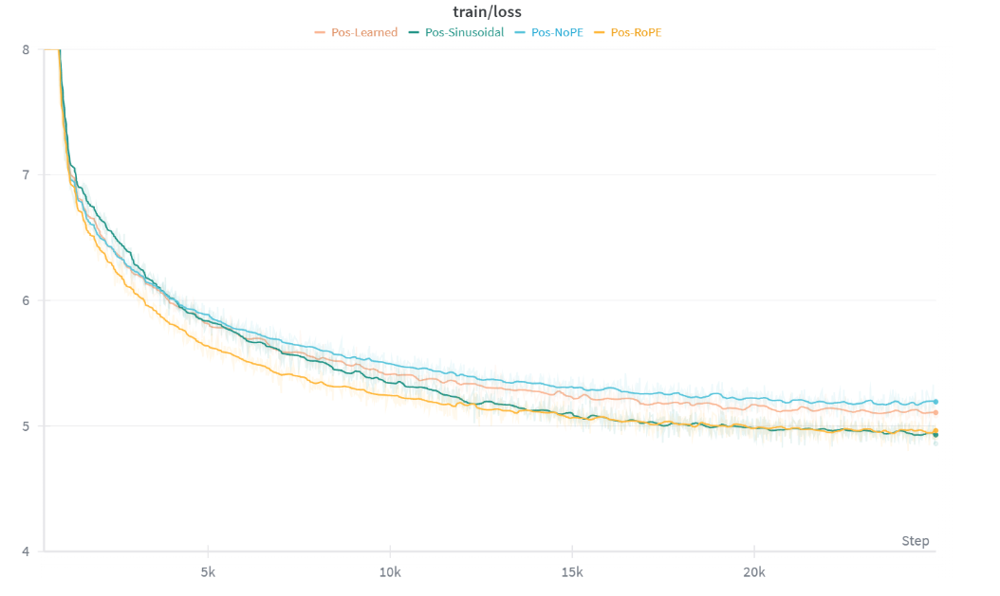

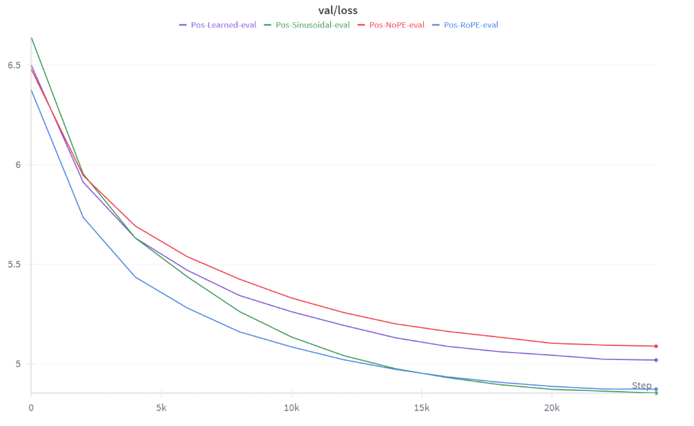

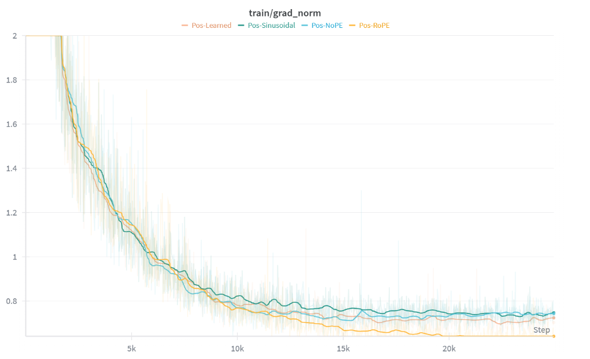

[^绘图]: 上图从上到下依次为：训练集 Loss、验证集 Loss、梯度范数

**Loss 曲线分析 (Training Loss)** 观察训练集 Loss 曲线，我们可以看到不同位置编码策略对模型收敛性能的显著影响：

1. **Pos-RoPE (黄色, Yellow)**：**表现最佳**。曲线全程保持最低，且下降趋势最快。这有力地证明了旋转位置编码（Rotary Position Embedding）通过将相对位置信息以乘性方式注入，极大地提升了模型对序列语义的捕捉能力，是当前架构下的最优解。
2. **Pos-Sinusoidal (绿色, Green)**：在训练的前 10,000 步（10k），该曲线与 Pos-Learned (橙色) 的数值高度重合，两者下降趋势一致。在 10,000 步之后，该曲线继续下降，Loss 值逐渐低于 Pos-Learned。至 15,000 步（15k）左右，其 Loss 值已降低至与 Pos-RoPE (黄色) 相近的水平，表明正余弦位置编码在训练后期能够支持模型达到较低的 Loss。
3. **Pos-Learned (橙色, Orange)**：在训练的前 10,000 步，该曲线与 Pos-Sinusoidal (绿色) 保持同步。但在 10,000 步之后，其下降幅度减缓，Loss 值始终高于 Pos-Sinusoidal 和 Pos-RoPE。这表明可学习的绝对位置编码在当前实验设置下，后期收敛效果不如正余弦编码。
4. **Pos-NoPE (浅蓝, Light Blue)**：在整个训练过程中，该曲线的 Loss 值始终高于其他所有组。这表明不使用显式位置编码会导致模型无法有效降低 Loss，位置信息对于模型性能是必要的。

**梯度范数分析 (Gradient Norm)** 观察梯度范数曲线，反映了不同编码方式对优化稳定性的影响：

1. **高稳定性组 (RoPE)**：**Pos-RoPE (黄色)** 的梯度范数在 Warmup 结束后迅速下降，并始终保持在所有实验组中的**最低水平**（约 0.6 左右）。这种低且平稳的梯度范数表明 RoPE 的损失地形（Loss Landscape）最为平滑，优化器更容易找到下降方向，与其 Loss 的优异表现高度一致。
2. **基准组 (Additive & NoPE)**：**Pos-Sinusoidal (绿色)**、**Pos-Learned (色)** 和 **Pos-NoPE (蓝色)** 的梯度范数相对较高且纠缠在一起。特别是加性位置编码（Sinusoidal/Learned）直接改变了 Word Embedding 的模长分布，导致梯度呈现出比 RoPE 更高的震荡幅度。

### 3. 权重绑定 (Weight Tying) 的影响

我们将基准模型规模从约 8M 扩展至 20M 参数，旨在提高实验结论对于现代大语言模型架构的**代表性（Representativeness）\**与\**数据计算效率（Data-Compute Efficiency）**。由于极小的 8M 模型参数过度集中于词嵌入层，极易在 Weight Tying 实验中引入因架构比例失调导致的偏差；而 20M 模型不仅能修正这一分布，使其更接近标准 Transformer 的参数结构，还能在当前 4 亿 Token 的固定训练预算下，达到符合 **Chinchilla Scaling Laws** 的最佳训练比（约 20:1），从而在避免过拟合的同时，获得区分度更显著、更具泛化价值的消融实验结果

**实验设置**：

- **模型规模**: ~20M 参数
  - $d_{model}$=384,  $n_{layers}$=10,  $n_{heads}$=6，

本实验在 Vanilla (Post-Norm) 架构基础上，对比了两种嵌入层策略，即**Tied (紫色)**: 输入 Embedding 与输出 LM Head 共享参数，和**unTied (粉色)**: 输入与输出使用两个独立的矩阵。为了保证参数的确定性，因此我们对Tied于非Tied的$d_{ff}$层做出了相应变化，权重绑定位为**1536**，非权重绑定为**1024**，此时双方参数约为**21.53M,21.44M**

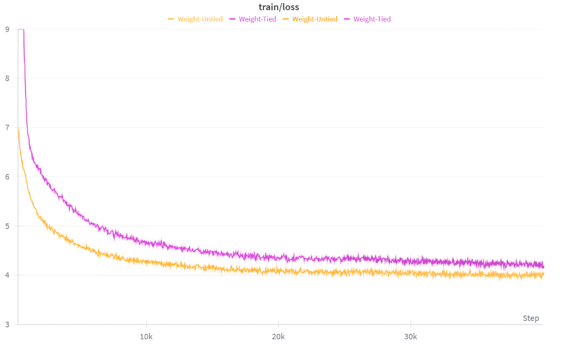

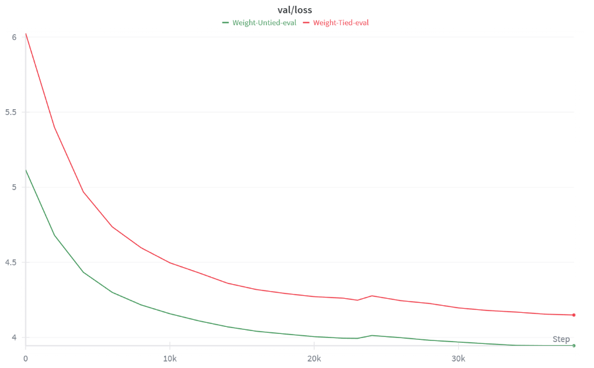

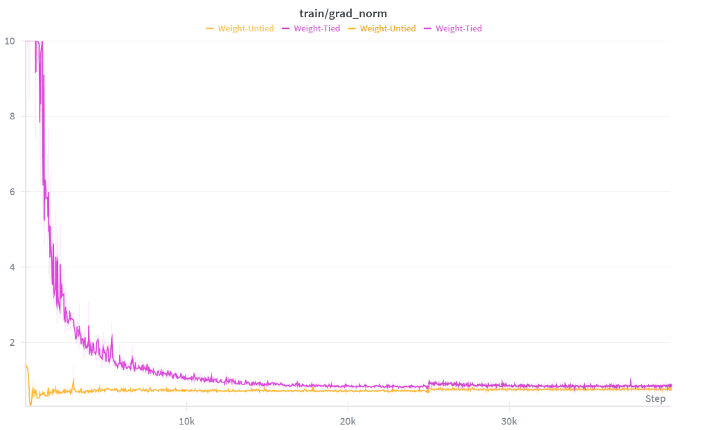

[^绘图]: 上图从上到下依次为：训练集 Loss、验证集 Loss、梯度范数

**1. 梯度范数分析 (train/grad_norm)**

- **Weight-Tied (紫色)**：展现了典型的 Post-Norm 架构特征。在训练初期（Warmup 阶段），梯度范数出现了剧烈的**尖峰**，随后呈指数级衰减。这是因为在绑定权重时，同一个矩阵 $W$ 既要作为输入 $XW$ 处理原始语义，又要作为输出层 $HW^T$ 计算 Logits。Loss 传回的梯度会直接叠加在这个共享矩阵上，导致初期更新量极大且方向冲突，增加了优化的震荡和难度。
- **Weight-Untied (橙色)**：表现出**异常的平稳性**。其梯度范数从 Step 0 开始就维持在极低的水平（约 0.6-0.8 之间），几乎是一条直线，没有任何剧烈的初始化震荡。
  - **原因**：当输入 Embedding 和输出 Head 分离为两个独立矩阵时，梯度的反向传播路径被解耦。输出层的剧烈梯度变化被分散，不会直接冲击输入层的表征。这种解耦使得优化器在初期就能在一个非常平滑的损失地形上寻找方向，从而实现了比绑定权重更快的收敛。

**2. Loss 曲线分析 (train/loss)**

- 得益于极高的梯度稳定性，**Weight-Untied (橙色)** 从一开始就占据了优势，Loss 下降速度明显快于 Tied 模型，并保持领先直到训练结束,但是训练差距在逐步缩小。

- 尽管 **Weight-Tied (紫色)** 为了平衡参数量将 $d_{ff}$ 增加到了 1536（Untied 为 1024），理论上拥有更强的 MLP 表达能力，但这种架构优势未能抵消掉共享权重带来的优化困难（即梯度震荡造成的早期损失），最终导致收敛效果不如未绑定权重的模型。

- **追赶趋势 (Catch-up Phenomenon)**：**Weight-Tied (紫色)** 虽然起步较高，但在过了早期的震荡期后，展现出了**更持久的下降动能**。观察曲线后半段（10k-30k 步），紫色曲线的斜率依然保持向下，且与其下方橙色曲线的间距在肉眼可见地缓慢缩小。因此推断，如果延长训练步数，可能会出现追平甚至反超

  

##### 权重绑定在小模型与大模型中的取舍

**A. 小模型偏向权重绑定 (Why Tie for Small Models)**

- **参数效率**：对于参数量极小（如 <10M）的模型，Embedding 层往往占据了总参数量的很大比例（有时甚至超过 30-40%）。此时绑定权重可以显著减少参数冗余，防止过拟合。
- **正则化作用**：小模型在有限数据上训练时，强制输入和输出共享同一个语义空间（即认为 token 在输入端的含义和预测时的含义一致）是一种强有力的归纳偏置（Inductive Bias），有助于在数据不足时辅助模型学习。

**B. 大模型偏向权重解绑 (Why Untie for Large Models)**

- **语义空间的差异**：随着模型规模增加（如本实验中的 20M 以及更大），模型有足够的能力去捕捉更细微的语义。实际上，**Source Embedding（输入）** 和 **Target Embedding（输出）** 的数学功能并不完全相同。输入需要具备泛化的上下文表征能力，而输出需要针对 Next Token Prediction 进行特异化的 Logits 映射。在大模型中，强制两者一致反而会成为限制模型表达能力的瓶颈（Bottleneck）。
- **参数占比稀释**：随着层数和隐藏维度的增加，Embedding 层在总参数中的占比逐渐降低，解除绑定的显存成本变得可以接受。

##### 20MB模型权重绑定性能反常的可能原因

- **优化稳定性与正则化收益的权衡倒置** 本实验揭示了在特定架构下，传统的“小模型应使用权重绑定以增强正则化”的经验法则失效。尽管20M参数规模通常受益于参数共享带来的泛化能力，但在**Post-Norm架构**中，**解除权重绑定（Weight Untied）**展现出了决定性的优化优势。实验数据显示，Untied模型在训练初期的梯度范数保持了极高的平稳性，而Tied模型则经历了剧烈的梯度震荡。这种震荡导致Tied模型在优化初期即陷入次优的参数空间，即便后续大幅延长训练步数（从25k延长至40k），也无法弥补初期梯度不稳造成的性能损失。这一结果证明，在当前设置下，**优化过程的稳定性（Optimization Stability）\**对于模型最终性能的影响权重，超过了\**参数效率带来的正则化收益（Regularization Benefit）**。
- **Post-Norm架构下的梯度冲突机制** 该现象的根本原因在于Post-Norm架构的梯度传播特性与权重绑定机制产生了负面耦合。在Post-Norm结构中，反向传播的梯度在经过多层非线性变换后，往往在输出层表现出高方差特性。当采用权重绑定时，共享的嵌入矩阵需同时承担“输入语义表征”与“输出概率映射”的双重功能，导致输出层剧烈波动的梯度直接叠加于输入嵌入层。这种**梯度冲突（Gradient Conflict）**破坏了底层特征学习的连续性。相反，解除绑定（Untied）通过物理上分离输入与输出矩阵，有效阻断了输出层的梯度高频震荡向输入层的直接传导，解耦了参数更新方向，从而在Post-Norm这种对初始化敏感的架构中实现了更平滑的收敛轨迹。

### 4. 激活函数影响

**实验设置**：为了探究激活函数对模型性能的独立影响，我们在控制模型参数量在6M，权重绑定前提下，对比了 **SiLU** 、传统 **ReLU** 与**Gelu**在原始架构的表现

为了探究激活函数对模型性能的独立影响，并排除参数规模带来的干扰，我们在以下严格受控的条件下进行了对比实验：

- **模型规模**：控制在 **~5.71M** 参数量。
- **配置**：开启权重绑定 (Weight Tying)。
- **对比对象**：
  - **Act-ReLU** (绿色)：传统的修正线性单元，作为基准 (Baseline)。
  - **Act-SiLU** (紫色)：Sigmoid Linear Unit ($x \cdot \sigma(x)$)，即 Swish 激活函数的一种特例。
  - **Act-GELU** (粉色)：Gaussian Error Linear Unit，现代 Transformer 的常用选择。

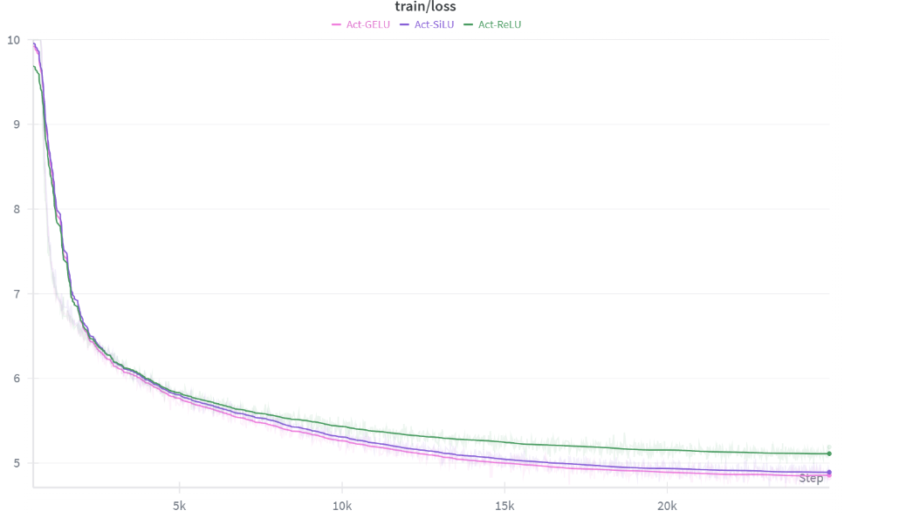

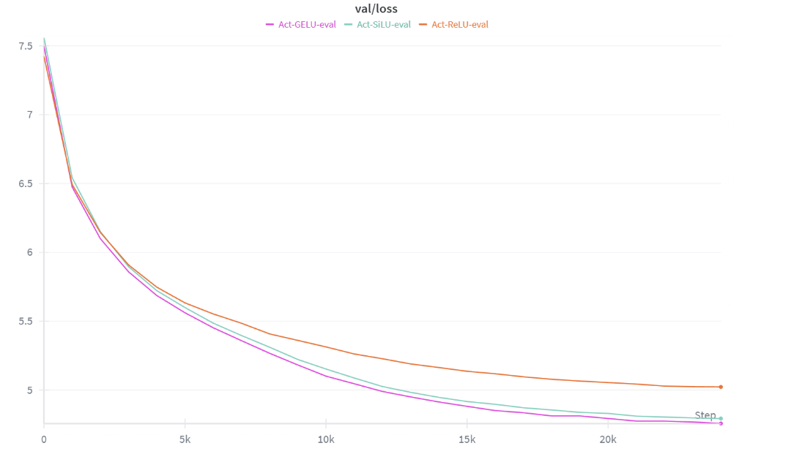

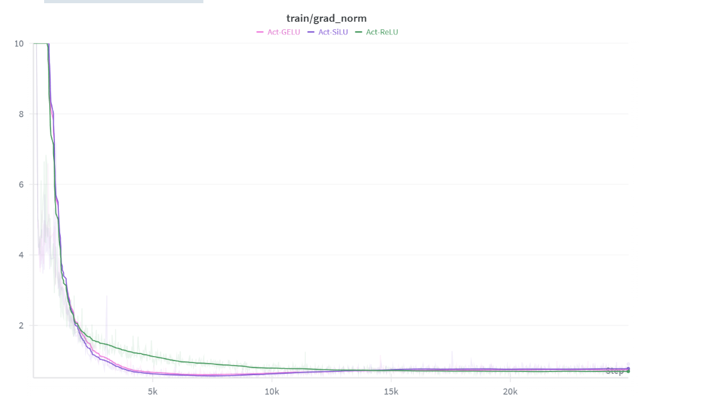

[^绘图]: 上图从上到下依次为：训练集 Loss、验证集 Loss、梯度范数


#### 观察

**1. 收敛性能的平滑优势 (Convergence Superiority)**

- **平滑激活函数的性能提升**：从 `train/loss` 曲线可以清晰地观察到，搭载 **GELU (粉色)** 与 **SiLU (紫色)** 的模型在整个训练周期中，其 Loss 值始终显著低于 **ReLU (绿色)** 模型。
- **后期收敛的一致性**：尽管 GELU 与 SiLU 的数学形式不同，但在本实验的参数规模下，两者的收敛曲线几乎纠缠在一起，表现出高度一致的性能。这表明只要引入了“平滑非线性”特性，模型就能获得优于硬截断（ReLU）的表达能力。

**2. 梯度稳定性的优势 (Gradient Stability Advantage)**

- **梯度的“镇静剂”效应**：`train/grad_norm` 图表揭示了不同激活函数对优化动力学的影响。**ReLU (绿色)** 的梯度范数在全程保持了较高的水平，且伴随更多的高频震荡。
- **平滑性带来的稳定流**：相比之下，**GELU** 和 **SiLU** 的梯度范数曲线更低且更为平滑。
  - 这是因为 ReLU 在 $x=0$ 处的不可导特性以及负半轴的硬零截断，容易导致“神经元死亡”或梯度突变。
  - 而 GELU/SiLU 提供的概率平滑近似（Probabilistic Smoothing）允许梯度在零点附近保留微弱的信息流，创造了更利于优化的损失地形（Loss Landscape）。

实验有力地证明了在 Transformer 架构中，放弃传统的 ReLU 而转向平滑激活函数（GELU 或 SiLU）是必要的。

尽管 ReLU 具有计算简单的优势，但在同等参数规模（~5.71M）下，**GELU 和 SiLU 展现出了更优的样本利用效率和更稳定的梯度行为**。这种优势并非源于参数量的增加，而是源于平滑激活函数对非线性特征更细腻的捕捉能力以及对梯度传播的改善。因此，在构建现代语言模型时，应优先选择 GELU 或 SiLU（及其变体 SwiGLU）作为默认配置。

结合Llama与Vanilla对比的的**SwiGLU**函数，我们可以看到**SwiGLU其实是更平滑**的。通常认为引入更复杂的门控结构可能会增加优化的复杂性，但实验表明，SwiGLU 的乘性交互似乎创造了更平滑的地形，使得模型在更新参数时更加稳健。

结合上述实验，有力地证实了四种激活函数的效果，相比于传统的Relu函数，现代SwiGLU等激活函数通过平滑机制与门控机制提升了模型的**非线性表达能力**，带来了**额外的梯度稳定性收益**。因此作为首选激活函数。

## 使用方法

### 1. 环境设置

使用uv进行环境管理，具体操作如下：

```
# 安装 uv (如果尚未安装)
pip install uv


#同步python版本
uv venv --python 3.12
# 从uv.lock同步环境，如果是5090需要手动安装最新的torch和相应库
uv sync
#wandb更新
# uv pip install -upgrade wandb
#环境激活
source .venv/bin/activate
```

### 2. 运行测试

本项目包含Stanford官方给出的完整的单元测试，用于验证各个组件（Attention, RMSNorm 等）的正确性，编写代码的时候，调整adapter.py中的接口，并运行下方命令即可。

注意windows的tests/test_tokenizer.py 的 import resource语句不能运行，需要在wsl虚拟环境UBuntu22.04运行。

另外，由于Windows与Linux的多进程运行方式不同，Windows上由于多进程分发耗时原因可能无法通过官方 1.5s speed test, 在Linux环境中speed_test用时在0.1-0.2秒左右。

```
uv run pytest # 一次性运行全部测试
# 测试BPE分词器训练部分
pytest tests/test_train_bpe.py -v
# 测试BPE分词器推理部分
pytest tests/test_tokenizer.py -v
# 测试model部分
pytest tests/test_model.py -v
# 测试nn_utils部分
pytest tests/test_nn_utils.py -v
# 测试优化器部分
pytest tests/test_optimizer.py -v
# 测试断点保存
pytest tests/test_serialization.py -v
# 测试get_batchv
pytest tests/test_data.py -v
# 测试推理分词
python tests/process_full_dataset.py -v
```

### 3. 数据准备与解压

在开始训练之前，需要下载 TinyStories 和 OpenWebText 数据集。运行以下命令以下载：

```
mkdir -p data
cd data

# 下载 TinyStories （2.27GB）
wget https://huggingface.co/datasets/roneneldan/TinyStories/resolve/main/TinyStoriesV2-GPT4-train.txt
wget https://huggingface.co/datasets/roneneldan/TinyStories/resolve/main/TinyStoriesV2-GPT4-valid.txt

# 下载 OpenWebText 样本 (10.11GB)
wget https://huggingface.co/datasets/stanford-cs336/owt-sample/resolve/main/owt_train.txt.gz
gunzip owt_train.txt.gz
wget https://huggingface.co/datasets/stanford-cs336/owt-sample/resolve/main/owt_valid.txt.gz
gunzip owt_valid.txt.gz

cd ..
```

### 4. 分词器训练

训练方法: 调整test_train_bpe.py的pytest注释，里面有 TinyStories 和 OpenWebText 数据集的完整接口。

### 5. 数据预处理

- 实现merge与vocab词表,使用test_train_bpe.py的接口生成在merge_vocab文件夹。在github种对所有数据集都有预存

```
pytest tests/test_train_bpe.py -v
```

### 6.训练与配置

模型可以通过 YAML 文件进行完全配置，配置文件目前在cs336_basic中，后面将会迁移到`configs`文件夹中。

目前训练各种消融实验模型的命令如下：

```
# 1. 实验一：架构对比 (Llama vs Vanilla)
python cs336_basics/train.py --config cs336_basics/01_llama_vs_vanilla.yaml
python cs336_basics/valloss.py --config cs336_basics/01_llama_vs_vanilla.yaml
# 2. 实验二：Norm 位置对比 (Pre-Norm vs Post-Norm)
python cs336_basics/train.py --config cs336_basics/02_norm_location.yaml
python cs336_basics/valloss.py  --config cs336_basics/02_norm_location.yaml
# 3. 实验三：位置编码对比 (RoPE, NoPE, Sinusoidal, Learned)
python cs336_basics/train.py --config cs336_basics/03_positional_encoding.yaml
python cs336_basics/valloss.py  --config cs336_basics/03_positional_encoding.yaml
# 4. 实验四：权重绑定对比 (Tied vs Untied)
python cs336_basics/train.py --config cs336_basics/04_weight_tying.yaml
python cs336_basics/valloss.py --config cs336_basics/04_weight_tying.yaml
# 5. 实验五：激活函数对比 (ReLU vs SwiGLU vs GELU)
python cs336_basics/train.py --config cs336_basics/05_activation.yaml
python cs336_basics/valloss.py --config cs336_basics/04_weight_tying.yaml
```

**训练一个现代 Llama 风格(PreNorm, RMSNorm, RoPE)的模型：**

```
python cs336_basics/train.py --config cs336_basics/06_llama.yaml
```

**训练一个“复古”的 2017 风格模型（Post-Norm, ReLU, Sinusodial PE）：**

```
python cs336_basics/train.py --config cs336_basics/07_vanilla.yaml
```

## 项目结构

```
.
├── configs/ 
|   ├── 01_llama_vs_vanilla.yaml                    # LLaMA 与 Vanilla (原版) 架构对比实验配置
|   ├── 02_norm_location.yaml                       # 归一化位置配置 (Pre-Norm vs Post-Norm)
|   ├── 03_positional_encoding.yaml                 # 位置编码策略 (如 RoPE, Sinusoidal)
|   ├── 04_weight_tying.yaml                        # 权重绑定 (Weight Tying) 设置
|   ├── 05_activation.yaml                          # 激活函数配置 (如 SwiGLU, GeLU, Silu, Relu)
|   ├── 06_llama.yaml                               # LLaMA 模型标准参数配置
|   └── 07_vanilla.yaml                             # Vanilla Transformer 模型标准参数配置
├── cs336_basics/ 
│   ├── bpe_data_structures.py                      # BPE 分词器 (训练架构)
│   ├── checkpointing.py                            # 模型检查点保存与加载
│   ├── data.py                                     # 单进程 Dataloader (Memory Mapping)
│   ├── model.py                                    # Transformer 核心组件 (CaseAttn, RoPE, RMSNorm)
│   ├── model——function.py                          # Transformer 核心组件 (softmax，attn)
│   ├── optimizer.py                                # 手写 AdamW 优化器
|   ├── tokenizer.py                                # BPE分词器推理部分
│   ├── pretokenization_example.py                  # 官方给出的多进程文本分块边界处理代码
│   ├── train.py                                    # transformer模型训练代码(集成 WandB)
│   ├── train_bpe.py                                # BPE 分词器训练代码
│   ├── train_bpe2.py                               # 官网tokenizersBPE代码
│   ├── utils.py                                    # 基础工具 (Softmax, CrossEntropy, LR 
│   ├── generation_utils.py                         # 文本生成核心逻辑 (Top-k, Temp)
│   └── generate.py                                 # 推理生成入口脚本
├── tests/                                          # 单元测试目录
│   ├── adapter.py                                  # 官方测试接口适配器
│   └── ...                                         # 官方测试用例
├── cs336_spring2025_assignment1_basics.pdf         # 官方作业 Handout (英文)
├── [翻译]cs336_spring2025_assignment1_basics.pdf    # 作业 Handout (中文翻译)
├── merge_vocab                                     # 训练分词此表文件夹
└── uv.lock 
```

## 参考文献


- Vaswani et al., "Attention Is All You Need" (2017)
- Su et al., "RoFormer: Enhanced Transformer with Rotary Position Embedding" (2021)
- Touvron et al., "LLaMA: Open and Efficient Foundation Language Models" (2023)
- Zhuo, Z., Zeng, Y., Wang, Y., Zhang, S., Yang, J., Li, X., ... & Ma, J. (2025). Hybridnorm: Towards stable and efficient transformer training via hybrid normalization. *arXiv preprint arXiv:2503.04598*.
