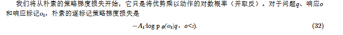
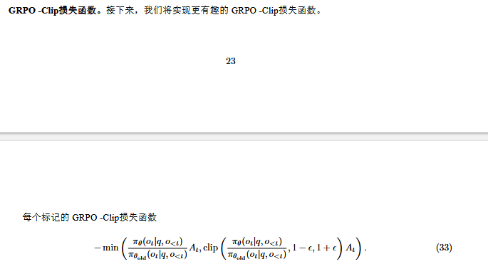

### PG(策略梯度)

具有参数 $\theta$ 的因果语言模型 (LM) 定义了在给定当前文本前缀 $s_{t}$（状态/观测值）的情况下，下一个 token $a_{t}\in\mathcal{V}$ 的概率分布 。在强化学习的上下文中，我们将**下一个 token** $a_{t}$ 视为**动作**（action），将**当前文本前缀** $s_{t}$ 视为**状态**（state） 。因此，LM 是一个类别随机策略（categorical stochastic policy）
$$
a_{t}\sim\pi_{\theta}(\cdot|s_{t}), \pi_{\theta}(a_{t}|s_{t})=[softmax(f_{\theta}(s_{t}))]_{a_{t}}
$$
意思就是：通过这个生成下一个token这个动作生成的各种词的概率，波浪号代表在这个分布里面进行采样，

在使用策略梯度优化策略时，将需要两个基本操作 ：

- **从策略中采样**：从上述类别分布中抽取一个动作 $a_{t}$ ；
- **计算动作的对数似然**：评估 $log~\pi_{\theta}(a_{t}|s_{t})$ 

通常，在使用 LLM 进行 RL 时，$s_{t}$ 是目前为止生成的部分完成/解决方案，而每个 $a_{t}$ 是解决方案的下一个 token ；当发出文本结束 (end-of-text) token 时，回合 (episode) 结束，例如 `<|end_of_text|>`，或者在我们的 r1_zero 提示词的情况下是 `</answer>` 

#### 轨迹

轨迹是智能体经历的状态和动作的交错序列 ：
$$
\tau=(s_{0},a_{0},s_{1},a_{1},...,s_{T},a_{T})
$$
这是一个“状态-动作”交替的序列 。

**$s_0$ (初始状态)**：这就是你给模型的**提示词（Prompt）** 。

**$a_t$ (动作)**：模型每一步吐出的 token。

**确定性环境 (Deterministic Environment)**：

$\rho_{0}(s_{0})$ 是格式化提示词的分布 。在一般的设置中，状态转换遵循某些环境动力学 $s_{t+1}\sim P(\cdot|s_{t},a_{t})$ ，$P$是环境概率

- 在下棋或机器人 RL 中，环境可能是不确定的（你走一步，环境会变）。
- 但在 LLM 中，环境是**确定**的：下一个状态 $s_{t+1}$ 仅仅是把刚才吐出的 token $a_t$ 拼接到旧前缀 $s_t$ 后面，即 $s_{t+1} = s_t || a_t$ 。

**终止条件 $T$**：

- 当模型吐出结束标志（如 `</answer>`）或者达到字数上限时，这一轮“游戏”就结束了 。
- 这种一次完整的对话过程，在 RL 里也叫 **回次 (Episode)** 或 **Rollout**

#### 奖励与回报

标量奖励 $r_{t}=R(s_{t},a_{t})$ 用于评判在状态 $s_{t}$ 采取动作的直接质量 。对于经验证领域上的 RL，标准的做法是给中间步骤分配零奖励，而给终端动作分配经过验证的奖励 ：
$$
r_{T}=R(s_{T},a_{T}):=\begin{cases}1 & \text{如果轨迹 } s_{T}||a_{T} \text{ 根据我们的奖励函数匹配标准答案}\\ 0 & \text{否则}\end{cases}
$$
**注**：中间的思考过程无奖励，只有最后的answer匹配才会给奖励

回报 $R(\tau)$ 聚合了轨迹沿线的奖励 。两种常见的选择是有限视野未折扣回报：
$$
R(\tau):=\sum_{t=0}^{T}r_{t},
$$
**注**：在这个里面，，直接把所有步奖励加起来，**中间都是0，只有最后是1**。

无限视野折扣回报 ：
$$
R(\tau):=\sum_{t=0}^{\infty}\gamma^{t}r_{t}, \quad 0<\gamma<1
$$
**注**：会用一个$\gamma$（折扣因子）让未来的奖励“**贬值**”，**不用这个**，因为数学题不需要模型“尽快”做完。只要在字数限制内，第 10 个 token 给出答案和第 100 个 token 给出答案，分值是一样的，所以不需要折扣 。

智能体的目标是最大化预期回报：
$$
J(\theta)=\mathbb{E}_{\tau\sim\pi_{\theta}}[R(\tau)],
$$
**注**：模型不能只做对一道题，我们要的是它在**所有题目**上平均表现都好。在当前参数 $\theta$ 下，模型生成的各种解题路径（轨迹）能拿到的**平均分**。我们的目标就是让这个平均分尽可能高。

所以找一个参数，让他的这个**优化目标最高**。

#### 朴素策略梯度

通过对预期回报进行梯度上升来学习策略参数 $\theta$：
$$
\theta_{k+1}=\theta_{k}+\alpha\nabla_{\theta}J(\theta_{k})
$$

$$
\nabla_{\theta}J(\pi_{\theta})=\mathbb{E}_{\tau\sim\pi_{\theta}}\left[\sum_{t=0}^{T}\nabla_{\theta}log~\pi_{\theta}(a_{t}|s_{t})R(\tau)\right]
$$

**推导策略梯度。** 

1. 轨迹的概率由下式给出：

   $$P(\tau|\theta)=\rho_{0}(s_{0})\prod_{t=0}^{T}P(s_{t+1}|s_{t},a_{t})\pi_{\theta}(a_{t}|s_{t})$$

   **注：**生成这条轨迹的总概率，是由**开局概率**累乘**环境概率P**和算出来的**softmax的概率**，由于外部环境恒定，因此这个项为1。

   因此，轨迹的对数概率为：

   $$log~P(\tau|\theta)=log~\rho_{0}(s_{0})+\sum_{t=0}^{T}[log~P(s_{t+1}|s_{t},a_{t})+log~\pi_{\theta}(a_{t}|s_{t})]$$

   **注**:对上面的式子做Log，这样多个极小的概率（比如 0.01）连续相乘会导致数值下溢会被避免。

2. 对数导数技巧：

   $$\nabla_{\theta}P=P\nabla_{\theta}log~P$$

   这个就是上面的求导以后转换一下：

   $$\nabla_{\theta}\log P = \frac{1}{P} \cdot \nabla_{\theta}P$$ 转换一下。

3. 环境项对 $\theta$ 是常数。$\rho_{0}, P(\cdot|\cdot)$ 和 $R(\tau)$ 不依赖于策略参数，因此：

   题目，环境和判断规则都是与策略参数无关的。

   $$\nabla_{\theta}\rho_{0}=\nabla_{\theta}P=\nabla_{\theta}R(\tau)=0$$

应用上述事实：

$$\nabla_{\theta}J(\theta)=\nabla_{\theta}\mathbb{E}_{\tau\sim\pi_{\theta}}[R(\tau)]$$

$$=\nabla_{\theta}\sum_{\tau}P(\tau|\theta)R(\tau)$$

$$=\sum_{\tau}\nabla_{\theta}P(\tau|\theta)R(\tau)$$

$$=\sum_{\tau}P(\tau|\theta)\nabla_{\theta}log~P(\tau|\theta)R(\tau) \quad \text{(对数导数技巧)}$$

$$=\mathbb{E}_{\tau\sim\pi_{\theta}}[\nabla_{\theta}log~P(\tau|\theta)R(\tau)]$$

给定通过采样起始状态 $s_{0}^{(i)}\sim\rho_{0}(s_{0})$ 并在环境中运行策略 $\pi_{\theta}$ 收集的 $N$ 个 rollout 的批次 $\mathcal{D}=\{\tau^{(i)}\}_{i=1}^{N}$，我们形成梯度的无偏估计量为：
$$
\hat{g}=\frac{1}{N}\sum_{i=1}^{N}\sum_{t=0}^{T}\nabla_{\theta}log~\pi_{\theta}(a_{t}^{(i)}|s_{t}^{(i)})R(\tau^{(i)})
$$
**跑数据（采样）**：让模型先随便做 $N$ 道题，生成 $N$ 个完整的解答过程（轨迹）。

**算分（Reward）**：批改这 $N$ 道题。做对的 $R=1$，做错的 $R=0$。

**算梯度（求导）**：对于每道题里生成的每一个词，计算它在神经网络里的梯度 $\nabla_{\theta}log~\pi_{\theta}$。

**乘分数（加权）**：

- 如果这题做对了 ($R=1$)：梯度保留，参数顺着梯度的方向更新。这意味着**“不仅要记住这个正确答案，还要增加生成这句话里每一个词的概率”**。
- 如果这题做错了 ($R=0$)：梯度乘以 0，直接失效。这意味着**“这次生成的废话不予采用，参数不往这个方向更新”**。（注：如果是给负分 $R=-1$，则会反向更新，降低生成这些词的概率）。

#### 策略梯度基线

正常的PG存在**高方差**问题，。为了缓解这个问题，一个常用的技巧是从奖励中减去一个只依赖于状态的基线函数 $b$ 。这是一种控制变量：其思想是通过减去一个与其相关的项来降低估计量的方差，而不引入偏差 。让我们将带有基线的策略梯度定义为 ：
$$
B=\mathbb{E}_{\tau\sim\pi_{\theta}}\left[\sum_{t=0}^{T}\nabla_{\theta}log~\pi_{\theta}(a_{t}|s_{t})(R(\tau)-b(s_{t}))\right]
$$
只要基线函数与**策略参数**$\theta$无关，就是无偏的，效果和原来的效果是一样的。推导用上面对数导数技巧。
$$
\mathfrak{pg\_loss}=\frac{1}{N}\sum_{i=1}^{N}\sum_{t=0}^{T}log~\pi_{\theta}(a_{t}^{(i)}|s_{t}^{(i)})(R(\tau^{(i)})-b(s_{t}^{(i)}))
$$
**它不是真正的“损失”**：传统的 Loss（比如交叉熵）越低越好。但这里的 `pg_loss` 数值本身**没有任何意义**，你没法通过看 `pg_loss` 是 2.5 还是 0.8 来判断模型有没有变聪明。

**它的唯一使命，是骗过 PyTorch 去帮你求导**：PyTorch 不懂强化学习，它只会对算式调用 `.backward()` 求导。我们故意构造出这个公式，是因为**这个公式求完导后的结果，恰好等价于我们要的策略梯度 $\hat{g}$**。

#### TRPO,PPO的数学原理

在之前讨论的 REINFORCE（同策略）算法中，我们需要“用当前最新模型做题，然后立刻用这批数据更新它”。这导致每次更新完，之前生成的数据就**作废了**，效率很低。

**异策略策略梯度**。在异策略学习中，我们改用从我们正在优化的策略以外的某个策略采样的 rollout。像 PPO 和 GRPO 等流行策略梯度算法的异策略变体，使用来自策略旧版本 $\pi_{\theta_{old}}$ 的 rollout 来优化当前策略 $\pi_\theta$。异策略的策略梯度估计为：
$$
\hat{g}_{off-policy} = \frac{1}{N} \sum_{i=1}^N \sum_{t=0}^T \frac{\pi_\theta(a_t^{(i)} | s_t^{(i)})}{\pi_{\theta_{old}}(a_t^{(i)} | s_t^{(i)})} \nabla_\theta \log \pi_\theta(a_t^{(i)} | s_t^{(i)}) R(\tau^{(i)})
$$
为了提高效率，异策略学习允许我们**拿旧模型（$\pi_{\theta_{old}}$）做题产生的数据，来训练当前的新模型**

但是，旧模型和新模型做出同一个选择的概率是不一样的！为了修正这种偏差，数学上引入了**重要性权重（Importance Weight）**，也就是公式里的这一项：

$$\frac{\pi_{\theta}(a_t|s_t)}{\pi_{\theta_{old}}(a_t|s_t)}$$

它表示：如果在旧模型下概率很低，但在新模型下概率很高，这个权重就会变大，以此来纠正数据来源不同的问题。

**注**：每个策略都有不同的概率分布。

更新界限：直到新模型的改变太大，导致这个分式的近似不再合理为止。此时就需要重新采样做题。就是下面的约束。

**TRPO和PPO的特殊点。**

如果新旧模型差异太大了，这个分式 $\frac{\pi_{\theta}}{\pi_{\theta_{old}}}$ 的结果可能会变得极大或极小。这会导致梯度爆炸，使得训练直接崩溃。

**TRPO 的做法**：在使用这个公式计算梯度的同时，TRPO 增加了一个**极其严格的数学硬约束（KL 散度约束）**，也就是所谓的“信任区域”（Trust Region）。它强行规定，每次更新参数，新模型相对旧模型的改变不能超过某个设定的界限。TRPO 虽然严谨，但计算非常复杂、极其消耗算力。

**PPO 的做法**：既然 TRPO 算 KL 散度太麻烦，PPO 选择了一种更简单粗暴的方式——**截断（Clipping）**。如果 $\frac{\pi_{\theta}}{\pi_{\theta_{old}}}$ 跑到了某个安全区间（比如 $[0.8, 1.2]$）之外，系统就直接把它一刀切平，不让它继续变大。

#### GRPO

**优势估计 (Advantage estimation)**。GRPO 的核心思想是从策略 $\pi_{\theta}$ 中为每个问题采样多个输出，并使用它们来计算基线 。这种方法很方便，因为我们无需学习神经价值函数 $V_{\phi}(s)$，该函数不仅难以训练，而且从系统角度来看也很繁琐 。对于问题 q 和通过 $\{o^{(i)}\}_{i=1}^{G}\sim\pi_{\theta}(\cdot|q)$ 采样得到的一组输出，令 $r^{(i)}=R(q,o^{(i)})$ 为第 i 个输出的奖励 。DeepSeekMath 和 DeepSeek R1 将第 i 个输出的组归一化奖励 (group-normalized reward) 计算为：
$$
A^{(i)}=\frac{r^{(i)}-mean(r^{(1)},r^{(2)},...,r^{(G)})}{std(r^{(1)},r^{(2)},...,r^{(G)})+advantage\_eps},
$$

- **算法 3 组相对策略优化 (GRPO)** 
  - 输入：初始策略模型 $\pi_{\theta_{init}}$；奖励函数 R；任务问题 D 
  - 1: 策略模型 $\pi_{\theta}\leftarrow\pi_{\theta_{init}}$ 
  - 2: for 步数 $=1,...,n\_grpo\_steps$ do 
  - 3: 从 D 中采样一批问题 $\mathcal{D}_{b}$ 
  - 4: 设定旧策略模型 $\pi_{\theta_{old}}\leftarrow\pi_{\theta}$ 
  - 5: 为 $\mathcal{D}_{b}$ 中的每个问题 q 采样 G 个输出 $\{o^{(i)}\}_{i=1}^{G}\sim\pi_{\theta_{old}}(\cdot|q)$ 
  - 6: 通过运行奖励函数 $R(q,o^{(i)})$ 计算每个采样输出 $o^{(i)}$ 的奖励 $\{r^{(i)}\}_{i=1}^{G}$ 
  - 7: 使用组归一化计算 $A^{(i)}$ (等式 28) 
  - 8: for 训练步数 $=1,...,n\_train\_steps\_per\_rollout\_batch$ do 
  - 9: 通过最大化 GRPO-Clip 目标来更新策略模型 $\pi_{\theta}$（稍后讨论，等式 29）
  - 10: end for 
  - 11: end for 
  - 输出 $\pi_{\theta}$ 

**GRPO 目标 (GRPO objective)**。GRPO 目标结合了三个思想：

- 离轨策略梯度 (Off-policy policy gradient)，就是**一次性更新多次** 。
- 使用组归一化计算优势 $A^{(i)}$，就是**一组进行基线评估**。
- 裁剪机制 (Clipping mechanism)，类似于近端策略优化 (PPO, Schulman 等，2017)

$$J_{GRPO-Clip}(\theta)=\mathbb{E}_{q\sim\mathcal{D},\{o^{(i)}\}_{i=1}^{G}\sim\pi_{\theta}(\cdot|q)} [\frac{1}{G}\sum_{i=1}^{G}\frac{1}{|o^{(i)}|}\sum_{t=1}^{|o^{(i)}|}min(\frac{\pi_{\theta}(o_{t}^{(i)}|q,o_{<t}^{(i)})}{\pi_{\theta_{old}}(o_{t}^{(i)}|q,o_{<t}^{(i)})}A^{(i)},clip(\frac{\pi_{\theta}(o_{t}^{(i)}|q,o_{<t}^{(i)})}{\pi_{\theta_{old}}(o_{t}^{(i)}|q,o_{<t}^{(i)})},1-\epsilon,1+\epsilon)A^{(i)})]$$

这个函数是对于每个token的平均值，**G个回答的平均token奖励取平均**

**这个是对每个token取得，所以会出现有截断有不截断的现象**

超参数 $\epsilon>0$ 控制了策略可以改变的程度 。为了理解这一点，我们可以按照 Achiam (2018a,b) 的方法，以更直观的方式重写每个 token 的目标 。定义函数：

$$g(\epsilon,A^{(i)})=\begin{cases}(1+\epsilon)A^{(i)}&if~A^{(i)}\ge0\\ (1-\epsilon)A^{(i)}&if~A^{(i)}<0.\end{cases}$$

我们可以将每个 token 的目标重写为：

$$min(\frac{\pi_{\theta}(o_{t}^{(i)}|q,o_{<t}^{(i)})}{\pi_{\theta_{old}}(o_{t}^{(i)}|q,o_{<t}^{(i)})}A^{(i)},g(\epsilon,A^{(i)}))$$

我们现在可以分类讨论。当优势 $A^{(i)}$ 为正时，每个 token 的目标简化为：

$$min(\frac{\pi_{\theta}(o_{t}^{(i)}|q,o_{<t}^{(i)})}{\pi_{\theta_{old}}(o_{t}^{(i)}|q,o_{<t}^{(i)})},1+\epsilon)A^{(i)}$$

由于 $A^{(i)}>0$，如果动作 $o_{t}^{(i)}$ 在 $\pi_{\theta}$ 下变得更有可能，即如果 $\pi_{\theta}(o_{t}^{(i)}|q,o_{<t}^{(i)})$ 增加，则目标值上升 。min 的裁剪限制了目标值可以增加的幅度：一旦 $\pi_{\theta}(o_{t}^{(i)}|q,o_{<t}^{(i)})> (1+\epsilon)\pi_{\theta_{old}}(o_{t}^{(i)}|q,o_{<t}^{(i)})$，该每个 token 的目标值就达到其最大值 $(1+\epsilon)A^{(i)}$ 。因此，策略 $\pi_{\theta}$ 不会被激励去偏离旧策略 $\pi_{\theta_{old}}$ 太远 。

类似地，当优势 $A^{(i)}$ 为负时，模型会尝试降低 $\pi_{\theta}(o_{t}^{(i)}|q,o_{<t}^{(i)})$，但不会被激励将其降低到 $(1-\epsilon)\pi_{\theta_{old}}(o_{t}^{(i)}|q,o_{<t}^{(i)})$ 以下

#### RL跟踪指标

**不应作为评估依据的指标：策略梯度“损失”（pg_loss）**

- 在 PyTorch 等框架中定义的 `pg_loss` 并不是机器学习中传统意义上的损失函数 。
- 它仅仅是一个数学构造标量，目的是在调用反向传播（`backward()`）时能够获取近似的策略梯度 。
- 在训练集或验证集上将其作为评估指标来报告是毫无意义的，即使验证集上的 `pg_loss` 看起来很好，也绝不意味着模型具备了良好的泛化能力 。

**必须记录和报告的核心指标：训练和验证奖励（Rewards/Returns）**

- 在进行强化学习训练时，始终应该记录并报告模型在训练和验证阶段所取得的真实奖励 。
- 这些奖励才是真正“有意义”的评估指标，它们直接反映了模型的推理表现，也是策略梯度方法最终试图优化的核心目标 。

#### 策略梯度的公式

解读：整个句子的奖励（广播）×每个token的对数概率。

这个函数本身是最大化强化学习收益，但是限制这个值，为了限制最小的，采用min方式取一个最小的，然后负号是为了适应梯度下降的，取负就是最小的