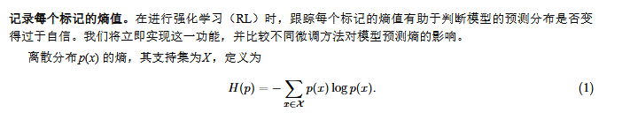
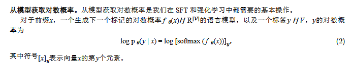
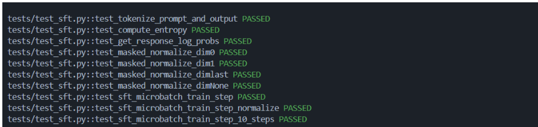

### 一些需要注意的地方

1. **损失函数**

   **其次，我们将引入一个新的基准（Benchmark）来评估模型** 。然而，本次作业的重点是弥合基础模型与下游任务之间的差距（后训练），因此我们必须使用独立于交叉熵的评估方法 。我们将使用来自 Hendrycks 等人（2021）的 **MATH 12K 数据集**，该数据集由极具挑战性的高中数学竞赛题目组成 。我们将通过将模型输出与参考答案进行对比来评估模型 。

   **评估范式的转变**：不再仅仅通过预测下一个 token 的准确性（交叉熵损失）来衡量模型好坏，而是通过**最终答案的正确性**来衡量 。这反映了业界从关注“模型学得像不像”到关注“模型能不能解决问题”的转变。

2. **思维链**

​       思维链是指在得出最终答案之前，逐步思考问题并生成中间推理步骤的过程 。

**大语言模型的思维链推理**：早期的思维链方法通过使用“草稿本”（scratchpad）将问题拆解为中间步骤，从而微调模型解决简单的算术任务 。其他研究通过提示（Prompt）让强大的模型在回答前“一步步思考”，发现这显著提高了在年级数学题等推理任务上的表现 。

**通过专家迭代（Expert Iteration）学习推理**：自我提升推理者（STaR）框架将推理视为一个引导循环：预训练模型首先采样多种多样的思维链，仅保留那些导致正确答案的样本，然后对这些“专家”轨迹进行微调 。迭代这一循环可以提高模型的推理能力和解题率 。STaR 证明了这种使用基于字符串匹配的自动验证方法，可以在没有人类编写推理轨迹的情况下引导出推理技能 。

**通过验证奖励、o1 和 R1 进行推理强化学习**：最近的研究探索了使用更强大的强化学习算法和验证奖励来提高推理性能 。OpenAI 的 **o1**、DeepSeek 的 **R1** 以及 Moonshot 的 **Kimi k1.5** 使用策略梯度方法，在数学和代码任务上进行训练，通过字符串匹配或单元测试验证正确性，在竞赛数学和编程表现上取得了显著进步 。随后的工作证实，即使是在 1.5B 参数的小模型上，纯粹的验证奖励强化学习也能提升推理表现 。

### baseline

#### 模型：

Qwen 2.5 Math 1.5B推理

#### prompt:

为了能够完成答案与思考的检验，本文使用r1_zero 提示prompt，这个prompt强制让推理过程打上 `<think>` 标签，**并将最终的结论包裹在 `<answer>` 标签中。** **这种设计的核心作用主要有两点**

- **实现自动化提取与精确评分**：通过规范化的结构，后续的奖励函数（Reward Function）能够利用正则表达式，轻松剥离长篇大论的推理步骤，精准提取出最终答案，并与标准答案（Ground Truth）进行数学等价性验证。
- **提供格式约束与奖励信号**：在强化学习（如 GRPO）的训练过程中，标签的完整性本身就被作为一种基础的“格式奖励（Format Reward）”。这能有效引导模型在训练初期快速收敛，固化出“先深度思考、后严格作答”的规范思维链（CoT）范式。

#### 评判标准

**1. 格式奖励 (Format Reward) 评判标准**

- **得 1 分**：模型输出必须严格包含完整的闭合标签。且 `</think>` 与 `<answer>` 之间**允许有1个空格/制表符，但最多只能包含一个换行符**。
- **得 0 分**：缺少 `<answer>` 或 `</answer>` 标签，或者在思考与作答阶段之间使用了过多的换行符（如 `\n\n`）破坏了规定的排版格式。

**2.答案奖励 (Answer Reward) 评判标准**

- **得 1 分**：在**格式得分为 1 的前提下**，成功提取 `<answer>` 标签内（或其中的 `\boxed{}` 内）的文本，并经过规范化处理（如去除单位、化简分数、统一浮点数精度）后，与标准答案（Ground Truth）在数学逻辑上**完全等价**（通过 SymPy 解析或 MathD 匹配）。
- **得 0 分**：答案在数学上错误、提取失败、或者格式本身就错误。

最终的**总奖励（Reward）**采取严格的一票否决制。即使格式正确（格式奖励 = 1.0），只要答案错误，**总奖励依然归零（Reward = 0.0）**。这能有效防止模型在 RL 训练中通过“只输出漂亮格式但不认真做题”来骗取分数。

#### 结果

刚开始官方对格式的要求非常严格，因此可能会出现**误杀**问题，我对多种格式进行了一定的改进，最后得到的结果如下表：

| 模型                   | 格式机制      | 数据集              | **准确率** | 格式错误率 | 格式对答案错 |
| ---------------------- | ------------- | ------------------- | ---------- | ---------- | ------------ |
| **Qwen 2.5 Math 1.5B** | 空格×n+换行×n | Bespoke-Stratos-17k | 1.50%      | 5.50%      | 93.0%        |
| **Qwen 2.5 Math 1.5B** | 严格空格      | GSM8K               | 2.65%      | 79.91%     | 17.44%       |
| **Qwen 2.5 Math 1.5B** | 空格×1+换行×1 | GSM8K               | 3.18%      | 73.16%     | 23.65%       |
| **Qwen 2.5 Math 1.5B** | 空格×n+换行×1 | GSM8K               | 3.18%      | 71.72%     | 25.09%       |
| **Qwen 2.5 Math 1.5B** | 空格×n+换行×n | GSM8K               | 3.18%      | 71.34%     | 25.47%       |

[^]: <think>与<answer>中间通过不同格式机制筛选

**准确率触顶**：将格式限制放宽后，整体准确率仅从 2.65% 微升至 3.18%，说明模型本身的基础推理能力薄弱（“不会做题”）。

**错误类型转移**：格式错误率虽大幅下降（从 79.91% 降至 25.09%），但这部分全转化成了“格式对了但答案算错”（激增至 71.72%）。

**核心结论**：模型的低分并非因为“格式要求太严被误杀”，而是真正的数学逻辑太差。这凸显了后续使用强化学习提升其内在推理能力的必要性。


### SFT监督微调

#### 监督微调伪代码

**算法 1：监督微调 (Supervised Finetuning, SFT)** 

- **输入**: 初始策略模型 $\pi_{\theta_{init}}$ ；SFT 数据集 $\mathcal{D}$ 
- 1: 策略模型初始化：$\pi_{\theta} \leftarrow \pi_{\theta_{init}}$ 
- 2: **for** 步骤 $= 1, ..., n\_sft\_steps$ **do** 
- 3: $\quad$ 从数据集 $\mathcal{D}$ 中采样一批（batch）问答对 $\mathcal{D}_{b}$ 
- 4: $\quad$ 使用模型 $\pi_{\theta}$ 计算给定问题的回答的交叉熵损失 
- 5: $\quad$ 根据交叉熵损失进行梯度步进（gradient step），以更新模型参数 $\theta$ 
- 6: **end for** 
- **输出**: 训练后的策略模型 $\pi_{\theta}$ 

#### 数据集的制作标准

所有脚本均采用 $R1-Zero$ 提示词标准，强制要求模型输出以 `<think>` 标签开始，并在提示词末尾预留该标签以引导模型进行思维链（CoT）推理。

##### train数据集

**RL (强化学习) 格式**：包含 `prompt`、`question` 和 `answer` 字段，主要用于基线评估及 $GRPO$ 等强化学习训练。

**SFT (监督微调) 格式**：包含 `prompt`、`response` 和 `ground_truth`。其中 `response` 被构造为符合推理规范的结构：`[推理过程]\n</think>\n<answer> [最终答案] </answer>`

##### test数据集

与train格式完全一样。

#### GSM8K数据集

将GSM8K进行转化，文档中说明的格式是一个包含格式化提示和目标回答的 JSON 元素：`{"prompt": str, "response": str}` 。其中目标回答包含了思维链推理轨迹和最终答案 。

GSM8K数据集是是**人类专家**写的标准解析， 前面是一段非常精简、毫无废话的解题步骤，然后用 `####` 隔开，最后是数字答案。因此需要用think标签和answer标签进行包裹（强依赖，评判基准）

最后的格式类似如此：{"prompt": str, "response": str}，其中promot可以用上一个baseline处理方式，question替换方式，response进行标签的插入。

SFT的特点就是**交叉熵**损失，必须一字不拉的学习。

掩码：prompt必须全部掩码，还有padding这些。prompt的一些提示对于训练没有帮助。

#### Bespoke-Stratos-17k 数据集

Bespoke-Stratos-17k 数据集存在AI生成的，因此长度和数据集质量十分不稳定，因此要对他进行如下清洗：

1. **标签替换**：`HuggingFaceH4/Bespoke-Stratos-17k` 中，它使用的是另一套特殊的标记词：
   - **思考过程**：`<|begin_of_thought|>` 和 `<|end_of_thought|>`
   - **最终答案**：`<|begin_of_solution|>` 和 `<|end_of_solution|>`
2. **结构检查**：所有的标签，包括["<think>", "</think>", "<answer>", "</answer>"只能有一个，切必须按照上述顺序实现：`开始思考 -> 结束思考 -> 开始回答 -> 结束回答`。
3. **硬性要求**：
   - 思考标签里面不允许有答案，只要提取出来\box里面的内容就删掉
   - answer里面必须有\boxed{...}，没有的也会直接删掉
   - answer里面长度太长（大于100），不直接丢弃，而是用正则去除核心答案，并重新拼装为response
   - 精确提取答案部分，然后使用extract_answer获取仅有\box部分的答案作为groud_truth
4. **长度限制**：过滤掉总 Token 数不在 $[500, 5120]$ 范围内的样本。这保证了思维链既不能太短（缺乏推理过程），也不能太长（超出模型上下文或过于冗余）。


##### --- 过滤总结报告 ---

原始数据总量: 16610 条
清洗后剩余量: 3881 条 (存活率: 23.37%)

具体处理状态分布：
  boxed_in_think: 6679
  missing_ground_truth: 5378
  fixed_and_passed: 4553
  length_out_of_range: 672
  missing_qa: 0
  extract_answer_failed_on_gt: 0
========================================                                                                                            


#### **梯度累计技术**

尽管模型采用bfloat16浮点型数据结构并使用FlashAttention-2注意力机制,但即便是80GB显  存的GPU也难以支持合理的批量处理规模。为实现更大批量计算,我们可以采用名为梯度累积的技术。该  技术的核心思想是:无需在每个批次后更新模型权重(即执行优化器步骤),而是将多个批次的梯度值累  积后再进行梯度更新。直观来说,若使用更大容量的GPU,我们应当能像一次性处理32个样本批次那样获  得相同计算结果。将样本分为16个批次,每批次2个样本,最后取平均值。

梯度累积在PyTorch中实现起来非常简单。需要说明的是,每个权重张量都包含一个存储梯度的属性.  grad。在调用loss.backward()函数前,该属性值为None;执行loss.backward()后,属性值即为梯度。通常我们  会先执行优化器的一步操作,再通过optimizer.zero_grad()()将梯度重置为零,从而清空权重张量的.grad字  段。

相关工具





在 SFT 中我们最小化的损失是给定提示时目标输出的负对数似然。为了计算这个损  失,我们需要计算给定提示时目标输出的对数概率,并对输出中的所有标记进行求和,同时屏蔽提示中的  标记并填充标记。

#### 

#### 验证阶段的小tips

在生成文本时，要进行右对齐，即再左边标签打上padding.（让最后一个词能够精准预测）

在计算交叉熵是，要在右边标签打padding（位置编码的正确性，一句话开头应该是0）

```
torch.nn.utils.rnn.pad_sequence默认右对齐，左对齐用torch.nn.functional.pad，或者将句子倒转，然后打标签再反转
```

#### 打padding的技巧

SFT必须先补全再踢人，不然会踢掉一些原始数据。

response_masks是专门对label的掩码，因此要从1开始

对于计算Loss ，除了多轮batch的平均，还要除一个batch数量的平均

对于inputs和lable的补全，都需要填padding_id,不能自己填-100啥的，至于如何不加入交叉熵，补全句子的时候他就给了默认值是0了，因此padding位置就是0

#### 测试结果



### SFT在GSM8K的检验结果

| **数据集** | **训练样本数** | **正确率** | **格式错误率** | **Token长度 (平均)** | **成功样本平均Token** | **错误回答平均Token** |
| ---------- | -------------- | ---------- | -------------- | -------------------- | --------------------- | --------------------- |
| GSM8K      | 128            | 20.50%     | 27.00%         | 301.62               | 254.07                | 313.88                |
| GSM8K      | 256            | 38.00%     | 9.50%          | 316.77               | 250.55                | 357.35                |
| GSM8K      | 512            | 45.50%     | 8.00%          | 347.40               | 257.67                | 422.31                |
| GSM8K      | 1024           | 51.50%     | 1.50%          | 340.51               | 283.26                | 401.31                |
