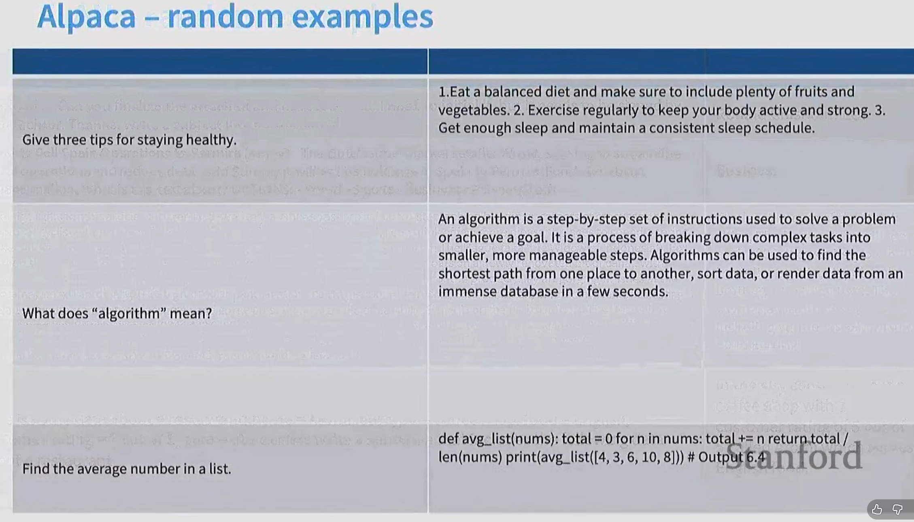
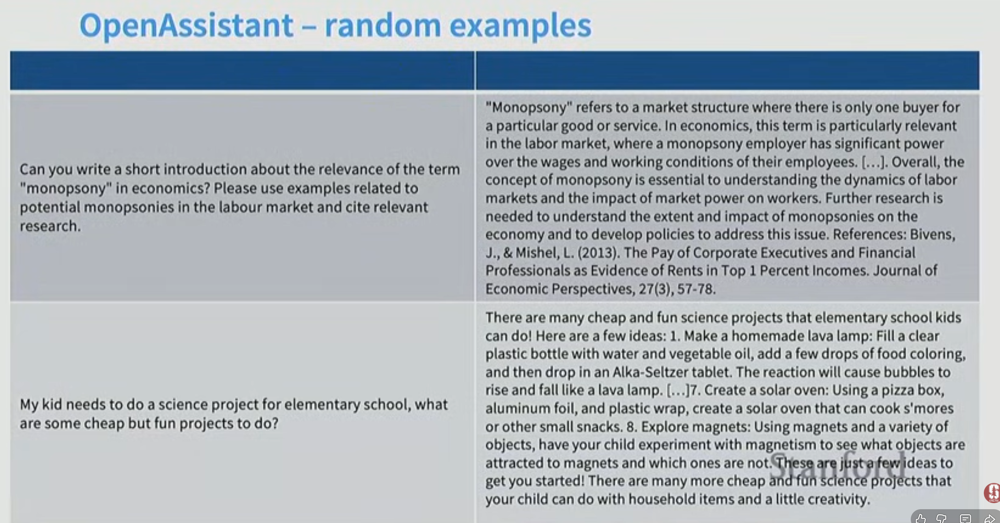
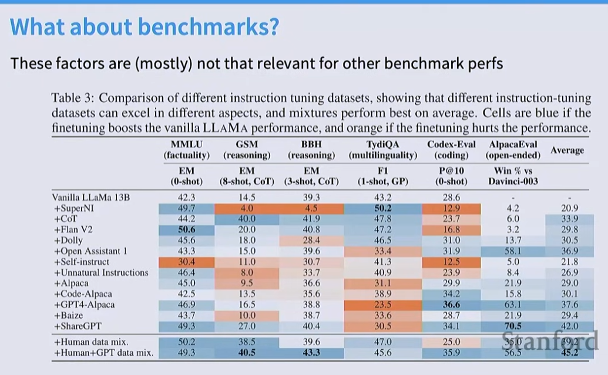
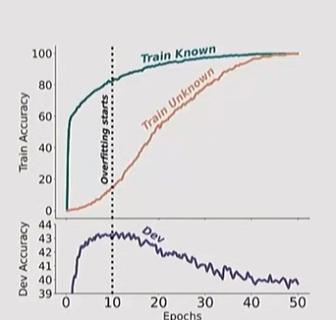
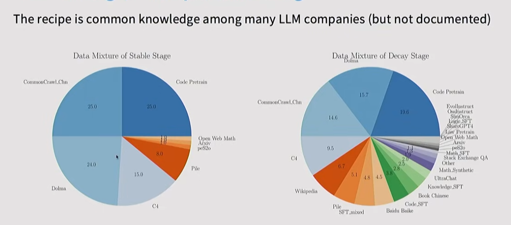
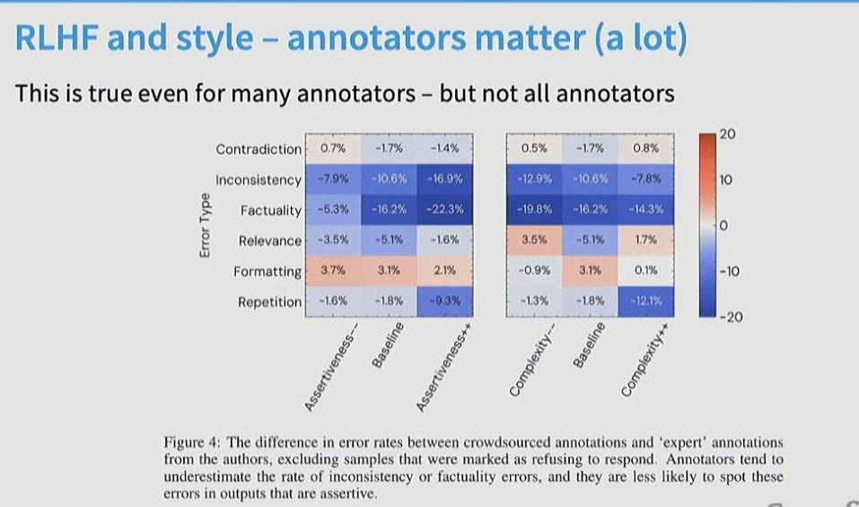
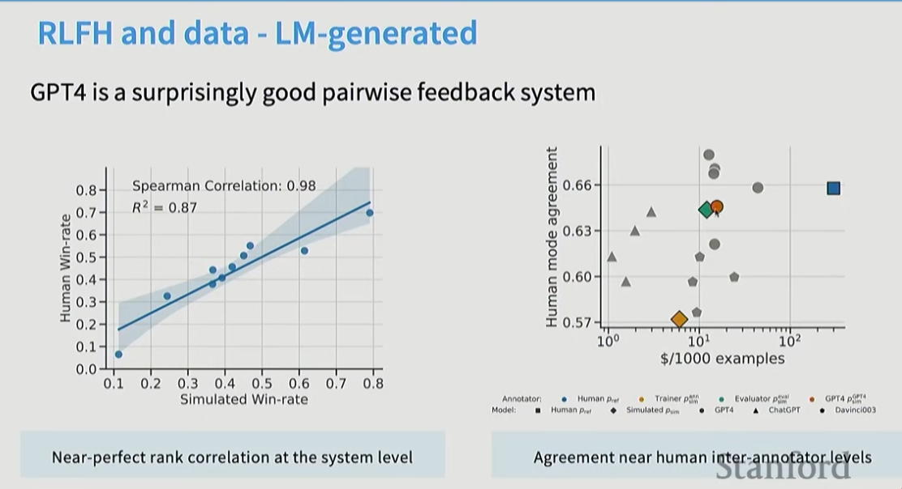

# 实现对语言模型（LM）输出更好、更严密的控制

预训练数据并不完全是我们想要的（但它具有可扩展性）……

> **我们能否收集我们“确实想要”的行为数据并训练语言模型？**

1. **那些数据看起来是什么样的？**
2. **我们如何才能最好地利用这些数据？**
3. **我们为此需要规模（Scale）吗？**

## **标准方法 —— 模仿（SFT）随后进行强化学习（‘RL’HF）**

#### **第 1 步：收集演示数据并训练有监督策略（SFT）**

- 从我们的提示词（Prompt）数据集中采样一个提示。
- 标注员演示理想的输出行为。
- 这些数据被用于通过有监督学习（Supervised Learning）对 GPT-3 进行微调。

#### **第 2 步：收集比较数据并训练奖励模型（RM）**

- 采样一个提示和多个模型输出结果。
- 标注员将这些输出结果按质量从最好到最差进行排序。
- 这些数据被用于训练我们的奖励模型（Reward Model）。

#### **第 3 步：使用强化学习针对奖励模型优化策略（RL）**

- 从数据集中采样一个新提示。
- 策略（模型）生成一个输出。
- 奖励模型计算该输出的奖励值。
- 该奖励被用于通过 PPO 算法更新策略。

#### **部分指令微调 (Instruction-tuning) 数据**

##### 谷歌的微调模型集合

**Finetuning tasks (微调任务)** 包含以下四大类：

- **TO-SF (特定任务):**
  - Commonsense reasoning (常识推理)
  - Question generation (问题生成)
  - Closed-book QA (闭卷问答)
  - Adversarial QA (对抗性问答)
  - Extractive QA (抽取式问答)
  - Title/context generation (标题/上下文生成)
  - Topic classification (主题分类)
  - Struct-to-text (结构化数据转文本)
  - *(55个数据集，14个类别，193个任务)*
- **Muffin (多任务微调):**
  - Natural language inference (自然语言推理)
  - Code instruction gen (代码指令生成)
  - Program synthesis (程序合成)
  - Dialog context generation (对话上下文生成)
  - Closed-book QA (闭卷问答)
  - Conversational QA (对话式问答)
  - Code repair (代码修复)
  - *(69个数据集，27个类别，80个任务)*
- **CoT (Reasoning) (思维链 / 推理):**
  - Arithmetic reasoning (算术推理)
  - Commonsense Reasoning (常识推理)
  - Implicit reasoning (隐式推理)
  - Explanation generation (解释生成)
  - Sentence composition (句子组成)
  - *(9个数据集，1个类别，9个任务)*
- **Natural Instructions v2 (自然指令集 v2):**
  - Cause effect classification (因果分类)
  - Commonsense reasoning (常识推理)
  - Named entity recognition (命名实体识别)
  - Toxic language detection (有毒/有害语言检测)
  - Question answering (问答)
  - Question generation (问题生成)
  - Program execution (程序执行)
  - Text categorization (文本分类)

#####  Oasst (Open Assistant / 开放助手)

##### Stanford (斯坦福大学)

### 多种数据集

基准概括

类GPT回答

复杂查询+复杂回答（高质量promot）

### 这些数据集的特点和问题

- **长度和要点**（风格差异）
- **参考文献及其他复杂知识**

**虽不显眼，但却很重要的方面……**

- **规模**
- **安全性**

### 基准测试

**不同指令微调数据集的对比。** 结果显示，不同的指令微调数据集在不同方面各有擅长，而混合数据集（Mixtures）的平均表现最好。如果微调**提升**了原生 LLaMA 的性能，单元格显示为**蓝色**；如果微调**损害**了性能，则显示为**橙色**。

- **最左侧列 (Datasets)：** 使用的微调数据集名称（如 SuperNI, CoT, Flan V2, ShareGPT 等）。
  - **Vanilla LLaMA 13B：** 原生 LLaMA 13B 模型（基准线）。
  - **+Human data mix：** 人类数据混合。
  - **+Human+GPT data mix：** 人类+GPT数据混合。
- **MMLU (factuality)：** MMLU 任务（考察**事实性**）。
- **GSM (reasoning)：** GSM 任务（考察**推理能力**）。
- **BBH (reasoning)：** BBH 任务（考察**推理能力**）。
- **TydiQA (multilinguality)：** TydiQA 任务（考察**多语言能力**）。
- **Codex-Eval (coding)：** Codex-Eval 任务（考察**代码能力**）。
- **AlpacaEval (open-ended)：** AlpacaEval 任务（考察**开放式问答**）。
- **Average：** 平均分。

### 幻觉训练：

强制模型回答不知道的问题需要更长的时间达到同样的accut

反直觉：SFT如果在输入加入非常正确且丰富的知识，可能hi让LLM编造与这种知识表达深度相同的回复，蒸馏要注意这点

**关于知识提取与对齐的结论**

1. **你可能并不希望针对“长尾知识”（tail knowledge）进行微调，即使这正是该语言模型的应用场景。**
   - *解析：长尾知识指的是那些罕见、冷门的知识。这句话意味着，试图通过微调让模型记住这些冷门知识效果可能并不好，或者会有副作用。*
2. **原则上，“强化学习（RL）”式的正确性反馈可能会有所帮助。**
   - *解析：指利用类似 RLHF（人类反馈强化学习）的方法，针对内容的对错给予反馈，可能有助于改善模型表现。*
3. **语言模型（LMs）中的知识存储与提取是混乱且微妙的。**
   - *解析：指模型并不像数据库那样整齐地存储知识，其内部机制非常复杂（Messy）且充满细节（Nuanced），难以简单概括。*

### SFT简述

**SFT（监督微调）数据**

1. **当指令微调（SFT）仅仅用于提取预训练阶段已有的行为模式，而不是试图添加新的模式时，它的效果是最好的。**
   - *解析：SFT 更多是像一把钥匙，去解锁模型在预训练海量数据中已经学到的能力，而不是试图在这个阶段教给它全新的知识或能力。*
2. **添加（哪怕是事实正确的！）数据有时反而会造成损害。**
   - *解析：并不是数据越多越好，如果数据分布不当，即使内容是正确的，也可能破坏模型的原有性能（如前几张图提到的推理能力下降）。*
3. **少量“正确类型”的行为数据（如安全性、指令遵循、风格）就能产生巨大影响，但仍存在一个能从更多数据中获益的“长尾”部分。**
   - *解析：对于让模型“听话”或“安全”，少量高质量数据就够了；但对于一些罕见、复杂的场景（长尾），增加数据量仍然是有帮助的。

第一阶段：纯粹预训练数据，第二阶段：一部分预训练数据（warmup_stable）于高质量文本调优(warmup_decay)

### 模仿 (SFT)

**全称：** Supervised Fine-Tuning（监督微调）

- **翻译：**
  - 拟合 $\hat{p}(y|x) \approx p^*(y|x)$，其中 $p^*(y|x)$ 是某种参考分布。
  - 纯生成式建模视角。
  - 需要来自参考策略（参考数据）的样本。

> **解释：** 这是一个“照葫芦画瓢”的过程。模型的目标是**模仿**高质量的人类回答，尽可能让输出的概率分布接近人类的说话方式。

------

### 2. 优化 (RLHF)

**全称：** Reinforcement Learning from Human Feedback（人类反馈强化学习）

- **翻译：**
  - 寻找 $\hat{p}(\mathbf{y}|\mathbf{x})$，使得针对奖励 $R(y,x)$ 的期望值 $\max_p E_p[R(y,x)]$ 最大化。
  - 最大化某种我们可以测量的奖励函数。
  - 语言模型被视为“策略（Policies）”，而不是某种分布的模型。

> **解释：** 这是一个“刷分”的过程。模型不再只是模仿说话，而是被视为一个决策者（Agent）。它的目标是通过调整回答策略，去**赢取**更高的奖励分数（即让人类觉得更好、更有用或更安全）。
>
> 为什么选择优化（RLHF）而不是仅仅依赖监督学习（SFT），核心论点在于**成本**和**数据获取的难度**。

**SFT（监督微调）数据可能 \*非常昂贵\*，而且对于某些任务来说，让专家去验证（结果）比让专家去解答要容易得多。** *(解释：写出一个完美的答案很难，但判断两个答案哪个更好很容易且便宜。)*

**大多数前沿模型实验室在后训练数据上花费数百万美元……**

|                                | **基座模型 (Base model)** | **监督学习 (一次性) (Supervised learning)** | **成对反馈 (RLHF)(Pairwise feedback)** | **强化学习 (RL)** | **评估 (Evaluation)** |
| ------------------------------ | ------------------------- | ------------------------------------------- | -------------------------------------- | ----------------- | --------------------- |
| **计算成本** (Compute cost)    | $300k (30万美元)          | $100                                        | $100                                   | $100              | $0                    |
| **标注成本** (Annotation cost) | $0                        | **$25k (2.5万美元)**                        | **$4k (4千美元)**                      | $0                | $50                   |

**Pairwise feedback**（成对反馈）是 RLHF（人类反馈强化学习）流程中至关重要的一步，它的核心逻辑是：**“比较”比“创作”更容易，也更便宜。**

在你的那张图中，它对应的是 $4k 成本的那一栏，远低于 $25k 的 SFT（人工手写答案）。

它的具体操作流程通常如下：

1. **输入（Prompt）：** 给模型一个问题，例如“请写一首关于春天的诗”。
2. **生成（Generation）：** 让模型生成**两个**不同的回答（回答 A 和 回答 B）。
3. **比较（Comparison）：** 人类标注员不需要自己写诗，只需要阅读这两个回答，然后判断：“A 比 B 好”或者“B 比 A 好”。

图片中提到 SFT（专家手写答案）成本是 $25k，而 Pairwise feedback 只有 $4k。原因很简单：

- **认知负担不同：**
  - **SFT (创作):** 如果你要教模型写代码，你得雇佣一个高级程序员，让他从头手写一段完美的代码。这很累，很慢，很贵。
  - **Pairwise (判断):** 你只需要让程序员看两段代码，一眼就能看出哪段逻辑更通顺或没有 Bug。这非常快，而且便宜。
- **准确性：** 人类通常更擅长**挑错**和**鉴赏**，而不是凭空创作。比如我们都能分辨出什么是好电影，什么是烂片，但我们自己拍不出好电影。

这些成对的比较数据（$D = \{x, y_w, y_l\}$，即问题、胜者、败者）会被用来训练**奖励模型（Reward Model）**。

- 奖励模型不需要生成文本，它只需要学会给文本**打分**。
- 通过大量的“A 比 B 好”的数据，奖励模型就学会了人类的偏好：什么样的回答是人类喜欢的（高分），什么是不喜欢的（低分）

### 自信谬误

**左侧纵轴 (Error Type - 错误类型):**

- Contradiction (矛盾)
- Inconsistency (不一致)
- Factuality (事实性/真实性)
- Relevance (相关性)
- Formatting (格式)
- Repetition (重复)

**横轴 (变量):**

- 左图：Assertiveness (笃定程度/自信程度) —— 分为 `Assertiveness--` (不自信), `Baseline` (基准), `Assertiveness++` (非常自信)。
- 右图：Complexity (复杂程度) —— 分为 `Complexity--` (简单), `Baseline` (基准), `Complexity++` (复杂)。

**右侧颜色条:**

- 红色表示正值，蓝色表示负值（数值越负，表示差异越大）。

这张图揭示了 RLHF 训练中一个被称为 **“自信谬误” (Confidence Bias)** 或 **“阿谀奉承” (Sycophancy)** 的现象：

**1. 语气越自信，错误越难被发现 (左图分析)**

- 看左图的 `Factuality`（事实性）一行：
  - 当模型语气不自信 (`Assertiveness--`) 时，差值为 **-5.3%**。
  - 当模型语气非常自信/笃定 (`Assertiveness++`) 时，差值扩大到了 **-22.3%**。
- **结论：** 如果 AI 用一种非常自信、权威的语气胡说八道，普通人类标注者往往会被“唬住”，误以为它是对的，从而给它打高分。这会导致模型学到一个坏习惯：**“只要我听起来很自信，瞎编也没关系。”**

**2. 回答越复杂，错误也越难被发现 (右图分析)**

- 看右图的 `Factuality` 一行：
  - 随着回答复杂度的增加 (`Complexity++`)，蓝色的负值依然很大。
- **结论：** 当 AI 生成长篇大论或逻辑复杂的回答时，普通标注者可能因为懒惰或能力不足，无法仔细核查其中的事实错误。

**3. 只有“格式”错误容易被高估 (Formatting)**

- 注意 `Formatting` 这一行是浅红色的（正值）。这意味着普通标注者可能过于关注格式等表面问题，甚至比专家挑出了更多的格式毛病，但这并不是模型的核心能力问题。

###  **RLAIF**

**用 AI（特别是 GPT-4）来生成训练数据，代替人工进行反馈**。这通常被称为 **RLAIF**

**GPT-4 是一个令人惊讶的、优秀的“成对反馈系统”（Pairwise Feedback System）。** 也就是说，让 GPT-4 去判断“回答 A 和回答 B 哪个更好”，它的判断结果与人类高度一致。

 使用 GPT-4 进行标注，能在保持“人类级”一致性的同时，提供一种自动化的解决方案（尽管 GPT-4 的 API 成本也不算极其便宜，但在大规模和速度上具有优势）。

