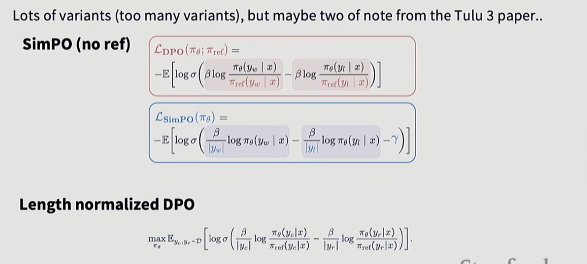
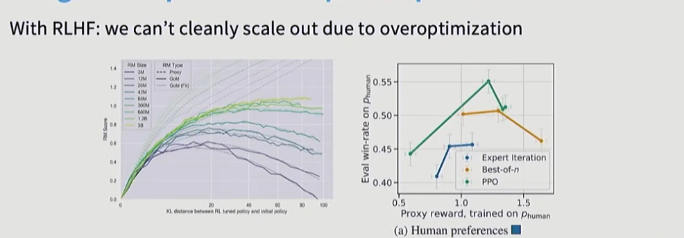
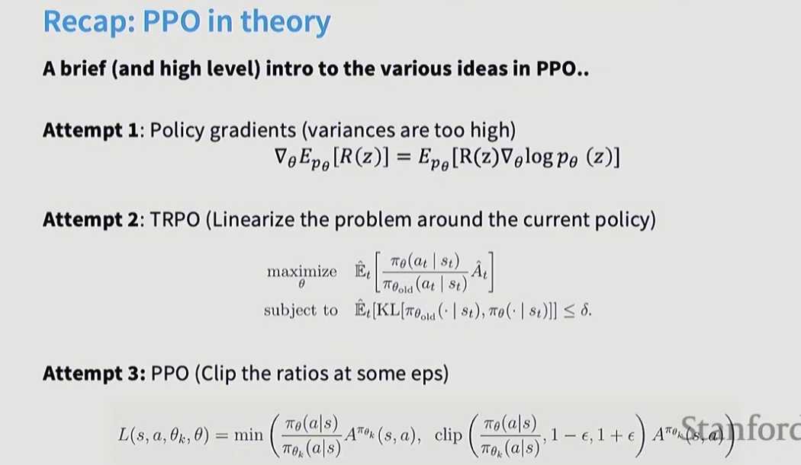
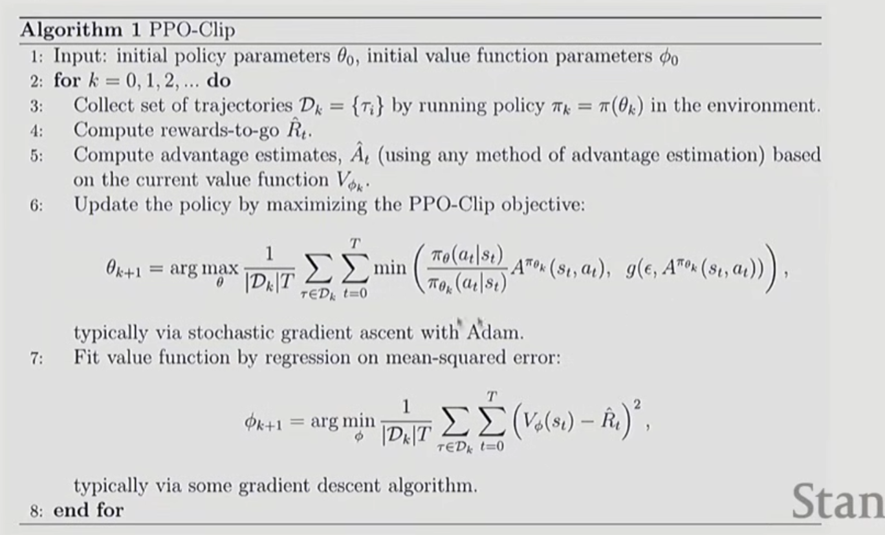
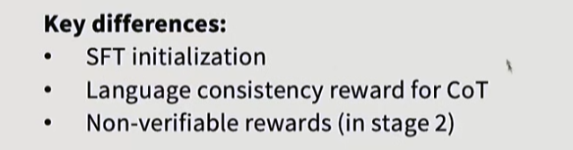
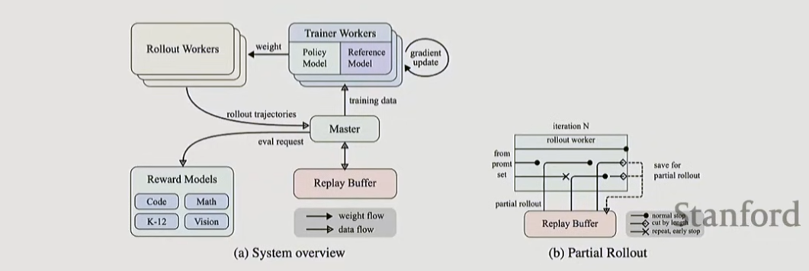
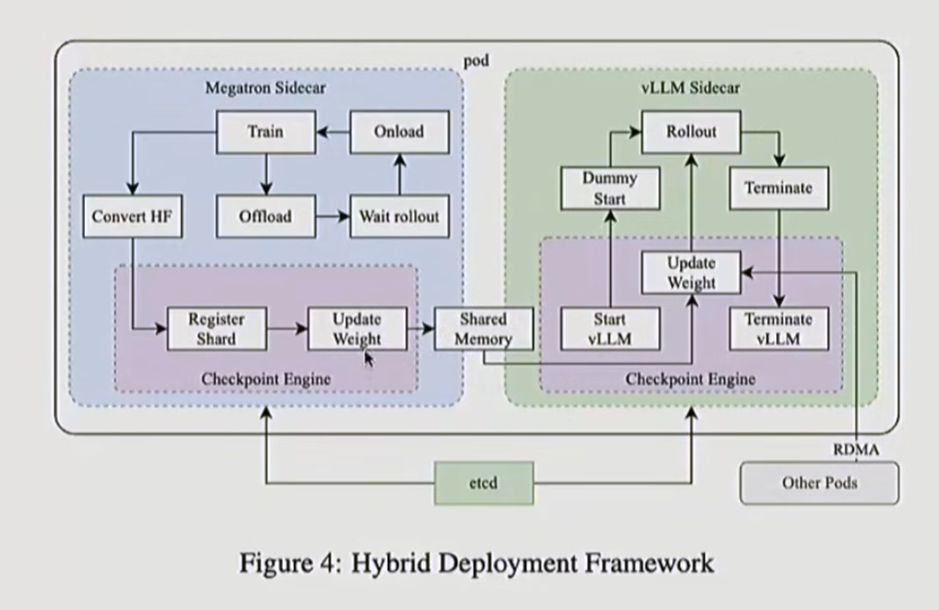
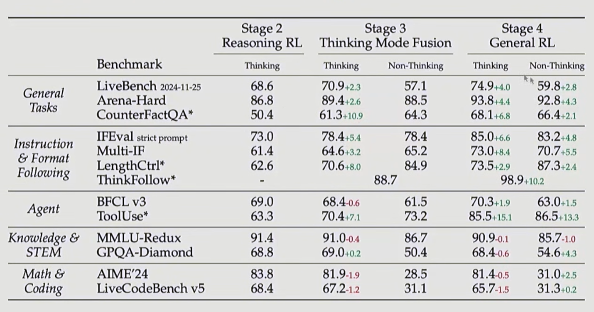
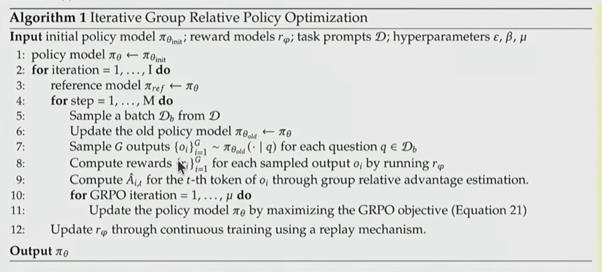

### PPO算法

**强化学习 (RL)。** 我们再次遵循 Stiennon 等人 (2020) 的方法，使用 PPO (Schulman 等人, 2017) 在我们的环境中微调 SFT 模型。该环境是一个“老虎机”（bandit）环境，它会展示一个随机的用户提示（prompt），并期望得到对该提示的回复。给定提示和回复后，它会产生一个由奖励模型确定的奖励，并结束该回合（episode）。此外，我们在每个 token 上增加了一个来自 SFT 模型的 KL 惩罚，以减轻奖励模型的过度优化。价值函数初始化自奖励模型（RM）。我们将这些模型称为“PPO”。

我们还尝试了将预训练梯度混合到 PPO 梯度中，以修复在公共 NLP 数据集上的性能退化。我们将这些模型称为“PPO-ptx”。我们在 RL 训练中最大化以下组合目标函数：

$$\text{objective}(\phi) = E_{(x,y)\sim D_{\pi^{RL}}} [r_\theta(x,y) - \beta \log (\pi_\phi^{RL}(y \mid x) / \pi^{SFT}(y \mid x))] + \gamma E_{x\sim D_{\text{pretrain}}} [\log(\pi_\phi^{RL}(x))]$$

其中 $\pi^{RL}_\phi$ 是学习到的 RL 策略，$\pi^{SFT}$ 是监督训练的模型，$D_{\text{pretrain}}$ 是预训练分布。KL 奖励系数 $\beta$ 和预训练损失系数 $\gamma$ 分别控制 KL 惩罚和预训练梯度的强度。对于“PPO”模型，$\gamma$ 设为 0。除非另有说明，本文中的 InstructGPT 指的是 PPO-ptx 模型。

#### **第一部分：追求高分 (Reward)**

- **项：** $r_\theta(x,y)$
- **含义：** 这是**奖励模型**给出的分数。
- **目的：** 让模型生成的回答 $y$ 尽可能符合人类的喜好（比如有用、诚实、无害），从而获得更高的分数。

#### **第二部分：不要忘本 (KL Penalty)**

- **项：** $- \beta \log (\pi_\phi^{RL}(y \mid x) / \pi^{SFT}(y \mid x))$
- **含义：** 这是一个**惩罚项**。它计算当前的强化学习模型（$\pi^{RL}$）和原始的监督微调模型（$\pi^{SFT}$）之间的 **KL 散度**。
- **目的：**
  - **防止“奖励黑客”（Reward Hacking）：** 如果没有这一项，模型可能会为了拿高分而输出一些乱码或奇怪的句子，只要这些句子能骗过奖励模型就行。
  - **保持语言流畅性：** 强制要求新模型的输出分布不能偏离原始模型太远，确保它说的话还是“人话”。

#### **第三部分：保持智商 (Pretraining Gradients)**

- **项：** $+ \gamma E_{x\sim D_{\text{pretrain}}} [\log(\pi_\phi^{RL}(x))]$

- **含义：** 这是标准的**语言建模目标**（即预测下一个词），使用的数据是原始的预训练数据（如维基百科、书籍等）。

- **目的：**

  - ### 解决 **“对齐税”（Alignment Tax）** 问题。

  - 在 RLHF 过程中，模型往往会因为过分迎合人类喜好而丧失一些通用的做题能力或事实知识。加上这一项，是为了让模型在学会有礼貌的同时，别忘了原本学到的物理、数学和历史知识。、

  - 这一项一版好多人不做

### PPO奖励模型（PLHF）

**奖励模型。** 为了训练我们的奖励模型，我们从上述的监督基准模型开始，然后添加一个随机初始化的线性头（linear head），用于输出一个标量值。我们训练这个模型来预测：给定一个帖子 $x$，在两个摘要 $y \in \{y_0, y_1\}$ 中，哪一个被人类判断为更好。如果人类倾向于 $y_i$，我们可以将奖励模型（RM）的损失函数写为：（ **RLHF损失**）

$$\text{loss}(r_\theta) = -E_{(x, y_0, y_1, i) \sim D} [\log(\sigma(r_\theta(x, y_i) - r_\theta(x, y_{1-i})))]$$

其中 $r_\theta(x, y)$ 是参数为 $\theta$ 的奖励模型对帖子 $x$ 和摘要 $y$ 输出的标量分数，$D$ 是人类判断的数据集。在训练结束时，我们对奖励模型的输出进行归一化，使得数据集中的参考摘要的平均得分为 0。

这个loss的要求就是让**正确的分数**减去**错误的分数**尽可能大，使用sigmoid转化为0或1，最后转化为概率，如果接近1则损失就小

**人类反馈策略。** 我们希望利用上述训练好的奖励模型，来训练一个能生成被人类判定为更高质量输出的策略（Policy，即 AI 模型）。我们主要通过强化学习来实现这一点，具体来说是将奖励模型的输出作为整个摘要的奖励，并使用 PPO 算法进行最大化，其中每个时间步是一个 BPE token。我们将策略初始化为在 Reddit TL;DR 数据集上微调过的模型。

**重要的是，我们在奖励中加入了一项，用于惩罚学习到的 RL 策略 $\pi_\phi^{RL}$ 与原始监督模型 $\pi^{SFT}$ 之间的 KL 散度**（如之前 [25] 中所做的那样）。完整的奖励 $R$ 可以写为：

$$R(x, y) = r_\theta(x, y) - \beta \log[\pi_\phi^{RL}(y|x) / \pi^{SFT}(y|x)]$$

**这个 KL 项有两个目的。** 首先，它作为一个**熵奖励（entropy bonus）**，鼓励策略进行探索，并防止其坍塌到单一模式（mode collapse）。其次，它确保策略**不会学习生成与奖励模型在训练期间所见数据差异过大的输出**。

对于 PPO 的价值函数（Value Function打分），我们使用一个与策略参数完全分离的 Transformer。这可以防止对价值函数的更新部分破坏预训练的策略。（即使用一个专门的打分transformer，而不是一个模型说话的打分全干）

### DPO算法

DPO 是一种目前非常流行的大语言模型（LLM）对齐方法，它旨在替代传统的 RLHF（基于人类反馈的强化学习，通常使用 PPO 算法）。

#### 第一步：确立 RLHF 的优化目标 (The Objective)

这是 DPO 的出发点，即标准的 RLHF 目标函数。

$$\max_{\pi_\theta} \mathbb{E}_{x \sim \mathcal{D}, y \sim \pi_\theta} [r(x, y)] - \beta \mathbb{D}_{\text{KL}} [\pi_\theta(y|x) || \pi_{\text{ref}}(y|x)]$$

**解析：**

- 这个公式包含两个相互制衡的目标：
  1. **最大化奖励** ($\mathbb{E}[r]$)：希望模型生成的回答 $y$ 能获得尽可能高的分数。
  2. **最小化 KL 散度** ($\mathbb{D}_{\text{KL}}$)：希望训练后的模型 $\pi_\theta$ 不要偏离原始的基础模型 $\pi_{\text{ref}}$ 太远。
- **$\beta$ (Beta)：** 这是一个超参数，用来控制“保守程度”。$\beta$ 越大，模型越不敢偏离原模型；$\beta$ 越小，模型越倾向于为了高分而冒险（可能导致产生幻觉或乱码）。

------

#### 第二步：推导最优策略的理论形式 (The Optimal Policy)

数学上可以证明，上述目标函数存在一个显式的**最优解**（虽然很难直接计算，但形式是确定的）。

$$\pi_r(y|x) = \frac{1}{Z(x)} \pi_{\text{ref}}(y|x) \exp\left( \frac{1}{\beta} r(x, y) \right)$$

**解析：**

- 这个公式告诉我们：一个“完美”的模型 $\pi_r$ 应该长什么样？
- 它是**基础模型** $\pi_{\text{ref}}$ 乘以**奖励的指数形式** $\exp(r/\beta)$。
- **直观理解：** 如果某个回答 $y$ 的奖励 $r(x,y)$ 很高，那么它的出现概率 $\pi_r(y|x)$ 就应该比原模型 $\pi_{\text{ref}}(y|x)$ 高很多。
- **$Z(x)$：** 这是一个归一化常数（配分函数），确保概率之和为 1。它非常难以计算，是 DPO 试图消除的对象。

------

#### 第三步：反解出“隐含奖励” (The Implied Reward)

这是 DPO 最具创新性的一步。如果不去求解 $\pi$，而是反过来，把 $r$ 表示出来呢？通过对第二步的公式取对数并移项：

$$r(x, y) = \beta \log \frac{\pi_r(y|x)}{\pi_{\text{ref}}(y|x)} + \beta \log Z(x)$$

**解析：**

- **核心洞察：** 奖励 $r$ 不再是一个黑盒子的分数，而是变成了**两个概率分布的比值**（Log-Likelihood Ratio）。
- **含义：** 如果一个模型 $\pi_r$ 认为某个答案出现的概率远高于参考模型 $\pi_{\text{ref}}$，那就意味着这个答案的“隐式奖励”很高。
- 这里的 $Z(x)$ 依然存在，但它只和输入 $x$ 有关，和具体的回答 $y$ 无关。这一点至关重要。

------

#### 第四步：构建 DPO 损失函数 (The DPO Objective)

我们将第三步得到的 $r(x,y)$ 代入到基于人类偏好的损失函数（Bradley-Terry 模型）中。

通常的偏好损失是：$\mathcal{L} = -\log \sigma(r(y_w) - r(y_l))$。（**胜者和败者，两个对**象）

$$\begin{aligned} \Delta r &= r(x, y_w) - r(x, y_l) \\ &= \left( \beta \log \frac{\pi_{\theta}(y_w | x)}{\pi_{\text{ref}}(y_w | x)} + \beta \log Z(x) \right) - \left( \beta \log \frac{\pi_{\theta}(y_l | x)}{\pi_{\text{ref}}(y_l | x)} + \beta \log Z(x) \right) \end{aligned}$$

代入后，$\beta \log Z(x)$ 在相减时**互相抵消**，最终得到 DPO 的核心公式：

$$\mathcal{L}_{\text{DPO}}(\pi_\theta; \pi_{\text{ref}}) = -\mathbb{E}_{(x, y_w, y_l) \sim \mathcal{D}} \left[ \log \sigma \left( \beta \log \frac{\pi_\theta(y_w | x)}{\pi_{\text{ref}}(y_w | x)} - \beta \log \frac{\pi_\theta(y_l | x)}{\pi_{\text{ref}}(y_l | x)} \right) \right]$$

**解析：**

- **$y_w$ vs $y_l$：** 分别代表人类偏好的“赢家回答”和不偏好的“输家回答”。
- **优化目标：** 这是一个二分类的对数似然损失。模型 $\pi_\theta$ 需要通过梯度下降来调整参数，使得：
  - **赢家比率** $\frac{\pi_\theta(y_w)}{\pi_{\text{ref}}(y_w)}$ 变大（相对于参考模型，更倾向于生成好回答）。
  - **输家比率** $\frac{\pi_\theta(y_l)}{\pi_{\text{ref}}(y_l)}$ 变小（相对于参考模型，抑制生成坏回答）。
- **无需 Reward Model：** 整个公式中不再包含独立的奖励模型 $r_\phi$，只包含我们需要训练的策略网络 $\pi_\theta$ 和冻结的参考网络 $\pi_{\text{ref}}$。

#### DPO的适用范围：

DPO（Direct Preference Optimization，直接偏好优化）本质上是在通过数据告诉模型：**“人类更喜欢 A 回答，不喜欢 B 回答”。**

它最适合 **开放式、主观性强、没有标准答案** 的领域：

- **创意写作与对话：** 比如“写一首悲伤的诗”或“用幽默的语气解释量子力学”。这种任务没有唯一的对错，只有“好”与“更好”。
- **价值观对齐（Alignment）：** 比如“如何礼貌地拒绝用户的危险请求”。
- **风格调整：** 让模型说话更像某个角色，或者更简洁。

数学（以及代码生成、逻辑推理）与上述任务有着本质区别。

**A. 核心冲突：客观真理 vs. 主观偏好**

- **数学题的特点：** 答案只有 **对（1）** 和 **错（0）**。$1+1=2$ 是绝对真理，$1+1=3$ 是绝对错误。
- **DPO 的逻辑：** DPO 试图学习 $P(\text{good}) > P(\text{bad})$。
- **问题所在：** 如果你用 DPO 训练数学，你是在告诉模型“答案是 2 的回答 **优于** 答案是 3 的回答”。这虽然没错，但不够强力。数学需要的是 **“必须是 2，绝对不能是 3”**，而不是“2 比 3 好一点点”。

**B. 致命弱点：缺乏“探索（Exploration）”能力**

这是最关键的一点。

- **DPO 是“离线”的（Off-policy）：** 它通常是在已经生成好的静态数据集上训练的（比如由 GPT-4 生成的一批数据）。模型只能模仿数据集中已有的解题路径。如果数据集里没有一种巧妙的解法，DPO 模型大概率学不会。
- **数学需要“在线”探索（On-policy）：** 做数学题像走迷宫。模型需要自己试着走几步（Chain of Thought），如果走通了（得到正确答案），RL 算法（如 PPO 或 DeepSeek 使用的 GRPO）会给它一个巨大的奖励。
  - **这种机制能让模型发现人类数据集中都没有的新解法（即“顿悟”时刻）。** DPO 很难做到这一点，它更像是在做“高级的模仿”。

**C. 信号的稀疏性与过程错误**

- **DPO 的数据：** 通常是 `(Prompt, Good Answer, Bad Answer)`。
- **数学的陷阱：** 在数学中，一个 `Bad Answer` 可能是“步骤全对，最后计算错了一位”，而另一个 `Bad Answer` 可能是“逻辑完全胡说八道”。
  - DPO 很难区分这两者的细微差别。
  - 而基于规则的 RL（Rule-based RL）可以通过**验证器（Verifier）**，精确地检测到哪一步逻辑断了，或者直接验证最终答案是否正确。



非常依赖于超参数，需求，运行环境，后续

### RLHF存在**非常严重的过度优化现象**



因为过度优化，RLHF 无法通过单纯扩大规模来提升效果

#### 左图解读：模型“自我感觉良好”但实际在退步

- **横轴 (KL distance)：** 代表经过 RL 训练后的模型与初始模型之间的差异有多大（模型改动了多少）。
- **纵轴 (RM Score)：** 奖励模型给出的分数。
- **实线 (Proxy)：** 模型试图优化的那个“代理奖励模型”的分数。
- **虚线 (Gold)：** 代表“金标准”奖励（更接近真实人类偏好）的分数。
- **现象：** 随着模型训练的深入（KL distance 变大），实线（代理分数）可能还在上升或维持高位，但虚线（真实分数）却开始大幅下降。
- **结论：** AI 学会了“钻空子”（Reward Hacking）。它通过产生一些奇怪的输出，骗过了不完美的奖励模型拿到了高分，但实际上偏离了人类真正的意图。

#### 3. 右图解读：经典的“倒 U 型”曲线

- **横轴 (Proxy reward)：** 模型在代理奖励模型上获得的分数。
- **纵轴 (Eval win-rate)：** 在真实人类评估中的胜率（实际质量）。
- **绿线 (PPO)：** 最常用的强化学习算法。
- **现象：** 这是一个典型的“倒 U 型”曲线。起初，随着奖励分数的提高，人类评估的胜率也确实提高了（左半边）。但是，一旦超过某个临界点（Peak），**虽然奖励分数还在涨，但人类觉得其实际表现（胜率）却在断崖式下跌**。
- **结论：** 一味地最大化奖励分数是危险的，会导致模型“过拟合”那个有缺陷的打分器。

### TRPO

**策略梯度（Policy Gradient, PG）** 是强化学习中一种通过直接优化“策略”来让 AI 变聪明的方法。“如果一个动作带来了好的结果（高分），就增加在这个状态下做这个动作的概率；如果结果不好，就减少概率。”

在强化学习中，“策略”（通常写成 $\pi$ 或 $p_\theta$）就是 AI 的**大脑**或**反射神经**。

- **输入：** 当前的环境画面或状态（比如：马里奥前面有个坑）。
- **输出：** 做每个动作的概率（比如：跳跃 80%，前进 10%，后退 10%）。
- **参数 $\theta$：** 控制这些概率的神经网络参数（权重）。

**策略梯度的目的：** 调整参数 $\theta$，让“跳跃”在这个状态下的概率变成 99%，因为这样能活下来（获得奖励）。

它清晰地展示了强化学习算法从原始策略梯度发展到 PPO（近端策略优化）的**三个演进阶段**。这张图的核心逻辑是：**发现问题（Attempt 1） -> 提出复杂的理论解法（Attempt 2） -> 简化为工程上好用的解法（Attempt 3）**。

以下是对这三个阶段的详细解析：

#### 1. Attempt 1: Policy Gradients（策略梯度）

这是最基础的方法，对应公式：

$$\nabla_\theta E_{p_\theta}[R(z)] = E_{p_\theta}[R(z)\nabla_\theta \log p_\theta (z)]$$

- **核心思想：** 直接对策略参数 $\theta$ 进行梯度上升，以最大化期望回报 $R(z)$。如果一个动作带来了高回报，就提高其发生的概率（通过 $\log p_\theta$ 的梯度），然后乘以一个学习率（步长）$\alpha$ 来更新模型参数 $\theta$。
- **存在的问题：** 图片中括号里注明了 **"variances are too high"（方差过高）**。
  - 这意味着梯度的估计非常不稳定（Noisy）。
  - 此外，它对“步长”（Step size）非常敏感。如果步长太大，策略可能会更新到一个很糟糕的状态，且很难恢复；如果步长太小，训练又太慢。

#### 2. Attempt 2: TRPO（置信域策略优化）

为了解决 Attempt 1 中步长不可控的问题，提出了 TRPO。

- **核心思想：** **"Linearize the problem around the current policy"（在当前策略附近线性化问题）**。它引入了“信任域”（Trust Region）的概念。

- #### 1. 核心公式解析

  **最大化目标函数 (Objective):**

  $$\underset{\theta}{\text{maximize}} \ \hat{\mathbb{E}}_t \left[ \frac{\pi_\theta(a_t | s_t)}{\pi_{\theta_{\text{old}}}(a_t | s_t)} \hat{A}_t \right]$$

  - **含义：** 这是一个**替代目标函数（Surrogate Objective）**。
  - **$\frac{\pi_\theta(a_t | s_t)}{\pi_{\theta_{\text{old}}}(a_t | s_t)}$ (概率比率)：** 这是一个重要性采样（Importance Sampling）的比率。它衡量了新策略 $\pi_\theta$ 相对于旧策略 $\pi_{\theta_{\text{old}}}$ 采取某个动作的概率变化（新老策略：**同一个问题，同一个回答**）。
  - **$\hat{A}_t$ (优势函数)：** 衡量当前动作 $a_t$ 比平均水平好多少。
  - **直观理解：** 如果某个动作的优势 $\hat{A}_t$ 是正的（好动作），我们要通过最大化这个公式来**增加**该动作在新策略中的概率；如果是负的，则**减少**其概率。

- **数学表达：**

  - **目标：** 最大化新旧策略的比率乘以优势函数 $\hat{A}_t$。
  - **约束（Subject to）：** $\hat{\mathbb{E}}_t [\text{KL}[\pi_{\theta_{\text{old}}}, \pi_\theta]] \leq \delta$。这是一个**硬约束**，要求新旧策略之间的 KL 散度（分布差异）不能超过阈值 $\delta$。

- **优缺点：**

  - **优点：** 理论上保证了策略更新的单调提升（Monotonic Improvement），非常稳定。
  - **缺点：** 计算极其复杂。处理 KL 散度约束通常需要计算海森矩阵（Hessian Matrix）或使用共轭梯度法，这在深度神经网络中运算量巨大且难以实现。

#### 3. Attempt 3: PPO（近端策略优化）

这是最终的解决方案，也是目前最流行的强化学习算法之一。

- **核心思想：** **"Clip the ratios at some eps"（在某个 epsilon 范围内截断比率）**。PPO 的目的是模仿 TRPO 的稳定性，但移除复杂的 KL 散度约束计算。

- **公式解析：**

  $$L(...) = \min \left( \frac{\pi_\theta}{\pi_{\theta_k}} A, \ \text{clip}\left(\frac{\pi_\theta}{\pi_{\theta_k}}, 1-\epsilon, 1+\epsilon\right) A \right)$$

- **它是如何工作的？**

  - 它计算新旧策略的概率比率 $r_t(\theta) = \frac{\pi_\theta}{\pi_{\theta_k}}$。
  - **Clipping（截断）：** 它强制这个比率保持在 $[1-\epsilon, 1+\epsilon]$ 之间（通常 $\epsilon$ 取 0.1 或 0.2）
  - 从“硬约束”改为“直接截断。
  - 如果策略更新得太激进（比率超出了这个范围），超出的部分在计算梯度时会被忽略（被 clip 掉）。

- **结果：** PPO 极其巧妙地把 TRPO 的“硬约束”变成了一个目标函数中的“惩罚项”（或者说限制项），既保留了稳定性，又可以使用标准的一阶优化器（如 Adam）进行训练，容易实现且计算高效。（步子迈的太大直接限制为$[1-\epsilon, 1+\epsilon]$，求导直接为0）








### GRPO

#### 1. 什么是 GRPO？

GRPO 是一种旨在**降低强化学习（RL）训练成本**的优化算法。

- **全称**：Group Relative Policy Optimization
- **核心目标**：在保持训练效果的同时，去除传统 PPO 算法中昂贵的“价值函数”（Value Function）或“评论家模型”（Critic Model）。

#### 2. GRPO 与 PPO 的核心区别

幻灯片左侧的要点直接指出了 GRPO 的演进逻辑：

1. **基于 PPO (Start with PPO)**：GRPO 的许多部分（如限制策略更新幅度的 Clipping 机制）与 PPO 是相似的。
2. **移除价值函数 (Remove the value function)**：这是最大的不同。
   - **在 PPO 中**：通常需要一个“策略模型”（Actor，负责生成动作）和一个“价值模型”（Critic，负责评估状态价值）。Critic 模型通常和 Policy 模型一样大，这意味着**显存和计算资源**的双倍消耗。
   - **在 GRPO 中**：**放弃了 Critic 模型**。这大大节省了训练成本（显存和计算量）。
   - 打分函数是作为**奖励模型 / 验证器 (Reward Model / Verifier)**存在的。两者都有。由于他是静态的，因此不需要反向传播，也不需要存优化器状态，只需要前向传播，因此**显存与计算资源会小很多**。
   - 在当前算力架构下，**显存通常是瓶颈**，所以这个交换非常划算。
3. **新的优势计算方式 (Advantage as "z-score within group")**：既然没有 Critic 来告诉模型当前动作好不好，GRPO 采用“组内相对比较”的方法。

#### 3. GRPO 的工作原理 (数学解析)

图片中间的灰色框展示了具体的算法流程和公式，我们可以将其分解为三个步骤：

**第一步：分组采样 (Group Sampling)**

对于每一个问题（Input Question, $q$），模型不是只生成一个答案，而是从旧策略 $\pi_{\theta_{old}}$ 中采样生成**一组**输出 $\{o_1, o_2, \dots, o_G\}$。

> *即：同一个问题，让模型回答 G 次，得到 G 个不同的答案。*

**第二步：计算优势 (Advantage Calculation) - 公式 (3)**

这是 GRPO 的精髓。它不依赖外部 Critic 打分，而是计算这组答案的**相对好坏**。

优势 $A_i$ 的计算公式如下：

$$A_i = \frac{r_i - \text{mean}(\{r_1, r_2, \dots, r_G\})}{\text{std}(\{r_1, r_2, \dots, r_G\})}$$

- **含义**：这是标准的 **Z-score 标准化**（Standardization）。
- $r_i$ 是第 $i$ 个答案的原始奖励（Reward）。
- 它计算的是：当前答案的得分，减去这一组答案的**平均分**，再除以这组答案的**标准差**。
- **结果**：如果一个答案比组内平均水平好，$A_i$ 就是正的；如果比平均水平差，$A_i$ 就是负的。

**第三步：优化目标 (Objective Function) - 公式 (1) & (2)**

有了优势 $A_i$ 后，GRPO 使用一个类似于 PPO 的损失函数来更新模型 $\pi_\theta$。这个目标函数的设计旨在最大化奖励的同时，限制策略更新的幅度，以保证训练的稳定性。

1. $$\mathcal{J}_{GRPO}(\theta) = \mathbb{E} \left[ \frac{1}{G} \sum_{i=1}^G \left( \min \left( \text{ratio} \cdot A_i, \text{clip}(\text{ratio}, 1-\epsilon, 1+\epsilon) A_i \right) - \beta \mathbb{D}_{KL}(\pi_\theta || \pi_{ref}) \right) \right]$$

   这里包含了三个关键部分的详细拆解：

   1. **分组平均 (Group Averaging)**：$\frac{1}{G} \sum_{i=1}^G$

      - **机制**：GRPO 不像传统 PPO 那样基于单个样本进行更新，而是基于**一组 (Group)** $G$ 个样本的平均损失来计算梯度。
      - **作用**：这种分组机制利用了蒙特卡洛采样的特性，通过对一组输出的评估求平均，能显著降低梯度的方差，使得训练过程比单样本更新更加平滑和稳定。

   2. **PPO 裁剪机制 (Clipped Surrogate Objective)**：

      - **概率比率 (Probability Ratio)**：$\text{ratio} = \frac{\pi_\theta(o_i|q)}{\pi_{\theta_{old}}(o_i|q)}$，衡量了新策略 $\pi_\theta$ 相对于旧策略 $\pi_{\theta_{old}}$ 在生成特定回答 $o_i$ 时的概率变化。
      - **裁剪操作 (Clipping)**：$\text{clip}(\text{ratio}, 1-\epsilon, 1+\epsilon)$ 将概率比率强制限制在 $[1-\epsilon, 1+\epsilon]$ 的区间内（通常 $\epsilon$ 取 0.1 或 0.2）。
      - **取最小值 (Minimization)**：$\min(\dots)$ 操作在“原始目标”和“裁剪后目标”中取较小值。这是一种**悲观（Pessimistic）**的策略，确保只有在策略更新幅度合理且方向正确时才给予奖励，防止因单次更新步长过大（Policy Collapse）导致模型性能崩塌。

   3. **KL 散度惩罚 (KL Divergence Penalty)** - 对应公式 (2)：

      $$\mathbb{D}_{KL}(\pi_\theta || \pi_{ref}) = \frac{\pi_{ref}(o_i|q)}{\pi_\theta(o_i|q)} - \log \frac{\pi_{ref}(o_i|q)}{\pi_\theta(o_i|q)} - 1$$

      - **定义**：这里使用的公式 (2) 是 KL 散度的一种特定近似估计形式（Schulman 近似），用于衡量当前训练策略 $\pi_\theta$ 与参考策略 $\pi_{ref}$（通常是 SFT 模型）之间的分布距离。
      - **作用**：$\beta \mathbb{D}_{KL}(\dots)$ 作为一个正则化项（Regularization Term）被减去。
        - **防止跑偏**：它强迫模型在探索高分答案时，不要偏离人类语言的自然表达习惯太远。
        - **保留知识**：在强化学习微调大语言模型（LLM）时，这能有效防止模型“遗忘”预训练阶段获得的通用知识，避免出现乱码或通过钻漏洞（Reward Hacking）来获取高分但逻辑不通的回答。

#### 4. 总结：GRPO 到底强在哪？

幻灯片底部的总结非常精辟：

> **"In the online case... this is just policy gradient with group normalized rewards."**
>
> （在在线情况下……这其实就是带有**分组奖励归一化**的策略梯度算法。）

**核心优势总结：**

- **省钱省力**：不需要额外部署一个和主模型一样大的 Critic 模型，大幅降低了训练大型模型（如 DeepSeek-R1 等）时的显存需求。
- **自适应基线**：通过组内比较（Group Normalization），模型自动为每个问题找到了一个基线（平均分）。简单问题的平均分高，难问题的平均分低，通过减去平均分，模型能更准确地判断哪个答案是“真正的好答案”。

这个算法最近非常火（"New kid on the block"），因为它正是 **DeepSeek-R1** 等高性能推理模型背后的关键训练技术之一。

这里有一个混淆的点，**打分与价值函数**：

打分”的是裁判（Reward Model / Environment），而“价值函数”是用来预测分数的预言家（Critic）

价值函数的意义在于：**用来降低“方差”的，它充当了一个“及格线”或“基准线”（Baseline）**价值函数通过预测这个问题的基准线，判断你是否要奖励还是惩罚。高于基准线就奖励，低于就惩罚。

###  **带基线（Baseline）的 REINFORCE 算法**。

这是理解为什么 GRPO 和 PPO 可以“减去一个平均分”而不破坏训练的**数学基石**。

策略梯度定理 (13.5) 可以被**推广**，在动作价值函数的基础上包含与任意**基线 (baseline)** $b(s)$ 的比较：

$$\nabla J(\theta) \propto \sum_s \mu(s) \sum_a (q_\pi(s,a) - b(s)) \nabla \pi(a|s, \theta). \quad (13.10)$$

基线可以是任何函数，甚至是随机变量，只要它**不随动作 $a$ 变化**；该方程依然成立，因为减去的那个量（在求和后）为零：

$$\sum_a b(s) \nabla \pi(a|s, \theta) = b(s) \nabla \sum_a \pi(a|s, \theta) = b(s) \nabla 1 = 0.$$

带基线的策略梯度定理 (13.10) 可以用来推导更新规则，步骤与上一节类似。我们最终得到的更新规则是一个包含了通用基线的新版 REINFORCE 算法：

#### 1. 核心公式解析

看公式 (13.10) 的中间部分：

$$(q_\pi(s,a) - b(s))$$

- $q_\pi(s,a)$：是你做动作 $a$ 得到的实际价值（对应 GRPO 里的 $r_i$）。
- $b(s)$：是基线（对应 GRPO 里的组内平均分，或者 PPO 里的 Critic 预测值）。
- **减法**：这个减法就是计算**优势 (Advantage)** 的雏形。

#### 2. 为什么减去 $b(s)$ 不会算错？（数学魔法）

图片中间的推导证明了这一点：

$$\sum_a b(s) \nabla \pi(a|s, \theta) = 0$$

- **直觉解释**：因为 $b(s)$ 只跟状态有关，跟动作无关，所以我们可以把它提取出来。而所有动作的概率之和永远是 1（$\sum \pi = 1$）。常数 1 的梯度（导数）是 0。
- **结论**：你在计算梯度时，减去任何只与状态有关的基线 $b(s)$，**对于梯度的“期望值”（方向）没有任何影响**。你没有改变训练的目标，你只是改变了计算的过程。

#### 3. 既然没影响，为什么要减？（降低方差）

虽然**期望**（平均方向）没变，但是**方差**（波动幅度）变了。

- **不减基线**：奖励可能是 $1000$ 和 $1001$。梯度会一直猛推，这就好比你让模型一直在高空走钢丝，稍微一点波动就掉下来了。
- **减去基线**：奖励变成了 $-0.5$ 和 $+0.5$。梯度会在 0 附近摆动。这能让训练极其稳定，收敛速度快得多。

### Dr.DRPO

图片中展示了两个目标函数（Objective Function），它们的结构非常相似，都是基于 PPO（Proximal Policy Optimization）的裁剪（Clip）机制，但在**优势函数（Advantage）的定义**和**长度归一化**上存在关键区别。

#### **GRPO (原始版本)**

$$\mathcal{L}_{GRPO} = \frac{1}{G} \sum_{i=1}^G \textcolor{red}{\frac{1}{|o_i|}} \sum_{t=1}^{|o_i|} \left\{ \min \left[ \frac{\pi_\theta(o_{i,t}|q, o_{i,<t})}{\pi_{\theta_{old}}(o_{i,t}|q, o_{i,<t})} \hat{A}_{i,t}, \text{clip}\left(\frac{\pi_\theta(\dots)}{\pi_{\theta_{old}}(\dots)}, 1-\epsilon, 1+\epsilon\right) \hat{A}_{i,t} \right] \right\}$$

**其中优势函数 $\hat{A}_{i,t}$ 定义为：**

$$\hat{A}_{i,t} = \frac{R(q, o_i) - \text{mean}(\{R(q, o_1), \dots, R(q, o_G)\})}{\textcolor{red}{\text{std}(\{R(q, o_1), \dots, R(q, o_G)\})}}$$

------

#### **Dr. GRPO (改进版本 / "Done Right")**

$$\mathcal{L}_{Dr.GRPO} = \frac{1}{G} \sum_{i=1}^G \sum_{t=1}^{|o_i|} \left\{ \min \left[ \frac{\pi_\theta(o_{i,t}|q, o_{i,<t})}{\pi_{\theta_{old}}(o_{i,t}|q, o_{i,<t})} \hat{A}_{i,t}, \text{clip}\left(\frac{\pi_\theta(\dots)}{\pi_{\theta_{old}}(\dots)}, 1-\epsilon, 1+\epsilon\right) \hat{A}_{i,t} \right] \right\}$$

**其中优势函数 $\hat{A}_{i,t}$ 定义为：**

$$\hat{A}_{i,t} = R(q, o_i) - \text{mean}(\{R(q, o_1), \dots, R(q, o_G)\})$$

**差异一：优势函数（Advantage）的计算 (Bias 问题)**

**GRPO:** 采用了 `(Reward - Mean) / Std` 的形式。

- **问题:** 图片指出 "The division by the stdev term is not a valid baseline"（除以标准差项不是一个有效的基线）。在策略梯度中，基线（Baseline）应该是独立于当前动作的。引入标准差（依赖于当前采样的这组样本）进行除法运算，会破坏梯度的**无偏性（Unbiasedness）**。(过简单或者过于难得问题会得到**更多回报**)

**Dr. GRPO:** 采用了 `Reward - Mean` 的形式。

- **改进:** 去掉了分母上的标准差（std）。这使得优势函数的计算回归到标准的策略梯度形式（减去基线），从而保证了梯度的无偏估计。

**差异二：长度归一化项 (Length-Normalizer)**

**GRPO:** 公式中包含 $\frac{1}{|o_i|}$。

- 这意味着它是对每个样本的 **Token 级别** 的平均损失进行优化。它将长回答和短回答的贡献拉到了同一个“平均每 Token”的水平。（错了会引导模型输出很长，正确得话引导模型输出很短）

**Dr. GRPO:** 公式中**移除**了 $\frac{1}{|o_i|}$。

- 这意味着它是对整个 **Trajectory（轨迹/完整回复）** 的总和进行优化。

### COT

Deepseek R1的RL后训练分成两种奖励：

- 命中率奖励：数学题是否答对了，奖励是二元的
- 格式奖励：强制模型降COT放入思考标签里。

传统的语言模型通常是直接从 **Input（问题）** 映射到 **Output（答案）**。对于复杂问题（如数学题、逻辑推理），这种直接映射往往会导致错误。

**COT（思维链）** 强制模型打破这种直接映射，引入中间过程：

$$\text{Input} \rightarrow \underbrace{\text{Step 1} \rightarrow \text{Step 2} \rightarrow \dots}_{\text{Chain of Thought (推理过程)}} \rightarrow \text{Output}$$

**2COT 的两种主要形式**

- **Few-Shot COT (基于示例):**

  这是 Google Brain (Wei et al., 2022) 最初提出的方式。在 Prompt 中给模型展示几个“问题 -> **推理过程** -> 答案”的例子，让模型模仿这种推理风格。

- **Zero-Shot COT (零样本):**

  这是由东京大学 (Kojima et al., 2022) 发现的。不需要给例子，只需要在 Prompt 结尾加上一句咒语：

  > **"Let's think step by step." (让我们一步步思考)**
  >
  > 模型就会神奇地自动生成推理步骤，从而显著提高准确率。

**强化学习 (RL):** 也就是您关注的 GRPO。DeepSeek 使用 GRPO 来奖励那些能够生成**正确的、逻辑严密的思维链**的模型行为。

- 如果模型生成了错误的推理步骤，Reward 降低。
- 如果模型通过自我修正（Self-Correction）找到了正确路径，Reward 升高。



**R1训练过程**

**1. SFT 步骤，2 个 Epochs（轮次）：**

- **推理数据（Reasoning data）：** 针对不可验证的任务（例如“写出 X 的证明”），使用 V3 模型作为评判者（Judge）。（数据量：600k / 60万条）
- **非推理数据（Non-reasoning data）：** 使用 V3 模型的 SFT 数据集。（数据量：200k / 20万条）

**2. RLHF 步骤：**

- 在此处重用 R1-zero 风格的推理 RLHF。
- **不可验证的任务（Non-verifiable tasks）：** 使用 V3 的 RLHF 流程（Pipeline）。仍然使用 GRPO 算法（用于 RLHF）。

### KIMI K1.5

**Key steps** **关键步骤**

- **Dataset construction (difficulty filtering)** **数据集构建（难度筛选）**
- **SFT (for long COT)** **SFT / 有监督微调（针对长思维链）**
- **RL (with their own policy gradient loss)** **RL / 强化学习（使用他们独有的策略梯度损失函数）**

#### 数据集构建

**Standard curation across math-style settings, balancing topics** **针对数学风格的场景进行标准筛选，并平衡各个主题**

- **灰色方框译文（引用文本）：** “为了在提示词集合中实现多样化的覆盖，我们采用自动过滤器来选择那些**需要丰富推理**且**易于评估**的问题。我们的数据集包含了来自不同领域的问题，如 STEM 领域、竞赛和通用推理任务，包含纯文本和图文问答数据。此外，我们开发了一个**标签系统**来按领域和学科对提示词进行分类，以确保不同学科领域的表现均衡。”

**Exclude multiple choice / true false (false positives)** **排除多项选择题 / 判断题（以避免假阳性）**

- *解释：* “假阳性（False positives）”在这里指模型可能并不懂逻辑，只是通过“蒙”或者“猜”做对了选择题。为了强迫模型真正学会推理，训练数据去掉了这些容易蒙混过关的题型。

**Select only examples that models fail on best-of-8** **仅筛选那些模型在“Best-of-8”尝试中仍然失败的例子**

- *解释：* 让模型对一道题生成 8 个答案，如果 8 个答案里有一个是对的，说明这题对模型来说还不够难。这里只保留那些模型尝试了 8 次全都不对的“硬骨头”，用来进行后续的高强度训练。
- **灰色方框译文（引用文本）：** “我们采用一种基于模型的方法，利用模型自身的能力来**自适应地评估**每个提示词的难度。具体来说，对于每个提示词，SFT 模型使用相对较高的采样温度生成 **10 次**答案。然后计算通过率（Pass rate）并将其作为难度的代理指标——**通过率越低，难度越高**。这种方法使得难度评估能够与模型的内在能力对齐，使其对 RL（强化学习）训练非常有效。利用这种方法，我们可以预先过滤掉大多数琐碎简单的案例，并轻松探索 RL 训练期间的不同采样策略。”

#### 优化与RL

这是强化学习的标准目标函数：最大化预期奖励，同时通过 KL 散度约束模型不要偏离旧策略（Reference Model）太远。

$$\max_{\theta} \mathbb{E}_{(x,y^*) \sim \mathcal{D}} \left[ \mathbb{E}_{(y,z) \sim \pi_{\theta}} [r(x, y, y^*)] - \tau \mathrm{KL}(\pi_{\theta}(x) \| \pi_{\theta_{i}}(x)) \right]$$

这里展示了奖励函数与最优策略之间的关系，并定义了损失函数。

**推导关系：**（DPO）

$$r(x, y, y^*) - \tau \log Z = \tau \log \frac{\pi^*(y, z|x)}{\pi_{\theta_i}(y, z|x)}$$

**损失函数 (Loss Function)：**

Kimi 采用了**平方损失（Squared Loss）**，而不是常见的对数似然损失。这被认为是一种非参数假设下的优化方式。

$$L(\theta) = \mathbb{E}_{(x,y^*) \sim \mathcal{D}} \left[ \mathbb{E}_{(y,z) \sim \pi_{\theta_i}} \left[ \left( r(x, y, y^*) - \tau \log Z - \tau \log \frac{\pi_{\theta}(y, z|x)}{\pi_{\theta_i}(y, z|x)} \right)^2 \right] \right]$$

这是最终用于更新模型参数 $\theta$ 的梯度公式。它在标准的策略梯度（PG）基础上减去了一个正则化项。

$$\frac{1}{k} \sum_{j=1}^{k} \left( \nabla_{\theta} \log \pi_{\theta}(y_j, z_j | x) (r(x, y_j, y^*) - \bar{r}) - \frac{\tau}{2} \nabla_{\theta} \left( \log \frac{\pi_{\theta}(y_j, z_j | x)}{\pi_{\theta_i}(y_j, z_j | x)} \right)^2 \right)$$

- **第一项**：标准的策略梯度，其中 $(r - \bar{r})$ 是减去基线后的优势函数（Advantage），用于降低方差。
- **第二项**：正则化项（Regularization），源自上面定义的平方损失函数的梯度，用于防止策略更新过快，保持训练稳定。
- 没有clip

#### Kimi 中的长度控制

Kimi 的优化目标不存在与 GRPO 相同的长度偏差问题（即倾向于生成过长的文本）。

……但他们（开发团队）仍希望进一步压缩思维链（CoTs）的长度。

**对于每一个批次（Batch），他们引入了一个“长度奖励”**

$$\text{len\_reward}(i) = \begin{cases} \lambda & \text{如果回答正确 } (r=1) \\ \min(0, \lambda) & \text{如果回答错误 } (r=0) \end{cases}$$

其中 $\lambda$ 的计算方式为：

$$\lambda = 0.5 - \frac{\text{当前长度} - \text{最小长度}}{\text{最大长度} - \text{最小长度}}$$

- Lambda 的取值范围在 $[0.5, -0.5]$ 之间。在一组生成结果中，较长的序列会导致 Lambda 变为负值（惩罚）。
- **回答正确**的样本，会被激励变得**更短**。（因为越短 $\lambda$ 越接近 0.5，奖励越高）。
- **回答错误**的样本，会被激励去比当前生成结果的“中间长度”更短。（如果回答错误且废话连篇导致长度很长，$\lambda$ 为负，会受到惩罚；如果回答错误但很短，$\lambda$ 为正，但被 $\min(0, \lambda)$ 截断为 0，即不惩罚也不奖励）。
- （注意：他们只在训练的**后期**才启用这一机制，因为过早启用会影响模型的推理性能）。


RL（强化学习）的系统架构和资源利用率方面非常重要。

为什么 RL 很难做到高效？

- On-policy（在线策略）意味着需要进行 rollouts（采样生成/推演），这代表着（缓慢的）推理过程。
- 从训练切换到 rollouts（采样生成）通常意味着需要使用不同的框架（例如从训练框架切换到推理加速框架，增加了复杂性）。
- 长的 CoTs（思维链）会导致批处理（batches）非常不均匀（长短不一的数据会导致计算时的等待和填充，降低效率）。



### Kimi 的强化学习设置详解

**Training Phase:** At the outset, Megatron... **训练阶段：** 一开始，Megatron（训练框架）和 vLLM（推理框架）在单独的容器中执行，并由一个被称为 checkpoint-engine（检查点引擎）的“垫片进程（shim process）”进行封装。Megatron 开始执行训练过程。训练完成后，Megatron **卸载（offloads）** GPU 显存，并准备将当前权重传输给 vLLM。

**Inference Phase:** Following Megatron's offloading... **推理阶段：** 在 Megatron 卸载之后，vLLM 以虚拟（Dummy）模型权重启动，并通过 Mooncake（Kimi 内部的高速传输系统）从 Megatron 传输过来的最新权重进行更新。当采样（rollout）完成后，checkpoint-engine 会停止所有 vLLM 进程。

**Subsequent Training Phase:** Once the memory allocated to vLLM is released... **后续训练阶段：** 一旦分配给 vLLM 的内存被释放，Megatron 会重新**加载（onloads）** 内存并启动下一轮的训练。



**Megatron Sidecar (蓝色区域):** Megatron 边车（负责训练）

- Train: 训练
- Onload: 加载（显存/权重）
- Offload: 卸载（显存/权重）
- Convert HF: 转换 HF 格式
- Wait rollout: 等待采样

**vLLM Sidecar (绿色区域):** vLLM 边车（负责推理/采样）

- Rollout: 采样 / 生成
- Dummy Start: 虚拟启动
- Terminate: 终止

**Checkpoint Engine (紫色区域，中间层):** 检查点引擎

- Register Shard: 注册分片
- Update Weight: 更新权重
- Start vLLM: 启动 vLLM
- Terminate vLLM: 终止 vLLM

**Shared Memory:** 共享内存

**etcd:** 分布式键值存储（用于协调）

**RDMA:** 远程直接内存访问（用于跨节点通信）

这个相当于一个分时复用的训练与推理架构，交替使用GPU，通过 **Checkpoint Engine** 来协调谁该占用 GPU

**Megatron 训练 (Train):**

- Megatron 占用 GPU，进行 SGD（随机梯度下降）更新参数。
- 此时 vLLM 处于休眠或关闭状态。

**切换与权重传输 (Weight Update):**

- 训练一步结束后，Megatron 需要把新的“脑子”（权重）交给 vLLM 去考试。
- Megatron **卸载 (Offload)** 显存（把占用的显存释放出来）。
- 权重通过 **Shared Memory (共享内存)** 或 **Mooncake** (Kimi 自研的高速缓存/传输层) 极速传输给 vLLM。

**vLLM 采样 (Rollout):**

- vLLM 启动（或被唤醒），加载新权重。
- vLLM **占用 GPU**，利用其高效的 PagedAttention 技术快速生成大量的推理数据（Rollout）。

**切回训练:**

- 采样结束，vLLM **终止 (Terminate)** 并释放显存。
- Megatron 重新 **加载 (Onload)** 上场，利用刚才生成的数据计算 Loss 并更新参数。
- vLLM负责生成推理数据，通过reward进行评估，减去极限，通过优势计算loss

### QWEN3



**Stage 2: Reasoning RL (纯粹推理强化学习)**

- **核心目标**：追求极致的数理逻辑和代码能力。
- **训练方式**：主要依靠**客观规则奖励**（Rule-based Reward），例如数学题最终答案对不对、代码能不能通过测试用例。
- **表现特征**：它像一个“偏科天才”。模型为了解题会生成极长、甚至带有混乱自我纠错的思维链。此时它在 Math & Coding（如 AIME）上处于巅峰状态，但往往不懂得排版、不会调用工具，也不太听从日常对话的格式指令。

**2. Stage 3: Thinking Mode Fusion (思考模式融合强化学习)**

- **核心目标**：规范化思维链，区分“思考”与“表达”。
- **训练方式**：在推理的基础上，引入对输出结构的约束奖励，教导模型将内部的冗长推理（Thinking）与最终给用户的整洁回答（Non-Thinking）分离开来。
- **表现特征**：这是一个**承上启下的过渡期**。从表格可以看出，这个阶段首次出现了“Non-Thinking”列的有效数据。模型开始学会“什么时候该长篇大论地想，什么时候该直接给出答案”，通用任务的得分开始回升。

**3. Stage 4: General RL (通用对齐强化学习)**

- **核心目标**：全面对齐人类偏好，打造全能的“六边形战士”。
- **训练方式**：引入海量的**人类偏好反馈**（RLHF），不仅奖励答案正确，还奖励语气友好、排版美观、严格字数限制以及正确调用外部工具。
- **表现特征**：模型的“社会化”阶段。正如表格所示，模型在指令跟随（Instruction Following）、工具调用（ToolUse）和非思考模式的可用性上实现了爆发式增长。代价是不可避免地缴纳了微小的“对齐税”，导致极限推理能力（Math & Coding）出现了轻微的磨损。


在一般任务中：逻辑强化，思考模式融合，正常的RL微调都会日高性能

在math_codeing中：General RL在有思考的前提下反而会降低性能，无思考会有帮助。


针对表格中 **Math & Coding（数学与代码）** 性能下降的现象，这是一个在当前大语言模型（尤其是主打推理的模型，如 DeepSeek-R1 或 OpenAI o1）训练中非常典型且深刻的现象。

我们可以从数据表现和底层原因两个维度来深入解析：

**一、 数据层面的表现：持续的“微小失血”**

从表格中可以看出，在纯 **Thinking（思考模式）** 下，随着训练阶段的推进，数学和代码的极限能力在不断下降：

- **AIME'24（顶尖数学竞赛基准）**:
  - Stage 2 (纯推理RL) -> Stage 3: **83.8 $\rightarrow$ 81.9** (下降 **1.9**)
  - Stage 3 -> Stage 4 (通用RL): **81.9 $\rightarrow$ 81.4** (继续下降 **0.5**)
  - *累计下降了 2.4 分。*
- **LiveCodeBench v5（实时动态代码基准）**:
  - Stage 2 -> Stage 3: **68.4 $\rightarrow$ 67.2** (下降 **1.2**)
  - Stage 3 -> Stage 4: **67.2 $\rightarrow$ 65.7** (继续下降 **1.5**)
  - *累计下降了 2.7 分。*

与此形成鲜明对比的是，**非思考模式（Non-Thinking）** 在 Stage 4 却略有提升（AIME 提升2.5，LCB 提升0.2），但这依然无法弥补思考模式下的巅峰性能损耗。

**二、 底层原因解析：为什么会下降？**

这种现象在业内通常被称为 **“对齐税” (Alignment Tax)** 或 **“多目标优化冲突”**。具体原因可以归结为以下三点：

**1. 奖励信号的冲突与稀释 (Reward Objective Conflict)**

- **Stage 2 (Reasoning RL)** 的目标极其纯粹：只要数学题做对、代码能跑通（通常通过验证器给出非黑即白的客观奖励），模型就会得到强化。此时模型会将所有参数能力倾注在“如何解出这道题”上。
- **到了 Stage 3 和 Stage 4**，模型被要求具备通用能力。它不仅要题做对，还要语气好、会调用工具（ToolUse）、遵守各种奇奇怪怪的格式（比如 LengthCtrl 长度控制）。在强化学习中，引入新的奖励信号（比如人类偏好对齐）往往会拉偏原本纯粹逻辑推理的梯度方向，导致极限推理能力被稀释。

**2. 思考长度与偏好的博弈 (Thinking Length Penalty)**

- 顶尖的数学题（如 AIME）和复杂的算法题往往需要极长、极自由的“试错”和“自我纠正”过程（动辄生成几千到上万个 token 的思维链）。
- 在 **Stage 4 (通用RL)** 阶段，为了让模型在日常对话中更讨人喜欢、响应更敏捷，算法可能会隐式或显式地惩罚“过于冗长”或“带有大量无效自我否定”的输出。这种对“简洁性”的偏好，恰恰扼杀了模型解决极高难度数理问题时所需的“长程探索自由度”。

**3. 注意力分配的转移 (Attention Allocation)**

- 正如表格中 `Instruction & Format Following` 栏目在 Stage 4 显著提升（例如 LengthCtrl 提升了 8.0 到 10.9 不等）所暗示的，模型在后期的训练中学会了分配大量“脑力（Attention）”去关注用户的格式指令。
- 在大模型的隐空间中，算力是守恒的。当它时刻需要分心去思考“我这段话是不是太长了”、“我需要不要调用工具”时，用于维持纯粹逻辑推演的专注力就会下降。


### RL代码通用定义写法


**为语言模型设置强化学习 (`rl_setup_for_language_models()`)：**

- **状态 (State) $s$**：提示词 (prompt) + 迄今为止生成的回复 (generated response so far)

- **动作 (Action) $a$**：生成下一个 token

- **奖励 (Rewards) $R$**：回复的质量有多好；我们将重点关注：

  - **结果奖励 (Outcome rewards)**，它取决于完整的整段回复。
  - **可验证奖励 (Verifiable rewards)**，其计算过程是确定性的。
  - 折扣 (discounting) 和自举 (bootstrapping) 的概念在这里不太适用。传统 RL 常用的 Q-Learning 会使用折扣因子（$\gamma$）来评估某一步动作对未来的长期价值（Bootstrapping）。但文本生成的上下文是高度耦合的，单独剥离某个中间 token 去算它的“未来期望价值”在工程上极其困难且低效，因此主流的语言模型 RL（如 PPO/GRPO）更倾向于使用策略梯度（Policy Gradient）方法。
  - *例子：“...因此，答案是3英里。”*
  - 主流的语言模型 RL（如 PPO/GRPO）更倾向于使用策略梯度（Policy Gradient）方法。

- **状态转移概率 (Transition probabilities) $T(s' | s, a)$**：确定性的 $s' = s + a$

  - 可以进行规划 (planning) / 测试时计算 (test-time compute)（这与机器人领域不同）。
  - **状态实际上是人为构造的（与机器人不同），因此具有极大的灵活性。**

- **策略 (Policy) $\pi(a | s)$**：仅仅就是一个（经过微调的）语言模型本身。

- 在这个 MDP 框架下，所谓的“智能体策略（Policy）”，本质上就是你正在优化和消融对比的那个 Transformer 网络本身。不论底层是 Vanilla 架构还是 LLaMA 架构，RL 的过程都是通过奖励信号计算梯度，去更新这套架构的权重参数。在这个阶段，依然可以通过 wandb 等工具严密监控模型的 Loss 曲线和梯度范数（Gradient Norm），以确保强化学习没有导致模型崩溃（Mode Collapse）或梯度爆炸。

- **推演 / 回合 / 轨迹 (Rollout/episode/trajectory)**：$s \rightarrow a \rightarrow \dots \rightarrow a \rightarrow a \rightarrow R$

  **目标 (Objective)**：最大化期望奖励 $E[R]$

  （其中该期望值是基于提示词 $s$ 和生成的回复 token $a$ 取的）


**策略梯度：**

**定义 `policy_gradient()`:**

- 为了记号上的简便，让 $a$ 代表完整的回复。

- 我们希望关于策略 $\pi$ 最大化期望奖励：

  $$E[R] = \int p(s) \pi(a \mid s) R(s, a)$$

- 显而易见的做法是求梯度：

  $$\nabla E[R] = \int p(s) \nabla \pi(a \mid s) R(s, a)$$

  $$\nabla E[R] = \int p(s) \pi(a \mid s) \nabla \log \pi(a \mid s) R(s, a)$$ 前面是P(X),后面梯度部分是f(x)

  $$\nabla E[R] = E[\nabla \log \pi(a \mid s) R(s, a)]$$

  这里用了一个微积分技巧：由于导数 $\nabla \log f(x) = \frac{\nabla f(x)}{f(x)}$，所以 $\nabla f(x) = f(x) \nabla \log f(x)$。 将其代入公式后，就把原本无法直接计算的积分，巧妙地转化回了**期望形式** $E[\dots]$。 

  **工程意义：** 只要是期望，我们就可以通过**蒙特卡洛采样**来近似计算！也就是说，模型自己生成一堆回答，算一算平均梯度，就可以直接用来更新参数了。

- **朴素的策略梯度 (Naive policy gradient)：**

  - 采样提示词 $s$，采样回复 $a \sim \pi(a \mid s)$分布
  - 基于 $\nabla \log \pi(a \mid s) R(s, a)$ 更新参数（与 SFT 相同，但由 $R(s, a)$ 打分加权）

- **设定（高亮部分）：$R(s, a) \in \{0, 1\}$ = 回复是否正确**

  - 朴素策略梯度**仅在回复正确时**进行更新
  - 就像监督微调 (SFT) 一样，但数据集随着策略的变化而随时间改变
  - 自己生成一堆，外部评价打分，学生更新权重，再次生成新数据集。

- *（底部虚化文字）*

  - **挑战：高噪声/高方差**
  - 在这种设定下，奖励是稀疏的（很少有回复获得奖励 1，大多数获得 0）
  - 相比之下：在 RLHF 中，奖励模型（从成对偏好中学习）给出的分数更具连续性


#### Baseline

**最优的 $b^\*(s)$** = $E[(\nabla \pi(a \mid s))^2 R \mid s] \,/\, E[(\nabla \pi(a \mid s))^2 \mid s]$ （适用于单参数模型）

.因此，一种启发式 (heuristic) 的做法是使用平均奖励：

$$b(s) = E[R \mid s]$$

**（高亮部分）这依然很难计算，必须进行估计。**

**1. 理论上的完美解 (Optimal $b^*(s)$)**

第一行公式展示了，如果你想在数学上**绝对完美地把方差降到最低**，你应该怎么设置这个基线 $b^*(s)$。

这个公式的意思是：基线不应该仅仅是分数的平均，还应该考虑到模型参数的敏感度（即梯度平方 $(\nabla \pi)^2$）。

**工程现实**：幻灯片括号里无情地指出，这只适用于“单参数模型”。对于拥有几百亿参数的大语言模型来说，算一次梯度的平方然后再求期望，算力成本高到离谱，根本**无法计算**。

**2. 工程师的妥协：启发式平均值 (The Heuristic)**

既然完美的公式算不了，工程师们就退而求其次，采用了一个简单粗暴但极其有效的“启发式 (heuristic)”方法：**直接用这个提示词 $s$ 下的“预期平均奖励”来当基线**。

$$b(s) = E[R \mid s]$$

这非常符合直觉：如果遇到一道超级简单的题（提示词 $s$），模型闭着眼睛都能拿 0.9 分，那么这道题的基线就是 0.9。如果你这次只拿了 0.8 分，虽然是正数，但低于预期（$0.8 - 0.9 = -0.1$），依然要受到惩罚。

**3. 现实的骨感（高亮部分的意义）**

幻灯片最后指出：即便是简化成了 $E[R \mid s]$，它依然很难算。

为什么？因为计算期望 $E$ 需要模型对同一个提示词 $s$ 穷举所有可能的回答并打分求平均，这在时间上是不允许的。

**这就引出了业界目前的两种主流“估计”方案：**

1. **PPO (近端策略优化) 的做法**：既然算不出真实的平均期望，那我就**单独训练一个神将网络（叫做 Critic 或 Value Model）**。专门让它来预测“给定提示词 $s$，模型大概能拿多少分”，用这个神经网络的输出作为 $b(s)$ 的估计值。
2. **GRPO (DeepSeek 采用的做法) 的做法**：我不训练额外的神经网络了，我直接让模型对同一个提示词 $s$ 现场生成一小批答案（比如 8 个），我就拿这 **8 个答案的实际平均分**，来粗略估计 $b(s)$。


#### **优势函数 (Advantage functions)**

- 这种对 $b(s)$ 的选择与优势函数有联系。
- $V(s) = E[R \mid s]$ = 处于状态 $s$ 的预期奖励。
- $Q(s, a) = E[R \mid s, a]$ = 处于状态 $s$ 并采取动作 $a$ 的预期奖励。
- （注意：在这里 $Q$ 和 $R$ 是相同的，因为我们假设 $a$ 包含了所有动作（即完整的回复），并且我们使用的是结果奖励）
- **定义 (优势 advantage)**：$A(s, a) = Q(s, a) - V(s)$
- **直觉**：采取动作 $a$ 比在状态 $s$ 下的预期好多少。
- 如果 $b(s) = E[R \mid s]$，那么引入基线后的奖励（baselined reward）就等于优势！
- **高亮部分**：$E[R - b(s)] = A(s, a)$

- **总的来说：**
- **理想情况 (Ideal)**：$E[\nabla \log \pi(a \mid s) R(s, a)]$
- **估计值 (Estimate)**：$\nabla \log \pi(a \mid s) \delta$ （高亮部分）
- *（底部虚化文字）关于 $\delta$ 有多种选择，我们稍后会看到。*

1. **认识 RL 的三大核心函数：V、Q、A**

在第一张图中，引出了强化学习中最重要的三个字母：

- **状态价值函数 $V(s)$ (Value Function)**：

  它代表“班级平均分”。对于给定的提示词 $s$（比如一道极难的微积分题），不看具体回答，模型预期的平均得分是多少？这正是我们上一张幻灯片提到的基线 $b(s)$。

- **动作价值函数 $Q(s, a)$ (Action-Value Function)**：

  它代表“你的具体得分”。对于给定的提示词 $s$，并且模型**已经生成了特定的回复 $a$**，这个回答能拿多少分？

  *注意幻灯片里的那个括号*：在传统的机器人走迷宫里，$Q$ 包含了未来的收益；但在大模型输出整段文本这种设定下，动作 $a$ 就是整个句子，给完句子就结束了，所以**在这里 $Q$ 完完全全就等于最终的打分 $R$**。

- **优势函数 $A(s, a)$ (Advantage Function)**：

  **优势 = 你的具体得分 $(Q)$ - 班级平均分 $(V)$**。

  正如幻灯片所说，它的直觉就是：“你的这个表现，比我对你的预期好多少？”

**2. 从“绝对分”向“相对分”的终极进化**

 $E[R - b(s)] = A(s, a)$ 宣告了一个核心思想的转变：

**模型不再为了绝对的满分去更新参数，而是为了“超越平庸”去更新参数。**

- 如果 $A > 0$，说明这次表现超常，强烈奖励！

- 如果 $A < 0$，哪怕绝对分数 $R$ 还是个正数，但因为它低于预期，依然要受到惩罚（抑制该生成概率）。

  这种做法极其有效地消除了我们之前讨论的“高方差”问题，让梯度更新变得平滑且稳定。

**3. 图片 2 的工程抽象：万能的 $\delta$**

以前我们理想中的策略梯度是乘上原始奖励 $R$： $E[\nabla \log \pi \times R]$。

现在在实际写代码（估计值 Estimate）时，我们去掉了外层的期望符号 $E$（因为我们通过采样来算），并且把 $R$ 替换成了一个抽象的符号 $\delta$：

$$\text{更新梯度} = \nabla \log \pi(a \mid s) \times \delta$$

**为什么用 $\delta$？（对应底部虚化文字）**

因为随着强化学习算法的演进，工程师们发明了各种各样计算“优势”的方法，$\delta$ 是一个占位符：

1. 在最基础的带基线策略梯度中：$\delta = R - V(s)$
2. 在 OpenAI 的 PPO 算法中：$\delta$ 是更加复杂的广义优势估计 (GAE, Generalized Advantage Estimation)。
3. 在 DeepSeek 的 GRPO 算法中：$\delta$ 是这一个批次（Batch）内部，多个不同回答的奖励分数的标准化值 (Z-score)。

**总结：** 以后只要看到现代大模型的 RL 训练，它的底层公式永远是 $\nabla \log \pi \times \delta$。前面的对数梯度负责“指向”，后面的 $\delta$ 负责“力度和方向的翻转（正负）”。


#### GRPO代码



##### simple task

```
def sort_distance_reward(prompt: list[int], response: list[int]) -> float:
    """
    返回 response 与 ground_truth（即排序后的 prompt）的接近程度。
    具体而言，计算 response 与 ground_truth 在对应位置上元素相同的个数。
    """
    assert len(prompt) == len(response)
    ground_truth = sorted(prompt)
    return sum(1 for x, y in zip(response, ground_truth) if x == y)

def sort_inclusion_ordering_reward(prompt: list[int], response: list[int]) -> float:
    """
    返回 response 与 ground_truth（即排序后的 prompt）的接近程度。这个主要看排序
    """
    assert len(prompt) == len(response)

    # prompt 中的每个 token 只要出现在 response 中，就加一分
    inclusion_reward = sum(1 for x in prompt if x in response)
    
    ordering_reward = sum(1 for x, y in zip(response, response[1:]) if x <= y)
    
    return inclusion_reward + ordering_reward
    
    

# 提示词：n 个数字
prompt = [1, 0, 2]

# 回复：n 个数字
response = [0, 1, 2]

# 奖励应当能够反映回复在多大程度上接近完全排序状态。

# 定义一种奖励机制，返回回复与真实标签匹配的位置数量。
reward = sort_distance_reward([3, 1, 0, 2], [0, 1, 2, 3])
reward = sort_distance_reward([3, 1, 0, 2], [7, 2, 2, 5])
reward = sort_distance_reward([3, 1, 0, 2], [0, 3, 1, 2])

# 定义另一种能提供更多部分得分（partial credit）的替代奖励机制。
reward = sort_inclusion_ordering_reward([3, 1, 0, 2], [0, 1, 2, 3])
reward = sort_inclusion_ordering_reward([3, 1, 0, 2], [7, 2, 2, 5])
reward = sort_inclusion_ordering_reward([3, 1, 0, 2], [0, 3, 1, 2])
```

##### simple model